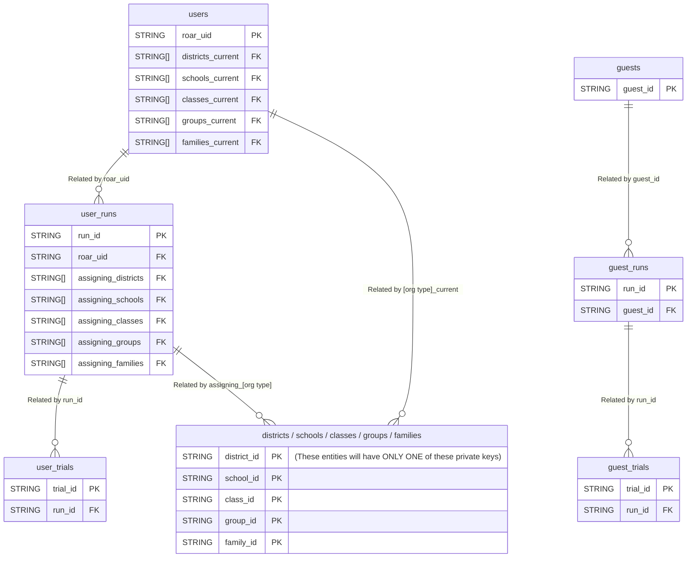

# Querying Assessment Data

ROAR's [assessment data][link_assessment_firestore_doc] is exported from Firestore to [BigQuery][link_bigquery]. This guide will walk you through the process of querying assessment data from BigQuery, including installation, authentication, understanding schemas, and exporting results to your local machine or a Google Cloud bucket.

## Tables and Views

BigQuery organizes data into datasets and tables (or views). Below are the key views available for querying in our lab's BigQuery project. The diagram below represents the relationships between these different views.



The diagram above only lists a subset of the attributes for each entity. For an exhaustive list of attributes for each view, click on the links below to view schema tables:

- [`users`][link_schema_users]
- [`user_runs`][link_schema_user_runs]
- [`user_trials`][link_schema_user_trials]
- [`districts`][link_schema_districts]
- [`schools`][link_schema_schools]
- [`classes`][link_schema_classes]
- [`groups`][link_schema_groups]
- [`families`][link_schema_families]
- `guests`: same as [`users`][link_schema_users] but with `guest_uid` as the private key instead of `roar_uid`
- `guest_runs`: same as [`user_runs`][link_schema_user_runs] but with the foreign key `guest_uid` instead of `roar_uid`
- `guest_trials`: same as [`user_trials`][link_schema_user_trials] but with the foreign key `guest_uid` instead of `roar_uid`

In each of these schema tables linked above, the columns "Field name," "Data type," and "Description" are self-explanatory. The "Key type" column indicates whether the field is a primary key (PK), unique key (UK), foreign key (FK), or none. A primary key uniquely identified each row in a table and cannot be `NULL`. A foreign key is references the primary key of another table. It establishes a relationship between two tables. A unique key is unique across all rows but can allow `NULL` values.

## Installation and initialization

To query assesement data, you will need the `bq` command line tool to interact with BigQuery from your terminal. To install `bq`,

1. [Install the `gcloud` CLI][link_gcloud_install]

1. [Initialize the `gcloud` CLI][link_gcloud_initialize]. When prompted to log in with your Google account, choose your Stanford-affiliated account. When prompted to select a project, choose `gse-roar-assessment`.

1. Install the `bq` tool if it is not already included:

    ```bash
    gcloud components install bq
    ```

1. Verify installation:

    ```bash
    bq --version
    ```

The initialization step above should have authenticated you into your Google account. But if you need to log in again, use

```bash
gcloud auth login
```

Similarly, the initialization step should set a default project ID. But if you need to reset the project ID, use

```bash
gcloud config set project gse-roar-assessment
```

## Querying Data

The bq tool allows you to execute SQL queries against the ROAR BigQuery tables listed above. If you are new to SQL, we recommend viewing the [Software Carpentry SQL lessons][link_lesson_swc_sql]. Once you are comfortable with SQL, see the examples below to guide you in querying ROAR data.

### Querying a single table

::: warning Cost Awareness

Queries in BigQuery incur costs based on the amount of data processed. Use filters and limits to minimize costs.

In the examples below, we will use `LIMIT 10` to limit our results to only 10 rows. We recommend that you do the same when refining your queries interactively. When you are satisfied with the query that you've built, then you can remove the `LIMIT` part to get all of the results you want.
:::

Research coordinators often want to query user runs. To pull 10 runs, you would use

```bash
bq query --nouse_legacy_sql \
'SELECT * FROM `gse-roar-assessment.assessment.user_runs` LIMIT 10'
```

The output of this command is written to STDOUT so it can be difficult to parse or feed into downstream analysis. Instead, let's save the output to a JSON file. Use the format `prettyjson` for a more human readable JSON file.

```bash
bq query --nouse_legacy_sql --format=prettyjson \
'SELECT
  *
FROM
  `gse-roar-assessment.assessment.user_runs`
LIMIT
  10' > output.json
```

### Exporting data to CSV

Researchers often want to export data to a CSV file. Let's see what happens when we change the format in that last query to `csv`:

```bash
bq query --nouse_legacy_sql --format=csv \
'SELECT
  *
FROM
  `gse-roar-assessment.assessment.user_runs`
LIMIT
  10' > output.csv
```

That command does create an `ouput.csv` file but if we inspect the contents, we see

```txt
Error printing table: Cannot print repeated field "assigning_districts" in CSV
format.
```

The `assigning_districts` field has the data type `ARRAY<STRING>`. Since CSV is a flat file format and cannot directly represent nested structures like arrays.

#### Selecting and excluding fields

One way to get around this limitation is to select only flattened fields. We can explicitly select certain field from the `user_runs` table:

```bash
bq query --nouse_legacy_sql --format=csv \
'SELECT
  roar_uid, run_id, reliable
FROM
  `gse-roar-assessment.assessment.user_runs`
LIMIT
  10' > output.csv
```

Or we can exclude the troublesome fields and select all remaining fields using `EXCEPT`:

```bash
bq query --nouse_legacy_sql --format=csv \
'SELECT
  * EXCEPT(
    assigning_districts,
    assigning_schools,
    assigning_classes,
    assigning_groups,
    assigning_families
  )
FROM
  `gse-roar-assessment.assessment.user_runs`
LIMIT
  10' > output.csv
```

#### Flattening nested fields

That works, but what if we actually want the data in those nested fields? We have options here as well. We can "stringify" the array fields, converting them into a JSON-like string:

```bash
bq query --nouse_legacy_sql --format=csv \
'SELECT
  * EXCEPT(
    assigning_districts,
    assigning_schools,
    assigning_classes,
    assigning_groups,
    assigning_families
  ),
  TO_JSON_STRING(assigning_districts) as assigning_districts,
  TO_JSON_STRING(assigning_schools) as assigning_schools,
  TO_JSON_STRING(assigning_classes) as assigning_classes,
  TO_JSON_STRING(assigning_groups) as assigning_groups,
  TO_JSON_STRING(assigning_families) as assigning_families,
FROM
  `gse-roar-assessment.assessment.user_runs`
LIMIT
  10' > output.csv
```

### Advanced queries that use multiple tables

TODO:
- [ ] Add an example of a simple WHERE clause, e.g., querying 10 SWR trials
- [ ] Add an example of a compound query, e.g., querying 10 SWR trials after a certain date
- Add examples of querying and joins that combine multiple tables
- [ ] Add an example of querying trials by a PID. PID is not in trials so we have to reference users to get the roarUid and then use that to query the trials
- [ ] Add an example of joining runs and trials
- [ ] Add an example of joining users and runs and trials
- [ ] Add an example querying inside of the array fields (i.e., getting all runs for a school)

### Exporting large queries to a google cloud bucket

For large datasets, it’s more efficient to export query results directly to a Google Cloud Storage bucket.

1. Create a Google Cloud Storage Bucket

   If you don’t already have a bucket, create one:

   ```bash
   gcloud storage buckets create gs://[BUCKET_NAME] --location=[LOCATION]
   ```

   Replace [BUCKET_NAME] and [LOCATION] with appropriate values.

2. Export Query Results

   Use the bq command to export query results:

   ```bash
   bq extract --destination_format CSV \
   'project_id:dataset_id.view1' gs://[BUCKET_NAME]/output.csv
   ```

   For JSON export, replace `--destination_format CSV` with `--destination_format NEWLINE_DELIMITED_JSON`.

[link_assessment_firestore_doc]: ../databases/assessment.md
[link_bigquery]: https://cloud.google.com/bigquery?hl=en
[link_gcloud_initialize]: https://cloud.google.com/sdk/docs/initializing
[link_gcloud_install]: https://cloud.google.com/sdk/docs/install
[link_lesson_swc_sql]: https://swcarpentry.github.io/sql-novice-survey/
[link_schema_users]: ./users.md
[link_schema_user_runs]: ./user_runs.md
[link_schema_user_trials]: ./user_trials.md
[link_schema_districts]: ./districts.md
[link_schema_schools]: ./schools.md
[link_schema_classes]: ./classes.md
[link_schema_groups]: ./groups.md
[link_schema_families]: ./families.md
