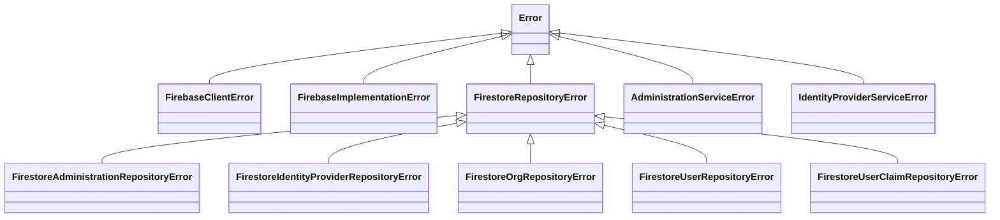

# Error Handling Architecture in ROAR

## Overview

ROAR implements a comprehensive error handling strategy with specialized error classes organized in a hierarchical structure. This architecture ensures errors are properly captured, categorized, and reported throughout the system.

## Error Class Hierarchy

The error handling system follows a hierarchical design that mirrors the application's architecture:



## Key Components

### Client-Level Errors
- [`FirebaseClientError`](../api/classes/FirebaseClientError.md): Base error for Firebase client operations
- [`FirebaseImplementationError`](../api/classes/FirebaseImplementationError.md): Errors during Firebase implementation setup

### Repository-Level Errors
- [`FirestoreRepositoryError`](../api/classes/FirestoreRepositoryError.md): Base class for all repository errors
- Entity-specific repository errors:
  - [`FirestoreAdministrationRepositoryError`](../api/classes/FirestoreAdministrationRepositoryError.md)
  - [`FirestoreIdentityProviderRepositoryError`](../api/classes/FirestoreIdentityProviderRepositoryError.md)
  - [`FirestoreOrgRepositoryError`](../api/classes/FirestoreOrgRepositoryError.md)
  - [`FirestoreUserRepositoryError`](../api/classes/FirestoreUserRepositoryError.md)
  - [`FirestoreUserClaimRepositoryError`](../api/classes/FirestoreUserClaimRepositoryError.md)

### Service-Level Errors
- [`AdministrationServiceError`](../api/classes/AdministrationServiceError.md): Errors in administration service operations
- [`IdentityProviderServiceError`](../api/classes/IdentityProviderServiceError.md): Errors in identity provider service operations

## Error Handling Principles

### 1. Error Encapsulation
Each error class encapsulates both an error message and the original error object, allowing for complete context preservation while providing a clean public API.

Example:
```typescript
class FirestoreRepositoryError extends Error {
  protected error: any;

  constructor(message: string, error?: any) {
    super(message);
    this.name = 'FirestoreRepositoryError';
    this.error = error;
  }
}
```

### 2. Specialized Error Types
Repository-specific error classes provide factory methods for creating standardized error instances for common error scenarios:

```typescript
class FirestoreIdentityProviderRepositoryError extends FirestoreRepositoryError {
  public getByProviderIdError(): FirestoreIdentityProviderRepositoryError {
    return new FirestoreIdentityProviderRepositoryError(
      'Error retrieving identity provider by provider ID'
    );
  }

  public noProviderDataError(): FirestoreIdentityProviderRepositoryError {
    return new FirestoreIdentityProviderRepositoryError(
      'No provider data available'
    );
  }
}
```

### 3. Error Propagation

Errors are propagated up the call stack, with each layer adding relevant context:

1. **Repository Layer**: Catches database errors and wraps them in repository-specific errors
2. **Service Layer**: Catches repository errors and wraps them in service-specific errors
3. **Controller/Function Layer**: Catches service errors and formats appropriate responses

## Best Practices

1. **Specific Error Messages**: Include actionable details in error messages
2. **Error Categorization**: Use specialized error classes for different error types
3. **Error Context**: Preserve original errors for debugging
4. **Consistent Error Handling**: Follow the same pattern across the codebase
5. **Error Logging**: Log errors at appropriate levels with context

## Example Usage

```typescript
try {
  const result = await identityProviderRepository.getByProviderId(params);
  return result;
} catch (error) {
  if (error instanceof FirestoreRepositoryError) {
    throw error;
  }
  throw new FirestoreIdentityProviderRepositoryError(
    'Failed to get identity provider by ID',
    error
  );
}
```
