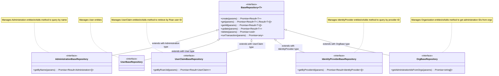
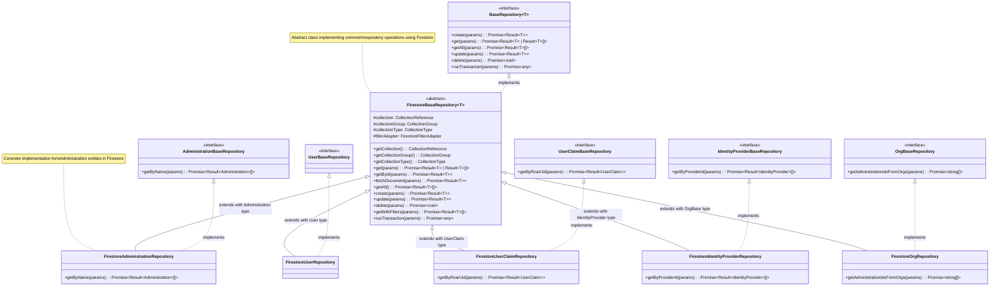
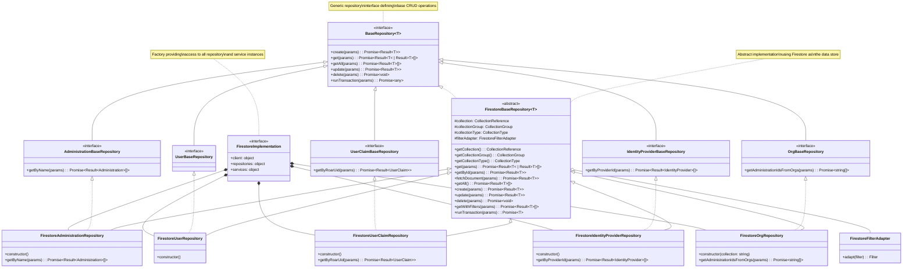

# Repository Pattern Architecture in ROAR

```mermaid
classDiagram
%% Base Repository Interface
class BaseRepository~T~ {
<<interface>>
+create(params): Promise~Result~T~~
+get(params): Promise~Result~T~ | Result~T~[]~
+getAll(params): Promise~Result~T~[]~
+update(params): Promise~Result~T~~
+delete(params): Promise~void~
+runTransaction(params): Promise~any~
}

    %% Specialized Repository Interfaces
    class AdministrationBaseRepository {
    <<interface>>
    +getByName(params): Promise~Result~Administration~[]~
    }

    class UserBaseRepository {
    <<interface>>
    }

    class UserClaimBaseRepository {
    <<interface>>
    +getByRoarUid(params): Promise~Result~UserClaim~~
    }

    class IdentityProviderBaseRepository {
    <<interface>>
    +getByProviderId(params): Promise~Result~IdentityProvider~[]~
    }

    class OrgBaseRepository {
    <<interface>>
    +getAdministrationIdsFromOrgs(params): Promise~string[]~
    }

    %% Define inheritance relationships
    BaseRepository <|-- AdministrationBaseRepository: extends with Administration type
    BaseRepository <|-- UserBaseRepository: extends with User type
    BaseRepository <|-- UserClaimBaseRepository: extends with UserClaim type
    BaseRepository <|-- IdentityProviderBaseRepository: extends with IdentityProvider type
    BaseRepository <|-- OrgBaseRepository: extends with OrgBase type

    %% Add notes to clarify the domain models
    note for AdministrationBaseRepository "Manages Administration entities\\nAdds method to query by name"
    note for UserBaseRepository "Manages User entities"
    note for UserClaimBaseRepository "Manages UserClaim entities\\nAdds method to retrieve by Roar user ID"
    note for IdentityProviderBaseRepository "Manages IdentityProvider entities\\nAdds method to query by provider ID"
    note for OrgBaseRepository "Manages Organization entities\\nAdds method to get administration IDs from orgs"
```

```mermaid
classDiagram
%% Base Repository Interfaces
class BaseRepository~T~ {
<<interface>>
+create(params): Promise~Result~T~~
+get(params): Promise~Result~T~ | Result~T~[]~
+getAll(params): Promise~Result~T~[]~
+update(params): Promise~Result~T~~
+delete(params): Promise~void~
+runTransaction(params): Promise~any~
}

    class AdministrationBaseRepository {
    <<interface>>
    +getByName(params): Promise~Result~Administration~[]~
    }

    class UserBaseRepository {
    <<interface>>
    }

    class UserClaimBaseRepository {
    <<interface>>
    +getByRoarUid(params): Promise~Result~UserClaim~~
    }

    class IdentityProviderBaseRepository {
    <<interface>>
    +getByProviderId(params): Promise~Result~IdentityProvider~[]~
    }

    class OrgBaseRepository {
    <<interface>>
    +getAdministrationIdsFromOrgs(params): Promise~string[]~
    }

    %% Firestore Base Repository
    class FirestoreBaseRepository~T~ {
    <<abstract>>
    #collection: CollectionReference
    #collectionGroup: CollectionGroup
    #collectionType: CollectionType
    #filterAdapter: FirestoreFilterAdapter
    +getCollection(): CollectionReference
    +getCollectionGroup(): CollectionGroup
    +getCollectionType(): CollectionType
    +get(params): Promise~Result~T~ | Result~T~[]~
    +getById(params): Promise~Result~T~~
    +fetchDocument(params): Promise~Result~T~~
    +getAll(): Promise~Result~T~[]~
    +create(params): Promise~Result~T~~
    +update(params): Promise~Result~T~~
    +delete(params): Promise~void~
    +getWithFilters(params): Promise~Result~T~[]~
    +runTransaction(params): Promise~any~
    }

    %% Concrete Firestore Repositories
    class FirestoreAdministrationRepository {
    +getByName(params): Promise~Result~Administration~[]~
    }

    class FirestoreUserRepository {
    }

    class FirestoreUserClaimRepository {
    +getByRoarUid(params): Promise~Result~UserClaim~~
    }

    class FirestoreIdentityProviderRepository {
    +getByProviderId(params): Promise~Result~IdentityProvider~[]~
    }

    class FirestoreOrgRepository {
    +getAdministrationIdsFromOrgs(params): Promise~string[]~
    }

    %% Define implementation relationships
    BaseRepository <|.. FirestoreBaseRepository : implements

    FirestoreBaseRepository <|-- FirestoreAdministrationRepository : extends with Administration type
    FirestoreBaseRepository <|-- FirestoreUserRepository : extends with User type
    FirestoreBaseRepository <|-- FirestoreUserClaimRepository : extends with UserClaim type
    FirestoreBaseRepository <|-- FirestoreIdentityProviderRepository : extends with IdentityProvider type
    FirestoreBaseRepository <|-- FirestoreOrgRepository : extends with OrgBase type

    AdministrationBaseRepository <|.. FirestoreAdministrationRepository : implements
    UserBaseRepository <|.. FirestoreUserRepository : implements
    UserClaimBaseRepository <|.. FirestoreUserClaimRepository : implements
    IdentityProviderBaseRepository <|.. FirestoreIdentityProviderRepository : implements
    OrgBaseRepository <|.. FirestoreOrgRepository : implements

    %% Add notes to explain the implementation pattern
    note for FirestoreBaseRepository "Abstract class implementing common\\nrepository operations using Firestore"
    note for FirestoreAdministrationRepository "Concrete implementation for\\nAdministration entities in Firestore"
```

```mermaid
classDiagram
%% Base Repository Interface
class BaseRepository~T~ {
<<interface>>
+create(params): Promise~Result~T~~
+get(params): Promise~Result~T~ | Result~T~[]~
+getAll(params): Promise~Result~T~[]~
+update(params): Promise~Result~T~~
+delete(params): Promise~void~
+runTransaction(params): Promise~any~
}

    %% Specialized Repository Interfaces
    class AdministrationBaseRepository {
    <<interface>>
    +getByName(params): Promise~Result~Administration~[]~
    }

    class UserBaseRepository {
    <<interface>>
    }

    class UserClaimBaseRepository {
    <<interface>>
    +getByRoarUid(params): Promise~Result~UserClaim~~
    }

    class IdentityProviderBaseRepository {
    <<interface>>
    +getByProviderId(params): Promise~Result~IdentityProvider~[]~
    }

    class OrgBaseRepository {
    <<interface>>
    +getAdministrationIdsFromOrgs(params): Promise~string[]~
    }

    %% Firestore Base Repository
    class FirestoreBaseRepository~T~ {
    <<abstract>>
    #collection: CollectionReference
    #collectionGroup: CollectionGroup
    #collectionType: CollectionType
    #filterAdapter: FirestoreFilterAdapter
    +getCollection(): CollectionReference
    +getCollectionGroup(): CollectionGroup
    +getCollectionType(): CollectionType
    +get(params): Promise~Result~T~ | Result~T~[]~
    +getById(params): Promise~Result~T~~
    +fetchDocument(params): Promise~Result~T~~
    +getAll(): Promise~Result~T~[]~
    +create(params): Promise~Result~T~~
    +update(params): Promise~Result~T~~
    +delete(params): Promise~void~
    +getWithFilters(params): Promise~Result~T~[]~
    +runTransaction(params): Promise~T~
    }

    %% Concrete Firestore Repositories
    class FirestoreAdministrationRepository {
    +constructor()
    +getByName(params): Promise~Result~Administration~[]~
    }

    class FirestoreUserRepository {
    +constructor()
    }

    class FirestoreUserClaimRepository {
    +constructor()
    +getByRoarUid(params): Promise~Result~UserClaim~~
    }

    class FirestoreIdentityProviderRepository {
    +constructor()
    +getByProviderId(params): Promise~Result~IdentityProvider~[]~
    }

    class FirestoreOrgRepository {
    +constructor(collection: string)
    +getAdministrationIdsFromOrgs(params): Promise~string[]~
    }

    %% Helper classes
    class FirestoreFilterAdapter {
    +adapt(filter): Filter
    }

    class FirestoreImplementation {
    <<interface>>
    +client: object
    +repositories: object
    +services: object
    }

    %% Inheritance relationships
    BaseRepository <|-- AdministrationBaseRepository
    BaseRepository <|-- UserBaseRepository
    BaseRepository <|-- UserClaimBaseRepository
    BaseRepository <|-- IdentityProviderBaseRepository
    BaseRepository <|-- OrgBaseRepository

    BaseRepository <|.. FirestoreBaseRepository

    FirestoreBaseRepository <|-- FirestoreAdministrationRepository
    FirestoreBaseRepository <|-- FirestoreUserRepository
    FirestoreBaseRepository <|-- FirestoreUserClaimRepository
    FirestoreBaseRepository <|-- FirestoreIdentityProviderRepository
    FirestoreBaseRepository <|-- FirestoreOrgRepository

    AdministrationBaseRepository <|.. FirestoreAdministrationRepository
    UserBaseRepository <|.. FirestoreUserRepository
    UserClaimBaseRepository <|.. FirestoreUserClaimRepository
    IdentityProviderBaseRepository <|.. FirestoreIdentityProviderRepository
    OrgBaseRepository <|.. FirestoreOrgRepository

    %% Composition relationships
    FirestoreBaseRepository o-- FirestoreFilterAdapter
    FirestoreImplementation *-- FirestoreAdministrationRepository
    FirestoreImplementation *-- FirestoreUserRepository
    FirestoreImplementation *-- FirestoreUserClaimRepository
    FirestoreImplementation *-- FirestoreIdentityProviderRepository
    FirestoreImplementation *-- FirestoreOrgRepository

    %% Notes
    note for BaseRepository "Generic repository\\ninterface defining\\nbase CRUD operations"
    note for FirestoreBaseRepository "Abstract implementation\\nusing Firestore as\\nthe data store"
    note for FirestoreImplementation "Factory providing\\naccess to all repository\\nand service instances"
```
