# Repository Pattern Architecture in ROAR

The ROAR backend implements a sophisticated repository pattern that provides a flexible and maintainable approach to data access. This architecture is illustrated through three key structural layers:

## 1. Base Repository Interface Layer

The foundation of our repository pattern is the generic `BaseRepository<T>` interface, which defines standard CRUD operations:

- create()
- get()
- getAll()
- update()
- delete()
- runTransaction()

This interface ensures consistent data access patterns across all entity types while maintaining type safety through generics.

## 2. Specialized Repository Interfaces

Building on the base interface, we define specialized repository interfaces for specific entity types:

- AdministrationBaseRepository
- UserBaseRepository
- UserClaimBaseRepository
- IdentityProviderBaseRepository
- OrgBaseRepository

Each specialized interface extends BaseRepository and adds entity-specific operations where needed. For example:

- AdministrationBaseRepository adds `getByName()`
- UserClaimBaseRepository adds `getByRoarUid()`
- IdentityProviderBaseRepository adds `getByProviderId()`

## 3. Concrete Implementation Layer

These concrete implementations encapsulate the logic required to operate within the context of that backend. The classes of the concrete implementation extend the contract defined by the base repository classes. In the example of Firestore, the FirestoreBaseRepository class provides a Firestore-specific implementation of the base repository contract which encapsulates the Firestore-specific logic required to interact with Firestore.

A Postgres or SQL implementation could be built by extending the base repository contract and implementing the required methods.

The concrete implementation layer is built around Firestore as the data store:

### FirestoreBaseRepository

An abstract class that:

- Implements the BaseRepository interface
- Provides Firestore-specific functionality
- Manages collection references and groups
- Handles filtering and transactions
- Serves as the foundation for all Firestore-specific repositories

### Concrete Repositories

Each entity type has its own concrete repository class that:

- Extends FirestoreBaseRepository
- Implements its corresponding specialized interface
- Provides entity-specific implementation details
- Manages Firestore collections for that entity

### Supporting Components

- FirestoreFilterAdapter: Transforms generic filters into Firestore-compatible queries
- FirestoreImplementation: Acts as a factory, providing access to repository and service instances

## Benefits of This Architecture

1. **Abstraction**: The interface-based approach abstracts data access details from business logic
2. **Flexibility**: Easily switch between different data stores by implementing new concrete repositories
3. **Type Safety**: Generic typing ensures compile-time type checking
4. **Maintainability**: Consistent patterns make the codebase easier to maintain
5. **Testability**: Interface-based design enables easy mocking for unit tests
6. **Scalability**: New entity types can be added by following the established pattern

## Base Repository Hierarchy

## Firestore Implementation

```mermaid
classDiagram
%% Base Repository Interface
class BaseRepository~T~ {
<<interface>>
+create(params): Promise~Result~T~~
+get(params): Promise~Result~T~ | Result~T~[]~
+getAll(params): Promise~Result~T~[]~
+update(params): Promise~Result~T~~
+delete(params): Promise~void~
+runTransaction(params): Promise~any~
}

    %% Specialized Repository Interfaces
    class AdministrationBaseRepository {
    <<interface>>
    +getByName(params): Promise~Result~Administration~[]~
    }

    class UserBaseRepository {
    <<interface>>
    }

    class UserClaimBaseRepository {
    <<interface>>
    +getByRoarUid(params): Promise~Result~UserClaim~~
    }

    class IdentityProviderBaseRepository {
    <<interface>>
    +getByProviderId(params): Promise~Result~IdentityProvider~[]~
    }

    class OrgBaseRepository {
    <<interface>>
    +getAdministrationIdsFromOrgs(params): Promise~string[]~
    }

    %% Firestore Base Repository
    class FirestoreBaseRepository~T~ {
    <<abstract>>
    #collection: CollectionReference
    #collectionGroup: CollectionGroup
    #collectionType: CollectionType
    #filterAdapter: FirestoreFilterAdapter
    +getCollection(): CollectionReference
    +getCollectionGroup(): CollectionGroup
    +getCollectionType(): CollectionType
    +get(params): Promise~Result~T~ | Result~T~[]~
    +getById(params): Promise~Result~T~~
    +fetchDocument(params): Promise~Result~T~~
    +getAll(): Promise~Result~T~[]~
    +create(params): Promise~Result~T~~
    +update(params): Promise~Result~T~~
    +delete(params): Promise~void~
    +getWithFilters(params): Promise~Result~T~[]~
    +runTransaction(params): Promise~T~
    }

    %% Concrete Firestore Repositories
    class FirestoreAdministrationRepository {
    +constructor()
    +getByName(params): Promise~Result~Administration~[]~
    }

    class FirestoreUserRepository {
    +constructor()
    }

    class FirestoreUserClaimRepository {
    +constructor()
    +getByRoarUid(params): Promise~Result~UserClaim~~
    }

    class FirestoreIdentityProviderRepository {
    +constructor()
    +getByProviderId(params): Promise~Result~IdentityProvider~[]~
    }

    class FirestoreOrgRepository {
    +constructor(collection: string)
    +getAdministrationIdsFromOrgs(params): Promise~string[]~
    }

    %% Helper classes
    class FirestoreFilterAdapter {
    +adapt(filter): Filter
    }

    class FirestoreImplementation {
    <<interface>>
    +client: object
    +repositories: object
    +services: object
    }

    %% Inheritance relationships
    BaseRepository <|-- AdministrationBaseRepository
    BaseRepository <|-- UserBaseRepository
    BaseRepository <|-- UserClaimBaseRepository
    BaseRepository <|-- IdentityProviderBaseRepository
    BaseRepository <|-- OrgBaseRepository

    BaseRepository <|.. FirestoreBaseRepository

    FirestoreBaseRepository <|-- FirestoreAdministrationRepository
    FirestoreBaseRepository <|-- FirestoreUserRepository
    FirestoreBaseRepository <|-- FirestoreUserClaimRepository
    FirestoreBaseRepository <|-- FirestoreIdentityProviderRepository
    FirestoreBaseRepository <|-- FirestoreOrgRepository

    AdministrationBaseRepository <|.. FirestoreAdministrationRepository
    UserBaseRepository <|.. FirestoreUserRepository
    UserClaimBaseRepository <|.. FirestoreUserClaimRepository
    IdentityProviderBaseRepository <|.. FirestoreIdentityProviderRepository
    OrgBaseRepository <|.. FirestoreOrgRepository

    %% Composition relationships
    FirestoreBaseRepository o-- FirestoreFilterAdapter
    FirestoreImplementation *-- FirestoreAdministrationRepository
    FirestoreImplementation *-- FirestoreUserRepository
    FirestoreImplementation *-- FirestoreUserClaimRepository
    FirestoreImplementation *-- FirestoreIdentityProviderRepository
    FirestoreImplementation *-- FirestoreOrgRepository

    %% Notes
    note for BaseRepository "Generic repository\\ninterface defining\\nbase CRUD operations"
    note for FirestoreBaseRepository "Abstract implementation\\nusing Firestore as\\nthe data store"
    note for FirestoreImplementation "Factory providing\\naccess to all repository\\nand service instances"
```

