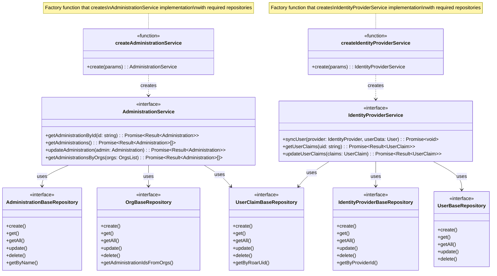

# Service Layer Architecture

## Core Principles

### Repository Abstraction Chain
The service layer operates on a chain of repository abstractions that provide increasingly specialized functionality:

```typescript
BaseRepository<T>
  └─> AdministrationBaseRepository
       └─> FirestoreAdministrationRepository
```

Each level in this chain serves a specific purpose:
- **BaseRepository**: Defines fundamental CRUD operations
- **Specialized Repositories**: Add domain-specific operations
- **Concrete Implementations**: Provide actual database interactions

```typescript
class AdministrationService {
  constructor(
    private adminRepo: AdministrationBaseRepository,
    private orgRepo: OrgBaseRepository
  ) {}

  async getAdministration(id: string): Promise<Result<Administration>> {
    return this.adminRepo.get({ id });
  }
}
```

```typescript
interface Result<T> {
  id: string;
  data: T;
  error?: Error;
  metadata?: Record<string, unknown>;
}
```

### Benefits

1. **Testability**
   - Easy to mock repository dependencies
   - Isolated business logic testing
   - Clear contract boundaries

2. **Maintainability**
   - Separation of concerns
   - Implementation independence
   - Clear dependency hierarchy

3. **Scalability**
   - New repositories can be added without service changes
   - Multiple database support
   - Consistent patterns across the system

## Service Layer Pattern Overview

The service layer in ROAR's repository pattern is implemented through factory functions that create service instances with their required repository dependencies. This design provides several key benefits:

### Factory Function Pattern
- **Dependency Injection**: Repository dependencies are injected at creation time
- **Encapsulation**: Implementation details are hidden behind interfaces
- **Type Safety**: TypeScript ensures correct repository implementations
- **Testability**: Easy to mock dependencies for unit testing

### Service Creation Example
```typescript
const adminService = createAdministrationService({
  administrationRepository, // AdministrationBaseRepository implementation
  orgRepository,           // OrgBaseRepository implementation
  userClaimRepository     // UserClaimBaseRepository implementation
});

const idpService = createIdentityProviderService({
  identityProviderRepository, // IdentityProviderBaseRepository implementation
  userClaimRepository,       // UserClaimBaseRepository implementation
  userRepository            // UserBaseRepository implementation
});
```

### Key Benefits
1. **Separation of Concerns**: Services handle business logic while repositories manage data access
2. **Loose Coupling**: Services depend on repository interfaces, not implementations
3. **Single Responsibility**: Each service handles specific domain operations
4. **Maintainability**: Easy to modify service implementation without affecting other layers
5. **Scalability**: New services can be added following the same pattern

This service layer implementation completes the repository pattern by providing a clean separation between business logic and data access while maintaining type safety and testability.


### Service Layer Pattern Implementation

