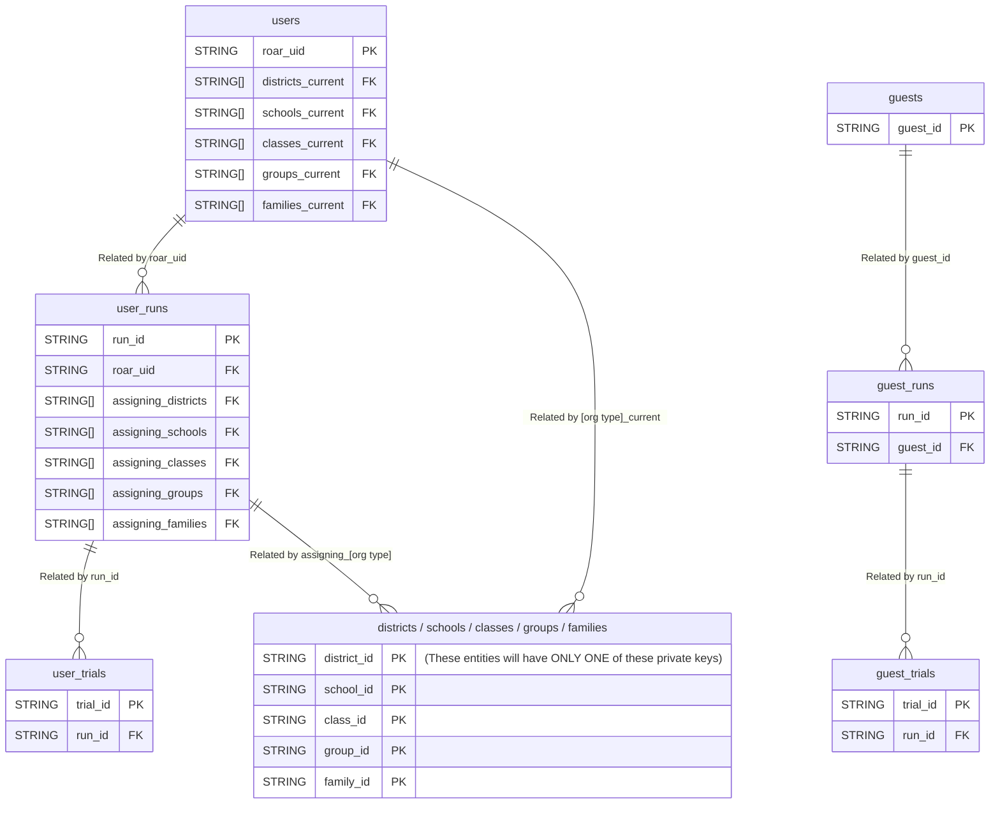

# Querying Assessment Data

ROAR's [assessment data][link_assessment_firestore_doc] is exported from Firestore to [BigQuery][link_bigquery]. This guide will walk you through the process of querying assessment data from BigQuery, including installation, authentication, understanding schemas, and exporting results to your local machine or a Google Cloud bucket.

::: tip How to use this guide

Please read through this entire guide (and work through the examples) before executing your production queries with BigQuery. BigQuery is a very powerful tool but its incorrect use can inflate ROAR's costs so it is important to read through the guide to the end to adopt best practices.
:::

## Tables and Views

BigQuery organizes data into datasets and tables (or views). Below are the key views available for querying in our lab's BigQuery project. The diagram below represents the relationships between these different views.



The diagram above only lists a subset of the attributes for each entity. For an exhaustive list of attributes for each view, click on the links below to view schema tables:

- [`users`][link_schema_users]
- [`user_runs`][link_schema_user_runs]
- [`user_trials`][link_schema_user_trials]
- [`districts`][link_schema_districts]
- [`schools`][link_schema_schools]
- [`classes`][link_schema_classes]
- [`groups`][link_schema_groups]
- [`families`][link_schema_families]
- `guests`: same as [`users`][link_schema_users] but with `guest_uid` as the private key instead of `roar_uid`
- `guest_runs`: same as [`user_runs`][link_schema_user_runs] but with the foreign key `guest_uid` instead of `roar_uid`
- `guest_trials`: same as [`user_trials`][link_schema_user_trials] but with the foreign key `guest_uid` instead of `roar_uid`

In each of these schema tables linked above, the columns "Field name," "Data type," and "Description" are self-explanatory. The "Key type" column indicates whether the field is a primary key (PK), unique key (UK), foreign key (FK), or none. A primary key uniquely identified each row in a table and cannot be `NULL`. A foreign key is references the primary key of another table. It establishes a relationship between two tables. A unique key is unique across all rows but can allow `NULL` values.

## Installation and initialization

To query assesement data, you will need the `bq` command line tool to interact with BigQuery from your terminal. To install `bq`,

1. [Install the `gcloud` CLI][link_gcloud_install]

1. [Initialize the `gcloud` CLI][link_gcloud_initialize]. When prompted to log in with your Google account, choose your Stanford-affiliated account. When prompted to select a project, choose `gse-roar-assessment`.

1. Install the `bq` tool if it is not already included:

    ```bash
    gcloud components install bq
    ```

1. Verify installation:

    ```bash
    bq version
    ```

The initialization step above should have authenticated you into your Google account. But if you need to log in again, use

```bash
gcloud auth login
```

Similarly, the initialization step should set a default project ID. But if you need to reset the project ID, use

```bash
gcloud config set project gse-roar-assessment
```

## Querying Data

The bq tool allows you to execute SQL queries against the ROAR BigQuery tables listed above. If you are new to SQL, we recommend viewing the [Software Carpentry SQL lessons][link_lesson_swc_sql]. Once you are comfortable with SQL, see the examples below to guide you in querying ROAR data.

### Querying a single table

::: warning Cost Awareness

Queries in BigQuery incur costs based on the amount of data processed. Use filters and limits to minimize costs.

In the examples below, we will use `LIMIT 10` to limit our results to only 10 rows. We recommend that you do the same when refining your queries interactively. When you are satisfied with the query that you've built, then you can remove the `LIMIT` part to get all of the results you want.
:::

Research coordinators often want to query user runs. To pull 10 runs, you would use

```bash
bq query --nouse_legacy_sql \
'SELECT * FROM `gse-roar-assessment.assessment.user_runs` LIMIT 10'
```

The output of this command is written to STDOUT so it can be difficult to parse or feed into downstream analysis. Instead, let's save the output to a JSON file. Use the format `prettyjson` for a more human readable JSON file.

```bash
bq query --nouse_legacy_sql --format=prettyjson \
'SELECT
  *
FROM
  `gse-roar-assessment.assessment.user_runs`
LIMIT
  10' > output.json
```

### Exporting data to CSV

Researchers often want to export data to a CSV file. Let's see what happens when we change the format in that last query to `csv`:

::: warning Failure is essential to learning.

This next query will fail. You're not doing anything wrong. It is supposed to fail for pedagogical purposes. Just run the command and keep reading.
:::

```bash
bq query --nouse_legacy_sql --format=csv \
'SELECT
  *
FROM
  `gse-roar-assessment.assessment.user_runs`
LIMIT
  10' > output.csv
```

That command does create an `ouput.csv` file but if we inspect the contents, we see

```txt
Error printing table: Cannot print repeated field "assigning_districts" in CSV
format.
```

The `assigning_districts` field has the data type `ARRAY<STRING>`. Since CSV is a flat file format and cannot directly represent nested structures like arrays.

#### Selecting and excluding fields

One way to get around this limitation is to select only flattened fields. We can explicitly select certain field from the `user_runs` table:

```bash
bq query --nouse_legacy_sql --format=csv \
'SELECT
  roar_uid, run_id, reliable
FROM
  `gse-roar-assessment.assessment.user_runs`
LIMIT
  10' > output.csv
```

Or we can exclude the troublesome fields and select all remaining fields using `EXCEPT`:

```bash
bq query --nouse_legacy_sql --format=csv \
'SELECT
  * EXCEPT(
    assigning_districts,
    assigning_schools,
    assigning_classes,
    assigning_groups,
    assigning_families
  )
FROM
  `gse-roar-assessment.assessment.user_runs`
LIMIT
  10' > output.csv
```

#### Flattening nested fields

That works, but what if we actually want the data in those nested fields? We have options here as well. We can "stringify" the array fields, converting them into a JSON-like string:

```bash
bq query --nouse_legacy_sql --format=csv \
'SELECT
  * EXCEPT(
    assigning_districts,
    assigning_schools,
    assigning_classes,
    assigning_groups,
    assigning_families
  ),
  TO_JSON_STRING(assigning_districts) as assigning_districts,
  TO_JSON_STRING(assigning_schools) as assigning_schools,
  TO_JSON_STRING(assigning_classes) as assigning_classes,
  TO_JSON_STRING(assigning_groups) as assigning_groups,
  TO_JSON_STRING(assigning_families) as assigning_families,
FROM
  `gse-roar-assessment.assessment.user_runs`
LIMIT
  10' > output.csv
```

### Using the WHERE clause

You can use the `WHERE` clause to filter results. For example, to select only runs with the task ID "swr", use

```bash
bq query --nouse_legacy_sql --format=csv \
'SELECT
  roar_uid, run_id, task_id
FROM
  `gse-roar-assessment.assessment.user_runs`
WHERE
  task_id = "swr"
LIMIT
  10' > output.csv
```

You can use the `AND` keywork to create compound filters. For example, you could query all "swr" runs that were started after a certain date using

```bash
bq query --nouse_legacy_sql --format=csv \
'SELECT
  roar_uid, run_id, task_id, time_started
FROM
  `gse-roar-assessment.assessment.user_runs`
WHERE
  task_id = "swr"
AND
  time_started > "2024-08-08"
LIMIT
  10' > output.csv
```

### Sorting results

You can use the `ORDER BY` clause to sort your results. For example, you can sort the results in the last query by time_started using

```bash
bq query --nouse_legacy_sql --format=csv \
'SELECT
  roar_uid, run_id, task_id, time_started
FROM
  `gse-roar-assessment.assessment.user_runs`
WHERE
  task_id = "swr"
AND
  time_started > "2024-08-08"
ORDER BY
  time_started ASC
LIMIT
  10' > output.csv
```

Note that we used the `ASC` keyword to sort the results in ascending order. To reverse that and sort results in descending order, use `DESC`. For example, a very popular and useful query for researchers it to request the 10 most recent runs for a given task ID:

```bash
bq query --nouse_legacy_sql --format=csv \
'SELECT
  roar_uid, run_id, task_id, time_started
FROM
  `gse-roar-assessment.assessment.user_runs`
WHERE
  task_id = "swr"
ORDER BY
  time_started DESC
LIMIT
  10' > output.csv
```

### Querying array fields

You can use the `UNNEST()` keyword to access the elements of an array field.
This will allow you to query based on values that appear in those arrays. In
this example, we want to retireve 10 records from the user_runs table where the
user was assigned to the school with ID "uSpviE1t4lUzH8J7I9aQ".

```bash
bq query --nouse_legacy_sql --format=csv \
'SELECT
  roar_uid, run_id, task_id, time_started,
  TO_JSON_STRING(assigning_schools) as assigning_school
FROM
  `gse-roar-assessment.assessment.user_runs`
WHERE
  "uSpviE1t4lUzH8J7I9aQ" IN UNNEST(assigning_schools)
ORDER BY
  time_started DESC
LIMIT
  10' > output.csv
```

Note that we use `UNNEST` in the `WHERE` clause and still have to use `TO_JSON_STRING` to flatten the `assigning_schools` column as above.

### Advanced queries that use multiple tables

All of our examples so far have queried only one table at a time. However, some queries require referencing multiple tables. For example, the `user_trials` table has a foreign key called `roar_uid` that references the private key `roar_uid` in the `users` table. But researchers don't always know the `roar_uid` of a particular user. They may instead want to query by the `assessment_pid` in the `users` table.

To query across multiple tables in BigQuery where you need to match a foreign key (`roar_uid`) from one table (`user_trials`) with a private key in another table (`users`), and filter based on a unique key (`assessment_pid`), you can use a `JOIN` clause. In the below example, we query for 10 trials from the user with PID "efschl-shs-a05c9862".

```bash
bq query --nouse_legacy_sql --format=csv \
'SELECT ut.*, u.assessment_pid
 FROM `gse-roar-assessment.assessment.user_trials` AS ut
 JOIN `gse-roar-assessment.assessment.users` AS u
   ON ut.roar_uid = u.roar_uid
 WHERE u.assessment_pid = "efschl-shs-a05c9862"
 LIMIT 10' > output.csv
```

This last query introduced a few new concepts so let's break it down.

- The `SELECT` clause selects which columns to include in the results.
- We use the `JOIN` keyword to join two tables together into one.
- While doing so, we use the `AS` keyword to refer to each table by a shortened variable name. So the `user_trials` table is assigned the alias `ut` and the `users` table is assigned the alias `u`.
- We use the `ON` keyword to identify the column names on which to join the two tables.
- The `JOIN`, `AS`, and `ON` clauses combine to defined a new table from which to select data. This joined table becomes the argument to the `FROM` keyword.
- Finally, we use the `WHERE` keyword as before to filter results to the requested PID.

Similarly, you could combine three different tables by chaining multiple `JOIN` clauses together. Let's combine the `users`, `user_runs`, and `user_trials` tables. Start by recognizing that the `users` and `user_runs` tables are linked by the `roar_uid` column. Similarly, the `user_runs` and `user_trials` columns are linked by the `run_id` column. Then the order of these joins should reflect the logical relationships between these tables:

```bash
bq query --nouse_legacy_sql --format=csv \
'SELECT ut.*, u.assessment_pid, ur.scores
FROM `gse-roar-assessment.assessment.users` AS u
JOIN `gse-roar-assessment.assessment.user_runs` AS ur
  ON u.roar_uid = ur.roar_uid
JOIN `gse-roar-assessment.assessment.user_trials` AS ut
  ON ur.run_id = ut.run_id
LIMIT 10' > output.csv
```

### Exporting large queries to a google cloud bucket

For large datasets, it’s more efficient to export query results directly to a Google Cloud Storage (GCS) bucket. This has a few benefits

- Handling of large datasets: GCS can handle large datasets that might exceed the limits of local storage or network speed. Large files won't impact local disk space or system performance.
- Cost-effectiveness: Avoid repeated query costs by exporting the results once and reusing data.
- Sharing and collaboration: GCS facilitates data sharing with team members or external collaborators. You can grant specific access to a GCS bucket or file to external collaborators without sharing your local system.

::: warning Follow the naming conventions

In the steps below, you will create GCS buckets to which to export data. In order to avoid name collisions, please read the below naming conventions thoroughly and follow the conventions strictly. The ROAR dev team will periodically audit the bucket names reserves the right to delete any buckets that do not follow the naming convention.
:::

Exporting to a GCS Bucket requires a few steps.

1. Create a Google Cloud Storage bucket

   The first step in exporting query results to a GCS bucket is to create a bucket. You MUST adopt the following naming convention when creating export buckets: `BUCKET_NAME = roar-bq-export_[IDENTIFIER]`. If your GCS bucket is for your own personal use, `IDENTIFIER` must be the string `internal_` followed by your SUNet ID. For example, Adam's bucket name would be `roar-bq-export_internal_adamrh`. If the bucket is for export to an external collaborator, the `IDENTIFIER` must be the string `external_` followed by the name of that organization. For example, a bucket that will be shared with collaborators at the Basque Center on Cognition, Brain, and Language (BCBL) would be named `roar-bq-export_external_bcbl`. In the commands below, replace `BUCKET_NAME` with the actual bucket name.

   ```bash
   gcloud storage buckets create gs://[BUCKET_NAME]
   ```

1. Export query results to the bucket

   Next, we use the `EXPORT DATA` keywords to tell BigQuery where to export the data. We can pass [export options][link_bq_export_options] using the `OPTIONS` keyword. In the example below, we tell BigQuery to export a csv file, overwrite existing files if necessary, and we specificy a wildcard pattern to use to name the exported files. You MUST use the following filename format: `FILENAME = [DATE]_[DESCRIPTION]_*.[EXT]`, where `DATE` is an [ISO 8601][link_iso_8601] date string for the export date in the format "YYYY-MM-DD", `DESCRIPTION` is a hyphen-delimited human readable description of the file contents, and `EXT` is a fiile extension, usually `csv` but it could also be `avro`, `json`, or `parquet` if desired.

   Note that the filename must contain a single wildcard character `*`. This requirement comes from Google's BigQuery and cannot be avoided. BigQuery will "shard" your exported data into multiple files if the exported data is greater than 1GB in size. So the parameter `uri="gs://bucket-name/YYYY-MM-DD_description_*.csv"` will create the files

   ```txt
   gs://bucket-name/YYYY-MM-DD_description_000000000000.csv
   gs://bucket-name/YYYY-MM-DD_description_000000000001.csv
   gs://bucket-name/YYYY-MM-DD_description_000000000002.csv
   ...
   ```

   Let's put this all together by taking the [`UNNEST` example query](#flattening-nested-fields) from above and exporting it to a bucket.

   ```bash
   bq query --nouse_legacy_sql \
   'EXPORT DATA
   OPTIONS(
     uri="gs://[BUCKET_NAME]/2024-12-11_school-name-export_*.csv",
     format="csv",
     overwrite=true
   ) AS
   SELECT
     roar_uid, run_id, task_id, time_started,
     TO_JSON_STRING(assigning_schools) as assigning_school
   FROM
     `gse-roar-assessment.assessment.user_runs`
   WHERE
     "uSpviE1t4lUzH8J7I9aQ" IN UNNEST(assigning_schools)
   ORDER BY
     time_started DESC
   LIMIT
     10'
   ```

   If the query results are less than 1GB in size, this will create one file at `gs://[BUCKET_NAME]/2024-12-11_school-name-export_000000000000.csv` with the query results.

[link_assessment_firestore_doc]: ../databases/assessment.md
[link_bigquery]: https://cloud.google.com/bigquery?hl=en
[link_bq_export_options]: https://cloud.google.com/bigquery/docs/reference/standard-sql/export-statements#gcs_s3_export_option
[link_gcloud_initialize]: https://cloud.google.com/sdk/docs/initializing
[link_gcloud_install]: https://cloud.google.com/sdk/docs/install
[link_iso_8601]: https://en.wikipedia.org/wiki/ISO_8601
[link_lesson_swc_sql]: https://swcarpentry.github.io/sql-novice-survey/
[link_schema_users]: ./users.md
[link_schema_user_runs]: ./user_runs.md
[link_schema_user_trials]: ./user_trials.md
[link_schema_districts]: ./districts.md
[link_schema_schools]: ./schools.md
[link_schema_classes]: ./classes.md
[link_schema_groups]: ./groups.md
[link_schema_families]: ./families.md
