# ROAR Data Flow Diagram (DFD)

## Definitions

- **Item**: A single stimulus in an assessment.
- **Trial**: A single stimulus/response pair.
- **Run**: A collection of trials within a single assessment.
- **Assessment**: A collection of items designed to assess a facet of the participant's reading ability.
- **Assignment**: A list of assessments chosen for a participant to complete.
- **Administration**: A collection of assignments assigned to an organization.
- **Organization**: A collection of participants, participant administrators, and research administrators.
- **Participant**: A user with the ability to access the assessments within an assigned administration.
- **Researcher**: A user with the ability to access the participant demographics and assignment run data for specified organizations.
- **Participant Administrator**: A user with the ability to enroll participants, generate assignment specifications for specified administrations, and access completion statistics and scores for specified administrations.
- **Research Administrator**: A user with the ability to enroll participants, create Participant Administrator accounts, and design assessment and assignment specifications.

## System Components (Vendor-Agnostic)

- **Admin Database**: system-of-record for identifiable operational data (PII/admin/org/rosters, etc.).
- **Assessment Database**: system-of-record for de-identified assessment response/run/trial data and derived scores.
- **Identity Provider & Access Management**: authentication and authorization for ROAR users.
- **Authorization & Data Validation Layer**: enforcement of access control and request/data validation.
- **Backend Compute Services**: backend business logic (serverless functions and/or containerized services), including cross-store synchronization and data-intensive operations.
- **Object Storage**: bucket-based object store for assets/corpora and participant artifacts like audio/video recordings.

## Level 0 DFD (Context)

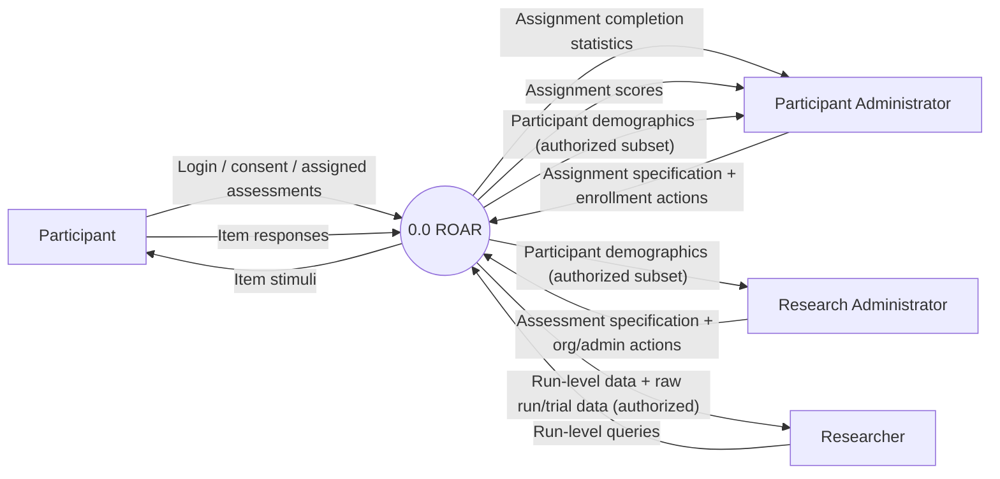

## Level 1 DFD (User-Facing Processes)

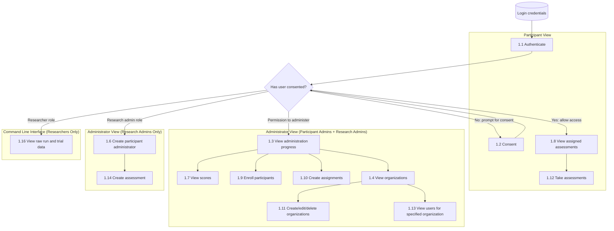

## Level 2 DFD (System-Level Processes)

Level 2 is visually dense. To make it maintainable we represent it here as:

- A shared system component map, then
- Process-focused sub-diagrams aligned to the Level 2 numbering.

### Level 2 — Shared System Components

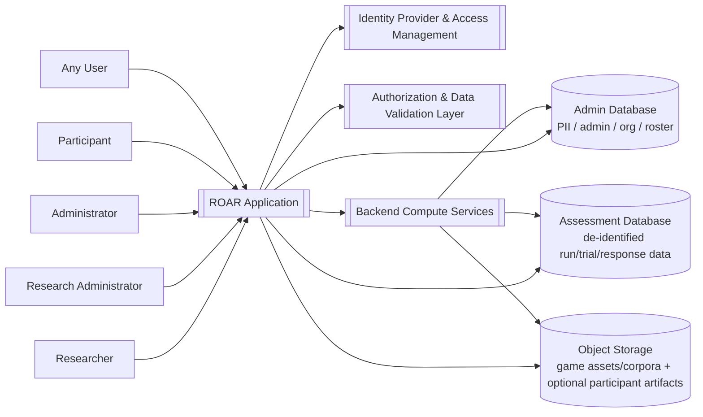

### 2.1–2.2 Authenticate + Consent (Gatekeeping)

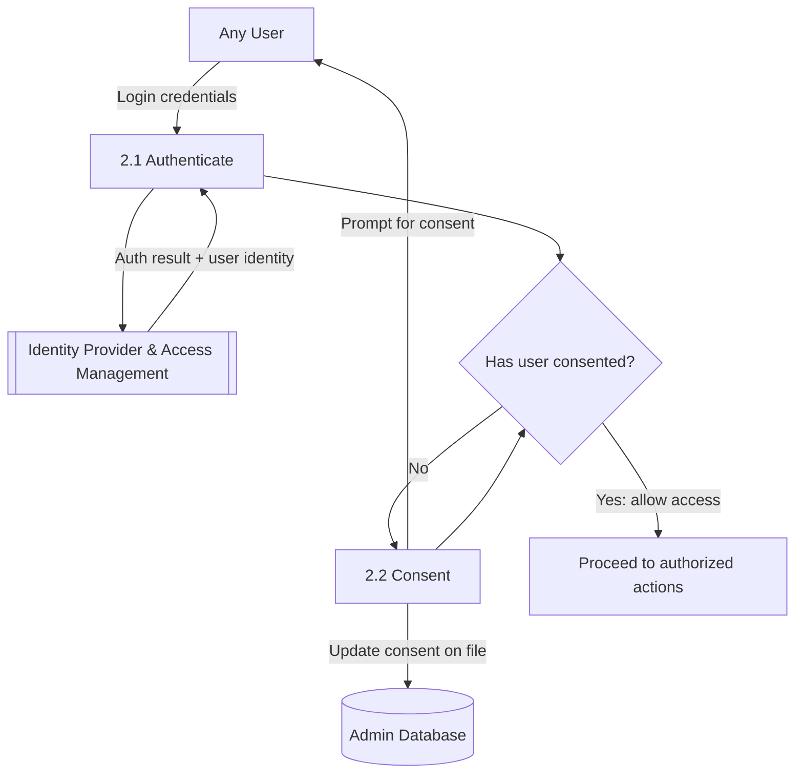

### 2.3–2.4 View Assigned Assessments + Take Assessments

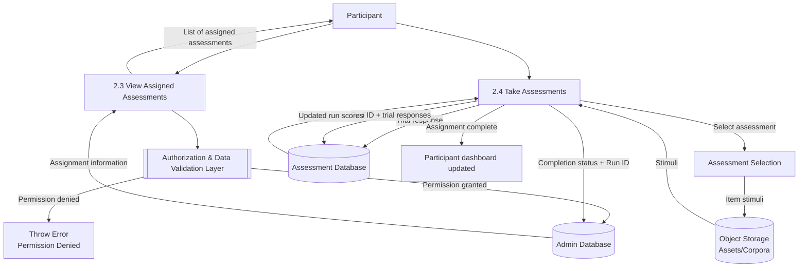

### 2.6–2.7 View Scores + View Administration Progress

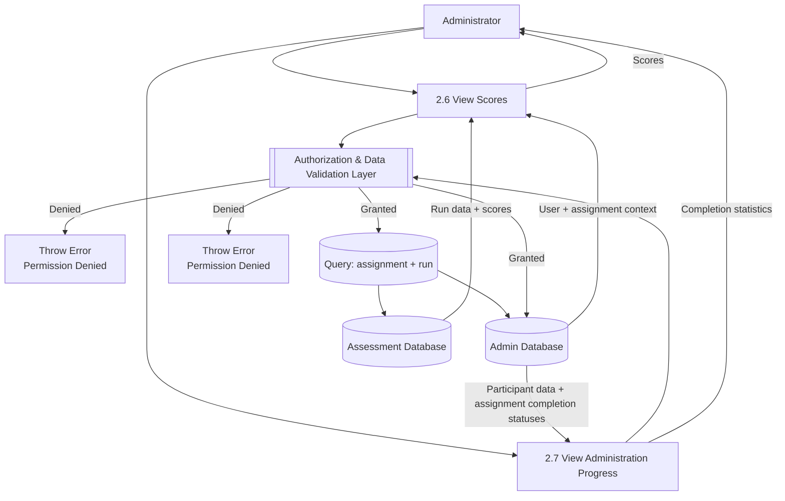

### 2.8–2.9 Enroll Participants + Create Assignments (with Backend Sync)

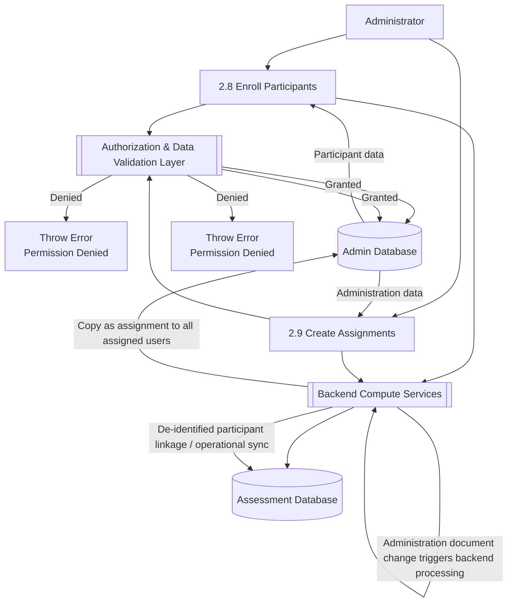

### 2.10–2.12 Organizations + View Users for Organization

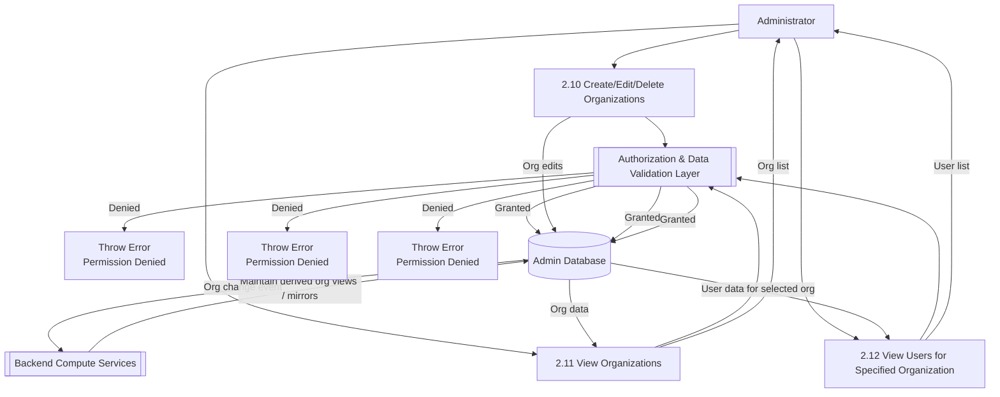

### 2.13 Create Participant Administrator

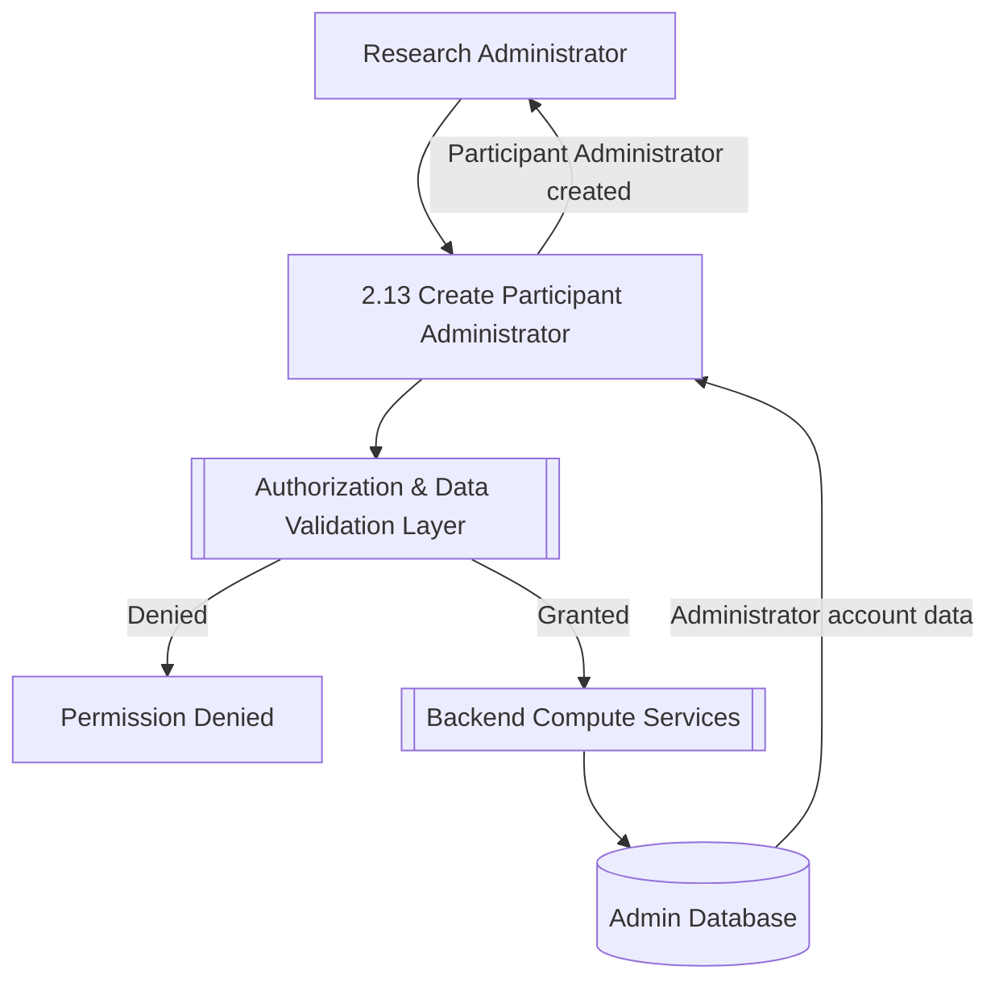

### 2.14 Create Assessment + Assets/Corpora

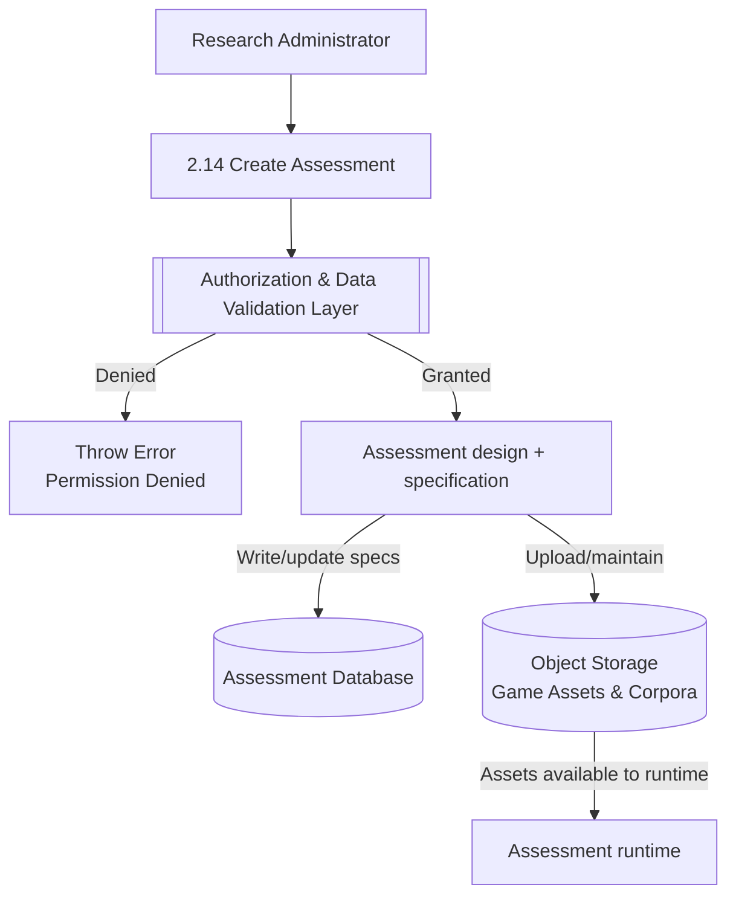

### 2.16 View Raw Run and Trial Data (Researcher CLI)

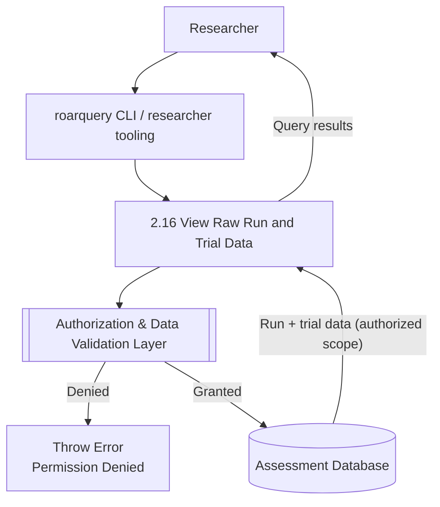

## Notes for Maintainers

- The "Admin Database" vs "Assessment Database" split is intentional: it supports PII separation and de-identified analytics/scoring.
- "Backend Compute Services" covers both event-driven sync and batch-ish operations (and can include vendor-agnostic ELT steps, provided they run inside your environment and don't create new external data recipients).
- "Object Storage" is used for assets/corpora and can be extended for participant artifacts (e.g., audio/video) if that's in scope.
