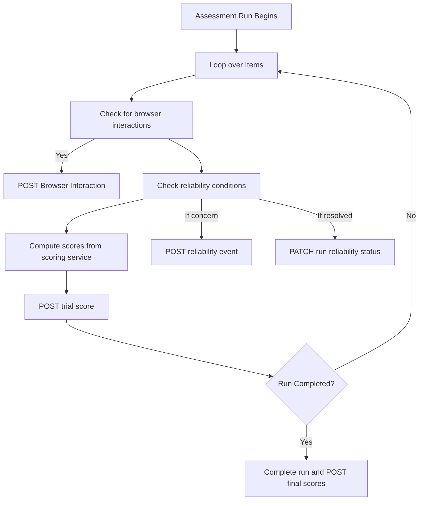

# ROAR Scoring System: Technical Specification

## 1. Purpose and Scope

This specification defines how the ROAR ecosystem generates, stores, computes, validates, and retrieves scores associated with task runs. It supports:

- Trial-level and run-level score handling
- Final vs. partial score storage
- Reliability tracking
- Browser interaction tracking
- Score update auditing
- Persistent post-run score storage
- On-demand score computation from item responses
- Score validation submitted by external clients

The API is grouped under the `/api/scoring/` namespace to support extensibility and clear separation from task execution flows.

## 2. System Overview

### Definitions

- **Run**: An attempt by a user to complete a task.

- **Trial**: A single stimulus-response interaction within a task.

- **Run Scores vs. Trial Scores**: in-progress, item-level scoring and run-level (summary) scoring are treated as conceptually and structurally distinct.

  - **Run Scores**, referred to hereafter as simply **scores**, are stored once at the completion of an assessment. They are derived from the full set of a user's item responses.

  - **Trial scores** are real-time estimates and are updated throughout the task after each trial.

  Scores and trial scores are stored in separate database tables.

- **Raw Score**: Direct count/aggregation from item correctness (e.g., total correct, total incorrect, total attempted). Ability estimates from computer adaptive testing are also considered raw scores (e.g., theta estimates and standard errors).

- **Computed Score**: Derived from raw scores via normalization, statistical transformations. This include percentile scores and standard scores.

- **Score Name**: A string representing the name of a particular score (e.g., "percentile," "num_correct", or "ROAR score"). This field can be any arbitrary string.

- **Score Type**: Either "raw" or "computed." See the definitions above.

- **Assessment Phase**: Indicates the testing stage of the assessment run. Acceptable values are:

  - "practice" – Practice or warm-up activity
  - "test" – Core task run used for scoring

  In the design below, we use a string `phase` field to capture this information instead of a boolean `is_practice` field so that we can extend the types of phases in the future (e.g., to add a "review" phase).

- **Assessment Domain**: The skill or subdomain being measured by a particular score within an assessment. A single task may report multiple domains if it includes blocks targeting different subskills (e.g., sound deletion or first-sound matching in a phonological awareness assessment). The `domain` field will default to `"composite"` if not specified, indicating that the score is relevant to the entire assessment.

- **Reliability**: A judgement about whether or not a run results in valid scores. In question form, "would a researcher believe that the scores resulting from this run accurately reflect the user's abilities?" Reliability judgements can evolve over the course of a run or after researcher reviews.

- **Reliability Events**: Events that indicate issues with the validity or trustworthiness of a run. Examples include response times being too fast or patterned guessing. Reliability events are the evidence upon which a final reliability decision is made.

### Component Flow Diagram



## Runtime Behavior

- During each trial, the task computes trials via `POST /api/scoring/compute` and submits trial-level scores via `POST /api/scoring/trial-scores`.
- The task also records browser interactions and submits them via `POST /api/scoring/browser/interactions`.
- The run may be annotated with reliability events via `POST /api/scoring/reliability-events`.
- These reliability events may me marked as resolved if the task determines that they should not invalidate the run.
- After a run completes, final scores are submitted via `POST /api/scoring/scores`.
- If the run is abandoned, a post-processing job may promote trial scores into a partial score record via `POST /api/scoring/scores with status=partial`.
- Scores may be updated later by researchers or staff, with all changes logged.

## Edge Cases and Error Handling

| Scenario                           | Behavior                                                      |
|------------------------------------|---------------------------------------------------------------|
| Run completed normally             | Scores logged with status = 'final'                          |
| Run ended early but is usable      | Trial scores promoted; scores logged with status = 'partial' |
| Run aborted with insufficient data | No scores logged                                              |
| Researcher updates score           | Append entry to `score_update_log`                           |
| Reliability issue detected         | Add entry to `reliability_events` and update run metadata     |

## Design Rationale

- Encapsulating scoring endpoints in `/api/scoring/*`
  - Distinguishes between persistent and transient scoring operations
  - Designs for future support (IRT, model versioning, audit trails)
  - Enables QA, partner integrations, and downstream analytics
- **Separation of trial and final scores**: Enables real-time feedback and post-hoc evaluation without cluttering the final scores table.
- **Partial scoring**: Promotes best-effort summaries when assessments terminate early.
- **Reliability metadata**: Keeps qualitative annotations separate from numeric scores.
- **Update auditing**: Supports transparent revision history without modifying core data.
- **Domain and phase fields**: Allow disaggregated and nuanced reporting across subskills and assessment stages.

## 7. API Contract

### `POST /api/scoring/compute`

Computes scores (raw, computed, IRT) from item responses. This simply returns scores and does not write to the database.

#### `/api/scoring/compute` request

```json
POST /api/scoring/compute
{
  "task_slug": "roar-word",
  "item_responses": [
    { "phase": "test", "a": 1, "b": 0, "c": 0, "d": 1, "correct": true },
    { "phase": "test", "a": 1, "b": 0, "c": 0, "d": 1, "correct": false },
  ],
}
```

#### `/api/scoring/compute` response

```json
{
  "scores": [
    {
      "name": "total_correct",
      "value": 1,
      "type": "raw",
      "domain": "composite",
      "phase": "test",
    },
    {
      "name": "theta_estimate",
      "value": -0.85,
      "type": "raw",
      "domain": "composite",
      "phase": "test"
    },
    {
      "name": "theta_se",
      "value": 0.1,
      "type": "raw",
      "domain": "composite",
      "phase": "test"
    },
    {
      "name": "percentile",
      "value": 48.2,
      "type": "computed",
      "domain": "composite",
      "phase": "test"
    },
    {
      "name": "standard_score",
      "value": 180,
      "type": "computed",
      "domain": "composite",
      "phase": "test"
    },
  ]
}
```

### `POST /api/scoring/validate`

Validates provided scores against computed results

#### `/api/scoring/validate` request

```json
POST /api/scoring/validate
{
  "task_slug": "roar-word",
  "item_responses": [
    { "phase": "test", "a": 1, "b": 0, "c": 0, "d": 1, "correct": true },
    { "phase": "test", "a": 1, "b": 0, "c": 0, "d": 1, "correct": false },
  ],
  "scores": [
    { "name": "total_correct", "value": 1, "type": "raw", "domain": "composite", "phase": "test", },
    { "name": "theta_estimate", "value": -0.85, "type": "raw", "domain": "composite", "phase": "test" },
    { "name": "theta_se", "value": 0.1, "type": "raw", "domain": "composite", "phase": "test" },
    { "name": "percentile", "value": 48.2, "type": "computed", "domain": "composite", "phase": "test" },
    { "name": "standard_score", "value": 180, "type": "computed", "domain": "composite", "phase": "test" },
  ]
}
```

#### `/api/scoring/validate` response

If valid, returns

```json
{ "valid": true }
```

If invalid, returns

```json
{
  "valid": false,
  "discrepancies": [
    {
      "name": "total_correct",
      "phase": "test",
      "domain": "composite",
      "type": "computed",
      "expected": 1,
      "received": 2
    }
  ]
}
```

### `POST /api/scoring/reliability-events`

Records a reliability event for a run.

```json
POST /api/scoring/reliability-events
{
  "run_id": 123,
  "user_id": 456,
  "task_id": 789,
  "variant_id": 444,
  "assignment_id": 923,
  "reason": "Mean RT under 200ms for 5+ trials",
  "reason_code": "fast_response"
}
```

### `PATCH /api/scoring/reliability-events/{run_id}`

Marks all reliability events for a run as resolved.

```json
PATCH /api/scoring/reliability-events/{run_id}
{
  "resolution": "Run behavior normalized after block 2",
  "resolution_code": "recovered"
}
```

### `POST /api/scoring/browser-interactions`

Captures a browser interaction during a trial.

```json
POST /api/scoring/browser-interactions
{
  "trial_id": 789,
  "run_id": 123,
  "user_id": 456,
  "task_id": 789,
  "variant_id": 444,
  "assignment_id": 923,
  "interaction_type": "fullscreen_exit",
  "metadata": { "window_width": 1024, "window_height": 768 }
}
```

### `POST /api/scoring/scores`

Creates final or partial scores for a completed or aborted run.

```json
POST /api/scoring/scores
{
  "run_id": 123,
  "user_id": 456,
  "task_id": 789,
  "variant_id": 101,
  "assignment_id": 111,
  "scores": [
    {
      "name": "total_correct",
      "value": 1,
      "type": "raw",
      "domain": "composite",
      "phase": "test",
    },
    {
      "name": "theta_estimate",
      "value": -0.85,
      "type": "raw",
      "domain": "composite",
      "phase": "test"
    },
    {
      "name": "theta_se",
      "value": 0.1,
      "type": "raw",
      "domain": "composite",
      "phase": "test"
    },
    {
      "name": "percentile",
      "value": 48.2,
      "type": "computed",
      "domain": "composite",
      "phase": "test"
    },
    {
      "name": "standard_score",
      "value": 180,
      "type": "computed",
      "domain": "composite",
      "phase": "test"
    },
  ]
}
```

### `POST /api/scoring/trial-scores`

Writes a single score from an individual trial (typically in dev or adaptive scenarios).

```json
POST /api/scoring/trial-scores
{
  "trial_id": 213,
  "run_id": 123,
  "user_id": 456,
  "task_id": 789,
  "variant_id": 101,
  "assignment_id": 111,
  "scores": [
    {
      "name": "total_correct",
      "value": 1,
      "type": "raw",
      "domain": "composite",
      "phase": "test",
    },
    {
      "name": "theta_estimate",
      "value": -0.85,
      "type": "raw",
      "domain": "composite",
      "phase": "test"
    },
    {
      "name": "theta_se",
      "value": 0.1,
      "type": "raw",
      "domain": "composite",
      "phase": "test"
    },
    {
      "name": "percentile",
      "value": 48.2,
      "type": "computed",
      "domain": "composite",
      "phase": "test"
    },
    {
      "name": "standard_score",
      "value": 180,
      "type": "computed",
      "domain": "composite",
      "phase": "test"
    },
  ]
}
```

## 8. SQL Schema

### `scores`

```sql
CREATE TABLE scores (
  id UUID PRIMARY KEY DEFAULT gen_random_uuid(),
  run_id UUID REFERENCES runs(id) ON DELETE CASCADE,
  task_id UUID REFERENCES tasks(id),
  variant_id UUID REFERENCES variants(id),
  user_id UUID REFERENCES users(id),
  assignment_id UUID REFERENCES assignments(id),
  value INTEGER NOT NULL,
  name TEXT NOT NULL,
  type TEXT CHECK (type IN ('raw', 'computed')),
  phase TEXT CHECK (phase IN ('practice', 'test')) default 'test',
  domain TEXT DEFAULT 'composite',
  status TEXT CHECK (status in ('final', 'partial', 'invalid')),
  created_at TIMESTAMP DEFAULT now()
);
```

### `trial_scores`

```sql
CREATE TABLE trial_scores (
  id UUID PRIMARY KEY DEFAULT gen_random_uuid(),
  trial_id UUID REFERENCES trials(id) ON DELETE CASCADE,
  run_id UUID REFERENCES runs(id) ON DELETE CASCADE,
  task_id UUID REFERENCES tasks(id),
  variant_id UUID REFERENCES variants(id),
  user_id INTEGER REFERENCES users(id),
  assignment_id INTEGER REFERENCES assignments(id),
  value INTEGER NOT NULL,
  name TEXT NOT NULL,
  type TEXT CHECK (type IN ('raw', 'computed')),
  phase TEXT CHECK (phase IN ('practice', 'test')) default 'test',
  domain TEXT DEFAULT 'composite',
  created_at TIMESTAMP DEFAULT now()
);
```

### `score_update_log`

```sql
CREATE TABLE score_update_log (
  id UUID PRIMARY KEY DEFAULT gen_random_uuid(),
  score_id UUID REFERENCES scores(id) ON DELETE CASCADE,
  old_domain TEXT NOT NULL,
  old_phase TEXT NOT NULL,
  old_type TEXT NOT NULL,
  old_value INTEGER NOT NULL,
  new_domain TEXT NOT NULL,
  new_phase TEXT NOT NULL,
  new_type TEXT NOT NULL,
  new_value INTEGER NOT NULL,
  updated_by UUID REFERENCES user(id),
  updated_at TIMESTAMP DEFAULT now(),
  reason TEXT
);
```

### `reliability_events`

```sql
CREATE TABLE reliability_events (
  id UUID PRIMARY KEY DEFAULT gen_random_uuid(),
  run_id UUID REFERENCES runs(id) ON DELETE CASCADE,
  user_id UUID REFERENCES users(id),
  task_id UUID REFERENCES tasks(id),
  variant_id UUID REFERENCES variants(id),
  assignment_id UUID REFERENCES assignments(id),
  reason TEXT,
  reason_code TEXT CHECK (
    reason_code IN (
      'fast_response',
      'blurred_focus',
      'fullscreen_exit',
      'inconsistent_response',
      'low_accuracy',
      'manual_review'
    )
  ),
  resolution TEXT,
  resolution_code TEXT CHECK (
    resolution_code IN (
      'recovered',
      'invalidated',
      'manual_review'
    )
  ),
  resolved_by UUID REFERENCES users(id),
  created_at TIMESTAMP DEFAULT now()
);
```

### `browser_interactions`

```sql
CREATE TABLE browser_interactions (
  id UUID PRIMARY KEY DEFAULT gen_random_uuid(),
  trial_id UUID REFERENCES trials(id) ON DELETE CASCADE,
  run_id UUID REFERENCES runs(id) ON DELETE CASCADE,
  user_id UUID REFERENCES users(id) ON DELETE CASCADE,
  interaction_type TEXT CHECK (
    interaction_type IN ('focus', 'blur', 'fullscreen_enter', 'fullscreen_exit')
  ) NOT NULL,
  timestamp TIMESTAMP DEFAULT now(),
  metadata JSONB
);
```

### `runs` Table Schema Changes

```sql
-- Add reliability_status with a constraint
ALTER TABLE runs
ADD COLUMN reliability_status TEXT CHECK (
  reliability_status IN ('reliable', 'unreliable', 'questionable')
) DEFAULT 'reliable';

-- Add reliable as a generated column for binary logic
ALTER TABLE runs
ADD COLUMN reliable BOOLEAN GENERATED ALWAYS AS (
  reliability_status = 'reliable'
) STORED;
```

## Migration Plan

- Scores are currently stored in `runs` documents in Firestore but are converted into a separate table using BigQuery. We will use these BigQuery views to populate the new `scores` table in Postgres.
- Derive reliability flags from existing metadata where available and populate `reliability_flags`.
- `trial_scores` will not be backfilled.
- Introduce `score_update_log` forward-looking only — no need to backfill.
- Update all scoring-related API endpoints to align with new schema.
- The `/api/scoring/compute` and `/api/scoring/validate` endpoints (and any services required to support them) will be the last to be implemented. The delivery date for those services and endpoints is after the larger "backend" refactoring of Q3 2025.

## Summary

The ROAR scoring system is built for flexibility, reproducibility, and auditability. By clearly separating trial data, final scores, and reliability annotations, we support both exploratory research and robust production-grade deployment.
