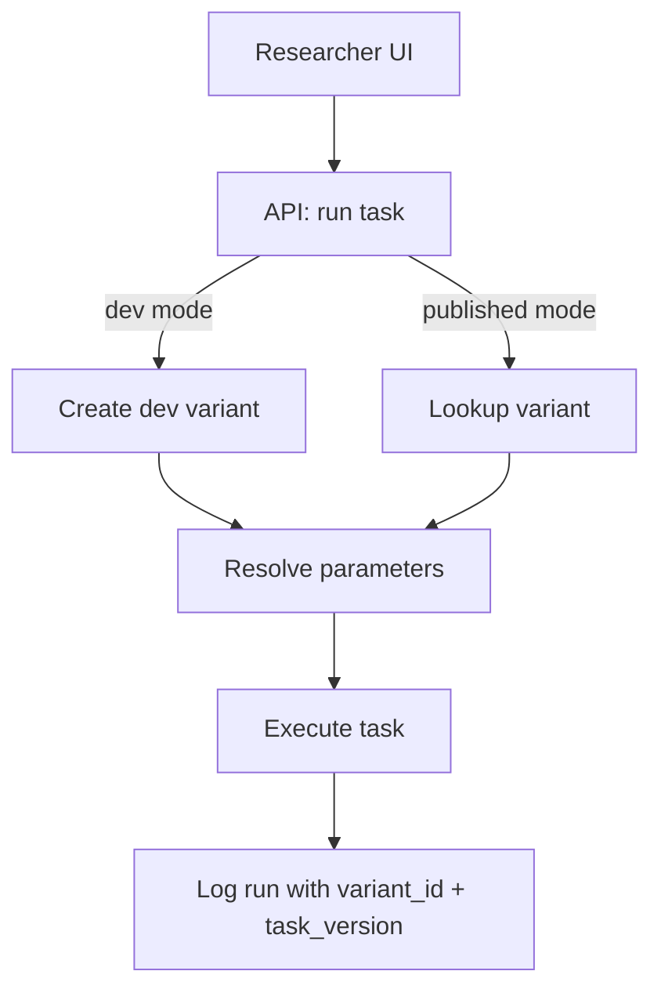

# ROAR Task Configuration and Variant System: Technical Specification

## Purpose and Scope

ROAR supports configurable tasks used in assessments. This document defines the technical specification for how researchers interact with configurable ROAR tasks, including:

* Creating and referencing **variants** (parameter configurations)
* Versioning **tasks**
* Supporting a flexible yet reproducible **dev mode**
* Executing and logging **task runs**

This spec ensures consistency, auditability, and scalability across both development and production contexts.

---

## System Overview

The ROAR task system consists of the following components:

* **Tasks**: Assessment units with parameterizable behavior

  A task is a unit of assessment content and logic (e.g., "ROAR Word"). Tasks are versioned to allow for backwards-compatible and breaking changes.

* **Task Versions**: Versioned logic and default handling per task

  A specific, versioned implementation of a task (e.g., v1.2.0). Task versions define default parameter values and behavior. Changes to logic, scoring, or parameter handling result in a new task version.

* **Variants**: Immutable parameter sets identified by a stable `variant_id`

  A variant is a unique, immutable configuration of a task's parameters. It is identified by a variant ID, which acts like a DOI. Once created, it will always refer to the same parameter set.

* **Variant Status**: `dev`, `published`, or `deprecated`

  A variant can be in one of three states: `dev`, `published`, or `deprecated`. The `dev` state indicates that the variant is in development and is not yet ready for production use. The `published` state indicates that the variant is ready for production use and is available for use in assessments. The `deprecated` state indicates that the variant is no longer recommended for use in assessments but is preserved for historical reproducibility or auditability.

* **Task Spec**: `{ variant_id, task_version }` — uniquely defines runtime behavior

  A Task Spec is the pair `{ variant_id, task_version }`. This combination fully determines the behavior of a task run, including default parameters, logic, and scoring. It is important to realize that the variant_id is not tied to any specific task version. The same variant_id may be used with different task versions, and it is the combination of variant_id and task_version — the Task Spec — that determines the full behavior of a task run.

* **Runs**: Executions of a task with a specific `variant_id` and `task_version`

  A run is a specific instance of a student or researcher interacting with a task. Every run references a variant_id and a task_version_id, allowing the exact task behavior to be reconstructed from the database.

### Component Flow Diagram



## Runtime Behavior by Mode

### Published Mode

* Researcher specifies a known `variant_id`
* System fetches parameter set from `variant_parameters`
* Task version defaults to the version pinned in the ROAR-dashboard dependencies (if task is launched from the dashboard) or the latest stable release (if task is launched as a standalone web application).
* Runtime merges parameters with task version's defaults
* Run is executed and logged with `variant_id`, `task_version_id`

### Dev Mode

::: info Reproducibility in Dev Mode

Dev-mode runs may use unpublished or unversioned code. While the parameter configuration is stored, exact task behavior may not be fully reproducible unless the development environment is version-controlled and pinned. The task_version_id for dev runs may be null or reference a placeholder.
:::

* Researcher provides a custom parameter set
* Because dev mode may include unversioned or unpublished code changes, the `task_version_id` logged for dev runs may be set to `NULL`, or a special placeholder (e.g., `"unversioned-dev"`) to indicate non-reproducibility. These runs are not guaranteed to be reproducible even though their variant parameters are stored.
* System auto-mints a new variant with `status = "dev"`.
* System logs a variant status change to `variant_status_log`.
* Variants with `status = "dev"` are not shown in public researcher dashboards or included in standard reporting or analytics views. This ensures that only validated, production-ready variants are visible for data analysis or deployment purposes.
* A `variant_id` is generated and stored in `variants`
* Task is run with that variant and task version
* Run is logged with the new `variant_id`
* A dev variant can be promoted to a published variant by toggling `status = "published"` and adding a name/description. In this case, the system also logs a variant status change to `variant_status_log`.

---

## Edge Cases and Error Handling

| Scenario                                             | Expected Behavior                                |
| ---------------------------------------------------- | ------------------------------------------------ |
| Missing `variant_id` in published mode               | 400 error with message "variant\_id is required" |
| Missing parameter value                              | Task resolves using defaults; log warning        |
| Unknown parameter or invalid value in production     | Task throws error and halts execution            |
| Dev-mode variant identical to existing published one | Deduplicate by comparing canonical param hash    |
| Attempt to promote already published variant         | No-op; return existing variant info              |
| Unknown parameter in dev mode                        | Allow execution, but log a warning that the parameter is not recognized by the current task version. This supports flexibility while helping researchers catch typos or misconfigurations.  |
| Running a dev or deprecated variant in production    | Reject request with 400 or 403 error. Dev variants are not permitted in production. |

---

## Design Rationale

* **Separation of variant and version** allows stable IDs while supporting evolving task logic
* **Variant ID as immutable key** ensures reproducibility and clean version control
* **Dev variants stored as real variants** avoids custom logic for freeform runs, simplifying the schema
* **Task Spec abstraction** clearly captures full execution context for a run
* **Use of a status field** to differentiate between published and dev variants allows for future lifecycle states.

---

## API Contract

### `POST /api/runs`

Creates a new run

* In published mode, it uses a supplied `variant_id`
* In dev mode, it mints a new dev variant (if needed) using the provided parameters

#### Dev Mode Request

```json
POST /api/runs
{
  "task_slug": "swr",
  "task_version": "v2.0.0",
  "parameters": { "num_items": 8, "shuffle": true },
  "user_id": 12345
}
```

#### Published Mode Request

```json
POST /api/runs
{
  "task_slug": "swr",
  "task_version": "v2.0.0",
  "variant_id": 123,
  "user_id": 12345
}
```

#### Response

```json
{
  "run_id": 12345,
  "user_id": 12345,
  "task_slug": "swr",
  "task_version": "v2.0.0",
  "variant_id": 123,
  "parameters": {
    "num_items": 8,
    "shuffle": true
  },
  "status": "dev",
}
```

### `GET /api/runs/{run_id}`

Returns metadata for a specific run.

```json
{
  "run_id": 12345,
  "user_id": 12345,
  "task_slug": "swr",
  "task_version": "v2.0.0",
  "variant_id": 123,
  "parameters": {
    "num_items": 8,
    "shuffle": true
  },
  "status": "dev",
}
```

### `GET /api/tasks/`

Returns metadata for all available tasks.

### `GET /api/tasks/{task_slug}`

Returns metadata for a specific task.

### `GET /api/tasks/{task_slug}/versions`

Returns metadata for all available versions of a specific task. Dev variants are excluded by default.

### `POST /api/variants/{variant_id}/change_status`

Changes the status of a variant. Valid statuses are `"dev"`, `"published"`, and `"deprecated"`.

```json
POST /api/variants/{variant_id}/change_status
{
  "status": "published"
}
```

Response:

```json
{
  "variant_id": 123,
  "status": "published"
}
```

---

## SQL Schema

### `tasks`

```sql
CREATE TABLE tasks (
  id SERIAL PRIMARY KEY,
  slug TEXT UNIQUE NOT NULL,
  display_name TEXT NOT NULL,
  description TEXT,
  created_at TIMESTAMP DEFAULT now()
);
```

### `task_versions`

```sql
CREATE TABLE task_versions (
  id SERIAL PRIMARY KEY,
  task_id INTEGER REFERENCES tasks(id) ON DELETE CASCADE,
  version TEXT NOT NULL,
  description TEXT,
  created_at TIMESTAMP DEFAULT now(),
  UNIQUE(task_id, version)
);
```

### `variants`

```sql
CREATE TABLE variants (
  id SERIAL PRIMARY KEY,
  task_id INTEGER REFERENCES tasks(id) ON DELETE CASCADE,
  variant_id TEXT UNIQUE NOT NULL,
  name TEXT,
  description TEXT,
  status TEXT CHECK (status IN ('dev', 'published', 'deprecated')) NOT NULL DEFAULT 'dev',
  created_at TIMESTAMP DEFAULT now()
);
```

### `variant_parameters`

```sql
CREATE TABLE variant_parameters (
  id SERIAL PRIMARY KEY,
  variant_id INTEGER REFERENCES variants(id) ON DELETE CASCADE,
  name TEXT NOT NULL,
  value JSONB NOT NULL,
  type TEXT,
  UNIQUE(variant_id, name)
);
```

### `variant_status_log`

```sql
CREATE TABLE variant_status_log (
  id SERIAL PRIMARY KEY,
  variant_id INTEGER REFERENCES variants(id),
  status TEXT CHECK (status IN ('dev', 'published', 'deprecated')) NOT NULL,
  changed_at TIMESTAMP DEFAULT now()
  changed_by INTEGER REFERENCES users(id)
);
```

### `runs`

```sql
CREATE TABLE runs (
  id SERIAL PRIMARY KEY,
  user_id INTEGER REFERENCES users(id) ON DELETE CASCADE,
  task_version_id INTEGER REFERENCES task_versions(id),
  variant_id INTEGER REFERENCES variants(id) NOT NULL,
  created_at TIMESTAMP DEFAULT now()
  -- Note: This schema only includes fields relevant to the task/variant system.
  -- Additional run metadata (e.g. device info, session ID, assignment ID, etc.) will be added in future extensions to the ROAR documentation.
);
```

---

## Migration Plan

* Migrate existing Firestore variants into the `variants` and `variant_parameters` tables
* Migrate the `registered` field to the `status` field.
* Deprecate the `registered` field for tasks. Instead tasks should be considered "published" if they have any published variants.
* Dev-mode Firestore runs can be replayed into SQL by minting variants
* Legacy tasks may require shimming in the API to handle missing variant metadata
* After migration, new runs must go through the SQL-backed system

---

## Summary

This spec provides a consistent, extensible, and reproducible system for managing task configuration and execution in ROAR. The abstraction of a **Task Spec = { variant ID, task version }** enables clarity for researchers, traceability for engineers, and scalability for the system.
