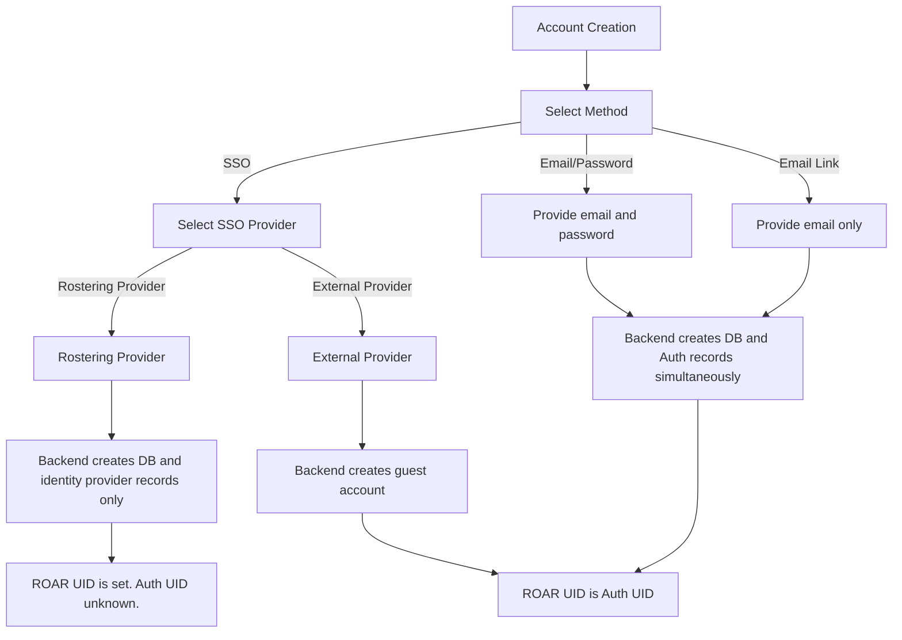
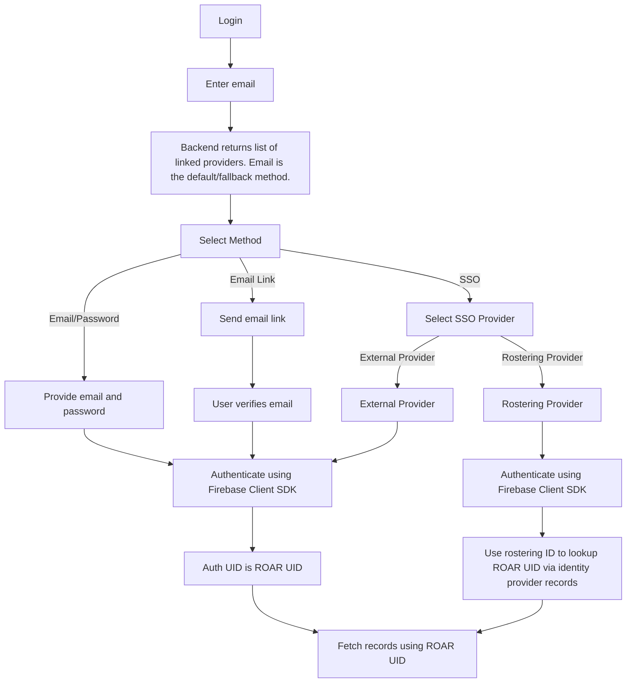
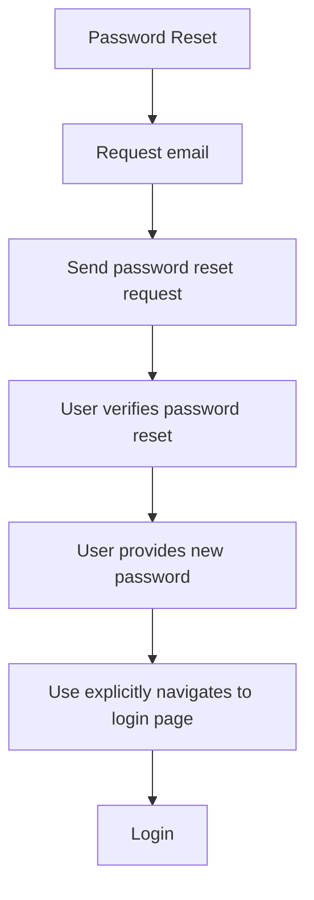

# Authentication Technical Specification

::: warning Draft Notice

This document is a work in progress and is subject to change.
:::

## Overview

## Authentication Flow

### Account Creation

### Login

### Password Reset

