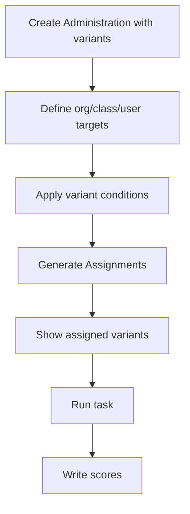

# ROAR Administrations & Assignments: Technical Specification

## Purpose and Scope

This spec defines how ROAR handles administration of tasks to users. It includes support for assigning variants to students based on org membership, grade level, or other attributes, and for controlling delivery order and optionality of specific variants.

## System Overview

Administrations and assignments enable educators and researchers to schedule groups of students to take specific task variants during a defined time period. This system ensures clarity, structure, and traceability for large-scale or longitudinal assessments.

### Definitions

* **Administration**: A bundle of variants scheduled for delivery between two dates. Defines ordering and target audience. Only one run per user per variant per administration is selected for scoring.
* **Administration Variant**: A variant included in the administration with metadata (order, required, conditional).
* **Administration Targets**: Defines whether the administration is scoped to a district, school, class, user, etc.
* **Administration Series**: For use cases requiring repeated, scheduled assessments (e.g., weekly benchmarks or longitudinal studies), ROAR uses administration series. An administration series is a collection of administrations that share the same variants and targets.
* **Assignment**: A resolved per-user instance of an administration.
* **Assignment Variant**: A resolved per-user variant from an administration.

### Component Flow Diagram



## Runtime Behavior

* Admins define variants in an administration with optional conditions.
* Users are assigned via organization membership or direct targeting.
* System resolves which variants apply to which user (based on org membership and variant conditions like grade).
* Users complete their assigned variants via the dashboard.
* Resulting runs and scores are linked to the assignment and administration.

## Edge Cases and Error Handling

| Scenario                                | Behavior                                |
| --------------------------------------- | --------------------------------------- |
| Variant condition not met               | Variant excluded from user’s assignment |
| Multiple targets (user + class) overlap | Deduplicate assignments                 |
| Optional variant                        | Shown in UI with "optional" label       |
| Variant fails to load                   | Skip or retry policy defined at runtime |

## Design Rationale

* Separation of admin and assignment layers enables flexible targeting.
* Variant-level conditions support differential assignment logic
* Assignments support both ordered and unordered variant sets.
* Administration series support repeatable or longitudinal patterns without duplicating logic.

## API Contract

::: warning This section is under construction

The ROAR administration API is currently in development and is not yet available.
:::

## SQL Schema

### `administrations`

```sql
CREATE TABLE administrations (
  id UUID PRIMARY KEY DEFAULT gen_random_uuid(),
  name TEXT NOT NULL,
  public_name TEXT,
  description TEXT,
  series_id UUID REFERENCES administration_series(id) ON DELETE CASCADE,
  series_index INTEGER,
  start_date DATE NOT NULL,
  end_date DATE NOT NULL,
  is_ordered BOOLEAN DEFAULT false,
  created_at TIMESTAMP DEFAULT now(),
  updated_at TIMESTAMP DEFAULT now(),
  deleted_at TIMESTAMP,
);
```

Both `series_id` and `series_index` are optional. An administration may exist independently outside of any series.

### `administration_series`

```sql
CREATE TABLE administration_series (
  id UUID PRIMARY KEY DEFAULT gen_random_uuid(),
  name TEXT NOT NULL,
  public_name TEXT,
  description TEXT,
  schedule_type TEXT CHECK (schedule_type IN ('fixed', 'rolling')),
  recurrence_interval_unit TEXT,  -- e.g., 'WEEKLY', 'DAILY'
  recurrence_interval_value INTEGER,  -- e.g., every 1 week
  total_occurrences INTEGER,  -- number of administrations to generate
  start_date DATE,
  duration_days INTEGER,
  created_at TIMESTAMP DEFAULT now(),
  updated_at TIMESTAMP DEFAULT now(),
  deleted_at TIMESTAMP,
);
```

There are two scheduling types:

* Fixed series (`schedule_type = 'fixed'`): Each administration has an explicit `start_date` and `end_date`, defined at creation time. All participants share the same calendar window. The `start_date` and `end_date` for the administration with series index `series_index` are calculated using the following pseudo-code:

  ```ts
  const interval = getRecurrenceIntervalDateTimeDelta(recurrence_interval_unit, recurrence_interval_value);
  const start_date = start_date + series_index * interval;
  const end_date = start_date + duration_days;
  ```

  Use case: Assign a task every Monday for 4 weeks

* Rolling series (`schedule_type = 'rolling'`): Participants are assigned an `enrollment_date`, and each administration's effective window is computed relative to that date. The `start_date` and `end_date` for the administration with series index `series_index` are calculated using the following pseudo-code:

  ```ts
  const interval = getRecurrenceIntervalDateTimeDelta(recurrence_interval_unit, recurrence_interval_value);
  const start_date = enrollment_date + series_index * interval;
  const end_date = start_date + duration_days;
  ```

  Use case: Each participant takes 10 sessions weekly starting from their enrollmentment date.

### `administration_series_variants` and `administration_variants`

```sql
CREATE TABLE administration_series_variants (
  id UUID PRIMARY KEY DEFAULT gen_random_uuid(),
  administration_series_id UUID REFERENCES administration_series(id) ON DELETE CASCADE,
  variant_id UUID REFERENCES variants(id) ON DELETE CASCADE,
  order_index INTEGER,
  assignment_conditions JSONB,
  requirement_conditions JSONB,
  created_at TIMESTAMP DEFAULT now(),
  updated_at TIMESTAMP DEFAULT now(),
  deleted_at TIMESTAMP,
);

CREATE TABLE administration_variants (
  id UUID PRIMARY KEY DEFAULT gen_random_uuid(),
  administration_id UUID REFERENCES administrations(id) ON DELETE CASCADE,
  variant_id UUID REFERENCES variants(id) ON DELETE CASCADE,
  order_index INTEGER,
  assignment_conditions JSONB,
  requirement_conditions JSONB,
  created_at TIMESTAMP DEFAULT now(),
  updated_at TIMESTAMP DEFAULT now(),
  deleted_at TIMESTAMP,
);
```

To distinguish when to assign a variant from when it is required to be completed, we use two separate condition trees:

* assignment_condition_json: logic for whether the variant is assigned to a user.

* requirement_condition_json: logic for whether the assigned variant is required (as opposed to optional).

This allows us to

* Assign a variant to many users but require only a subset to complete it.

* Mark some assigned variants as optional (if requirement conditions are not met).

Both of these fields store a JSONB object that encodes the full conditional logic as a tree, with `AND` and `OR` operators as internal nodes and leaf nodes representing field-based conditions. For example,

```json
{
  "AND": [
    { "field": "age", "operator": "<=", "value": "12" },
    {
      "OR": [
        { "field": "school_level", "operator": "=", "value": "elementary" },
        { "field": "school_level", "operator": "=", "value": "middle" }
      ]
    }
  ]
}
```

You can nest `AND` and `OR` operators to arbitrary depth. The leaf nodes are always of the form `{ field, operator, value }`.

When the condition JSON is `NULL`, it means that the condition is always true. And when we want the condition always to evaluate to false, we can use `{ "type": "const", "value": false }`. The following table shows different scenarios for the assignment and required conditions:

| Scenario                                       | `assignment_condition_json` | `requirement_condition_json`          |
| ---------------------------------------------- | --------------------------- | ------------------------------------- |
| Assigned and required for all                  | `NULL`                      | `NULL`                                |
| Assigned to all, optional                      | `NULL`                      | `{ "type": "const", "value": false }` |
| Assigned to all, conditionally required        | `NULL`                      | JSON condition                        |
| Conditionally assigned, required               | JSON condition              | `NULL`                                |
| Conditionally assigned, optional               | JSON condition              | `{ "type": "const", "value": false }` |
| Conditionally assigned, conditionally required | JSON condition              | JSON condition                        |

### `administration_series_targets` and `administration_targets`

```sql
CREATE TABLE administration_series_targets (
  id UUID PRIMARY KEY DEFAULT gen_random_uuid(),
  administration_series_id UUID REFERENCES administration_series(id) ON DELETE CASCADE,
  target_id UUID,
  target_type TEXT CHECK (target_type IN ('org', 'class', 'user')),
  created_at TIMESTAMP DEFAULT now(),
  updated_at TIMESTAMP DEFAULT now(),
  deleted_at TIMESTAMP,
);

CREATE TABLE administration_targets (
  id UUID PRIMARY KEY DEFAULT gen_random_uuid(),
  administration_id UUID REFERENCES administrations(id) ON DELETE CASCADE,
  target_id UUID,
  target_type TEXT CHECK (target_type IN ('org', 'class', 'user')),
  created_at TIMESTAMP DEFAULT now(),
  updated_at TIMESTAMP DEFAULT now(),
  deleted_at TIMESTAMP,
);
```

### `assignments`

```sql
CREATE TABLE assignments (
  id UUID PRIMARY KEY DEFAULT gen_random_uuid(),
  administration_id UUID REFERENCES administrations(id) ON DELETE CASCADE,
  user_id UUID REFERENCES users(id) ON DELETE CASCADE,
  started_at TIMESTAMP,
  completed_at TIMESTAMP,
  status TEXT CHECK (status IN ('not_started', 'in_progress', 'completed', 'skipped')) DEFAULT 'not_started',
  created_at TIMESTAMP DEFAULT now(),
  updated_at TIMESTAMP DEFAULT now(),
  deleted_at TIMESTAMP,
);
```

### `assignment_variants`

```sql
CREATE TABLE assignment_variants (
  id UUID PRIMARY KEY DEFAULT gen_random_uuid(),
  administration_id UUID REFERENCES administrations(id) ON DELETE CASCADE,
  assignment_id UUID REFERENCES assignments(id) ON DELETE CASCADE,
  variant_id UUID REFERENCES variants(id) ON DELETE CASCADE,
  order_index INTEGER,
  is_required BOOLEAN DEFAULT true,
  status TEXT CHECK (status IN ('not_started', 'in_progress', 'completed', 'skipped')) DEFAULT 'not_started',
  started_at TIMESTAMP,
  completed_at TIMESTAMP,
  created_at TIMESTAMP DEFAULT now(),
  updated_at TIMESTAMP DEFAULT now(),
  deleted_at TIMESTAMP,
);
```

### `runs`

```sql
CREATE TABLE runs (
  id UUID PRIMARY KEY DEFAULT gen_random_uuid(),
  administration_id UUID NOT NULL REFERENCES administrations(id),
  assignment_id UUID NOT NULL REFERENCES assignments(id),
  assignment_variant_id UUID NOT NULL REFERENCES assignment_variants(id),
  user_id UUID NOT NULL REFERENCES users(id),

  -- User demographics snapshot at run creation
  user_age_in_months_at_run INTEGER NOT NULL,
  gender_at_run TEXT,
  grade_at_run TEXT REFERENCES grade_levels(name),
  race_at_run TEXT[],
  hispanic_ethnicity_at_run BOOLEAN,
  frl_status_at_run frl_status_enum,
  iep_status_at_run BOOLEAN,
  ell_status_at_run BOOLEAN,

  variant_id UUID NOT NULL REFERENCES variants(id),
  task_version_id UUID NOT NULL REFERENCES task_versions(id),
  task_id UUID NOT NULL REFERENCES tasks(id),
  started_at TIMESTAMP NOT NULL,
  completed_at TIMESTAMP,
  status TEXT NOT NULL CHECK (status IN ('not_started', 'in_progress', 'completed', 'skipped')) DEFAULT 'not_started',
  use_for_reporting BOOLEAN DEFAULT false,
  created_at TIMESTAMP DEFAULT now(),
  updated_at TIMESTAMP DEFAULT now(),
  deleted_at TIMESTAMP,
);
```

### `run_targets`

```sql
CREATE TABLE run_targets (
  id UUID PRIMARY KEY DEFAULT gen_random_uuid(),
  run_id UUID NOT NULL REFERENCES runs(id),
  target_id UUID,
  target_type TEXT CHECK (target_type IN ('org', 'class', 'user')),
  created_at TIMESTAMP DEFAULT now(),
  updated_at TIMESTAMP DEFAULT now(),
  deleted_at TIMESTAMP,
);
```

We must also ensure that there is at most one "used for reporting" run per `(assignment_id, variant_id, user_id)`.

```sql
CREATE UNIQUE INDEX one_reporting_run_per_assignment_variant_user
ON runs(assignment_id, variant_id, user_id)
WHERE use_for_reporting = true;
```

## Administration stats

It is important to report administration progress statistics. For example, for a given administration:

* How many assignments have been created?
* How many assignments have been started?
* How many assignments have been completed?
* There are versions of all of the above questions but grouped by variant or task.

We can use this query to get the total number of assignees for a given administration:

```sql
SELECT COUNT(*) FROM assignments WHERE administration_id = :admin_id;
```

We can use the following SQL query to get the number of assignments with different statuses for a given administration:

```sql
SELECT
  COUNT(*) AS total_reporting_runs,
  COUNT(*) FILTER (WHERE status = 'started') AS started,
  COUNT(*) FILTER (WHERE status = 'completed') AS completed
FROM runs
WHERE administration_id = :admin_id
  AND use_for_reporting = true;
```

We can group those results by `task_id` using the following query:

```sql
SELECT
  task_id,
  COUNT(*) AS total,
  COUNT(*) FILTER (WHERE status = 'started') AS started,
  COUNT(*) FILTER (WHERE status = 'completed') AS completed
FROM runs
WHERE administration_id = :admin_id
  AND use_for_reporting = true
GROUP BY task_id;
```

Similarly, we can group those results by `variant_id`:

```sql
SELECT
  variant_id,
  COUNT(*) AS total_reporting_runs,
  COUNT(*) FILTER (WHERE status = 'started') AS started,
  COUNT(*) FILTER (WHERE status = 'completed') AS completed
FROM runs
WHERE administration_id = :admin_id
  AND use_for_reporting = true
GROUP BY variant_id;
```

And we can group by `org_id` using

```sql
SELECT
  rt.target_id AS org_id,
  COUNT(*) AS total,
  COUNT(*) FILTER (WHERE r.status = 'started') AS started,
  COUNT(*) FILTER (WHERE r.status = 'completed') AS completed
FROM runs r
JOIN run_targets rt ON r.id = rt.run_id
WHERE r.administration_id = :admin_id
  AND r.use_for_reporting = true
  AND rt.target_type = 'org'
GROUP BY rt.target_id;
```

or by `class_id` if we change the `rt.target_type` filter to `class`. We can even further group these results by `variant_id` using

```sql
SELECT
  rt.target_id AS org_id,
  r.variant_id,
  COUNT(*) AS total,
  COUNT(*) FILTER (WHERE r.status = 'started') AS started,
  COUNT(*) FILTER (WHERE r.status = 'completed') AS completed
FROM runs r
JOIN run_targets rt ON r.id = rt.run_id
WHERE r.administration_id = :admin_id
  AND r.use_for_reporting = true
  AND rt.target_type = 'org'
GROUP BY rt.target_id, r.variant_id;
```

## Migration Plan

* Backfill existing administrations from Firestore.
* Backfill existing administration_variants from Firestore. They are currently stored in the administration documents themselves.
* Backfill existing assignment and requirement conditions from Firestore. They are currently stored in the administraiton documents themselves.
* Backfill existing assignments from Firestore.
* Backfill existing assignment_variants from Firestore. They are currently stored in the assignment documents themselves.

## Summary

This design allows flexible, condition-aware scheduling of task variants across users. It supports both required and optional content, ordered delivery, and individualized assignment resolution based on user attributes.
