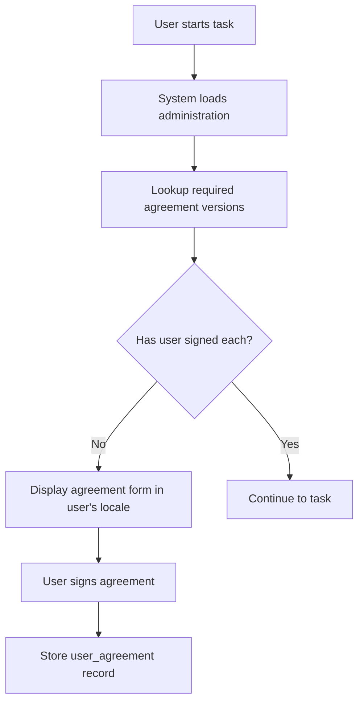

# ROAR Agreements: Technical Specification

## Purpose and Scope

This document defines the technical design and runtime behavior of the ROAR "Agreements" system. It is responsible for presenting, storing, and tracking user acceptance of various types of agreements, including Terms of Service (TOS), assent forms for minors, and consent forms for adults. The system ensures that users are only prompted to sign agreements they have not previously accepted, and it supports multiple agreement versions and translations.

## System Overview

The Agreements system manages:

* Versioned agreement definitions and content
* Multi-language support for agreement presentation
* Per-user agreement acceptance tracking
* Administration-level association with required agreements

### Definitions

* **Agreement Type**: Assent, consent, or terms of service (TOS)
* **Agreement**: A logical category of agreement (e.g., "baseline assent", "eye tracking consent").
* **Agreement Version**: A specific version of an agreement with fixed legal content.
* **Agreement Translation**: A localized version of an agreement version's content.
* **User Agreement**: A record that a user has signed a particular agreement version.

### Component Flow Diagram



## Runtime Behavior

1. When a user begins a task, the system identifies the administration it belongs to.
2. It queries the `administration_agreements` table for required agreements.
3. For each agreement, it checks whether the user has signed that version in `user_agreements`.
4. If not, it presents the agreement content in the user's preferred locale (fallback to English).
5. On acceptance, it inserts a `user_agreements` record with timestamp and signed locale.
6. The user proceeds only after signing all required agreements.

## Edge Cases and Error Handling

| Scenario                                     | Behavior                            |
| -------------------------------------------- | ----------------------------------- |
| User has already signed the required version | Proceed without prompting           |
| User has signed a different version          | Prompt to sign the required version |
| Agreement translation missing for locale     | Fallback to English                 |
| Agreement version missing or inactive        | Block task and log error            |
| User tries to skip signing                   | Block progression and show error    |
| User signs agreement but fails to store      | Show retry or contact support       |

## Design Rationale

* Versioning allows legal compliance over time as agreement text evolves.
* Multi-language support enables accessibility and equity.
* Decoupling content and logic supports reusable agreement types across multiple administrations.
* Storing agreement content in DB ensures transactional integrity and simplifies backups/version control.
* Single current version per agreement ensures clarity and avoids ambiguity in enforcement.

## API Contract

### `GET /api/users/:user_id/administration/:administration_id/agreements/pending`

Returns a list of agreement versions the user must sign before proceeding.

### `POST /api/users/:user_id/agreements/:agreement_version_id/sign`

Marks the agreement version as signed.

```json
{
  "signed_locale": "en"
}
```

## SQL Schema

```sql
CREATE TABLE agreements (
  id UUID PRIMARY KEY DEFAULT gen_random_uuid(),
  name TEXT UNIQUE NOT NULL,
  agreement_type TEXT NOT NULL CHECK (agreement_type IN ('tos', 'assent', 'consent')),
  requires_minor BOOLEAN NOT NULL DEFAULT FALSE
);

CREATE TABLE agreement_versions (
  id UUID PRIMARY KEY DEFAULT gen_random_uuid(),
  agreement_id UUID NOT NULL REFERENCES agreements(id),
  created_at TIMESTAMP DEFAULT CURRENT_TIMESTAMP,
  is_current BOOLEAN NOT NULL DEFAULT FALSE
);

-- Enforce only one current version per agreement
CREATE UNIQUE INDEX one_current_version_per_agreement
ON agreement_versions(agreement_id)
WHERE is_current;

CREATE TABLE agreement_translations (
  id UUID PRIMARY KEY DEFAULT gen_random_uuid(),
  agreement_version_id UUID NOT NULL REFERENCES agreement_versions(id),
  github_filename TEXT,     -- e.g., "agreements/assent/eye_tracking/v2_en.html"
  github_commit_sha TEXT,   -- e.g., "f9e8d7c6..."
  github_repo TEXT,
  created_at TIMESTAMP,
  locale TEXT NOT NULL,
  content TEXT NOT NULL,
  UNIQUE (agreement_version_id, locale)
);

CREATE TABLE administration_agreements (
  id UUID PRIMARY KEY DEFAULT gen_random_uuid(),
  administration_id UUID NOT NULL REFERENCES administrations(id),
  agreement_version_id UUID NOT NULL REFERENCES agreement_versions(id),
  UNIQUE (administration_id, agreement_version_id)
);

CREATE TABLE user_agreements (
  id UUID PRIMARY KEY DEFAULT gen_random_uuid(),
  user_id UUID NOT NULL REFERENCES users(id) ON DELETE CASCADE,
  agreement_version_id UUID NOT NULL REFERENCES agreement_versions(id),
  signed_at TIMESTAMP NOT NULL DEFAULT CURRENT_TIMESTAMP,
  signed_locale TEXT NOT NULL,
  UNIQUE (user_id, agreement_version_id)
);
```

## Migration Plan

1. Deploy new schema with the above tables.
1. Migrate existing agreement content from GitHub `roar-legal-docs` repo to the `agreement translations` table.
1. Write GitHub action to populate new `agreements`, `agreement_versions`, and `agreement_translations` when GitHub legal docs are updated.
1. Backfill any existing acceptances (from `user` document's `legal` field) if applicable.
1. Update task start logic to check `user_agreements` before proceeding.
1. Build admin UI to assign agreement versions to administrations.
1. Build multilingual form rendering component.

## Summary

This spec introduces a robust, versioned, and multilingual agreements framework that integrates with the administration lifecycle. It ensures legal compliance, user clarity, and runtime efficiency.
