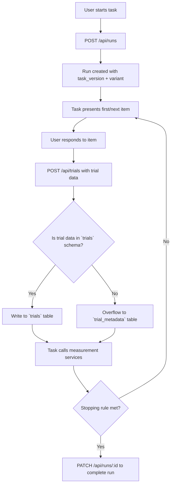

# ROAR Assessment Execution: Technical Specification

## Purpose and Scope

This document defines the runtime and API specification for executing a ROAR task. It details the lifecycle of a task run and defines schema for run and trial data. It relies on the [task configuration technical spec](task-configuration.md) to define how the system handles parameter resolution and how variant identity and task versioning are used to ensure reproducibility and flexibility.

## System Overview

### Definitions

* **Run**: A logged instance of a user executing a task, referencing a variant and task version.
* **Trial**: A single interaction within a run (e.g., one item or stimulus-response pair).

### Run Lifecycle

* A run is initiated every time that a task is launched.
  * If it is launched from the ROAR dashboard, the user initiates an interaction to launch the task. The task client then triggers `POST /api/runs`.
  * If it is launched as a standalone web application, the task client generally triggers `POST /api/runs` immediately on load.
* A run may exist in three states:
  * `in_progress`
  * `completed`
  * `abandoned`
* A run is initiated in the `in_progress` state.
* A run is completed when the user triggers a stopping rule defined by the task (e.g., time limit, all items presented)
* A run is marked abandoned if left `in_progress` after a period of inactivity (timeout handled by backend job)
* A run may be retried if invalidated (manually or automatically)
* Runs start with `reliable = false` (a run with zero responses is not reliable) and are patched to `reliable = true` if the run is validated by the measurement service.

### Component Flow Diagram



## SQL Schema

### Runs

```sql
CREATE TABLE runs (
  id UUID PRIMARY KEY DEFAULT gen_random_uuid(),
  user_id UUID REFERENCES users(id) ON DELETE CASCADE,
  task_version_id UUID REFERENCES task_versions(id),
  variant_id UUID REFERENCES variants(id) NOT NULL,
  assignment_id UUID REFERENCES assignments(id),
  administration_id UUID REFERENCES administrations(id),
  status TEXT CHECK (status IN ('in_progress', 'completed', 'abandoned')),
  completed_at TIMESTAMP,
  reliable BOOLEAN DEFAULT false,
  environment_id UUID REFERENCES client_environments(id),
  created_at TIMESTAMP DEFAULT now(),
  updated_at TIMESTAMP DEFAULT now(),
  deleted_at TIMESTAMP,
);
```

### Client Environments

```sql
CREATE TABLE client_environments (
  id SERIAL PRIMARY KEY,
  device_type TEXT,
  resolution TEXT,
  locale TEXT,
  user_agent TEXT,
  platform TEXT,
  touch_capable BOOLEAN,
  created_at TIMESTAMP DEFAULT now(),
  updated_at TIMESTAMP DEFAULT now(),
  deleted_at TIMESTAMP,
  UNIQUE(device_type, resolution, locale, user_agent, platform, touch_capable)
);
```

### Trials

```sql
CREATE TABLE trials (
  id UUID PRIMARY KEY DEFAULT gen_random_uuid(),
  run_id UUID REFERENCES runs(id) ON DELETE CASCADE,
  trial_index INTEGER NOT NULL,
  trial_index_in_block INTEGER,
  trial_type TEXT,
  phase TEXT,
  task_id UUID REFERENCES tasks(id) ON DELETE CASCADE,
  variant_id UUID REFERENCES variants(id) ON DELETE CASCADE,
  domain TEXT,
  corpus_id TEXT,
  item_id TEXT,
  internal_node_id TEXT,
  stimulus TEXT,
  distractors JSONB,
  expected_response TEXT,
  response TEXT,
  button_response INT,
  keyboard_response TEXT,
  swipe_response TEXT,
  response_modality TEXT,
  is_correct BOOLEAN,
  rt INT,
  time_elapsed INT,
  start_time_unix INT,
  timestamp TIMESTAMP,
  timezone TEXT,
  audio_feedback TEXT,
  item_parameters JSONB,
  created_at TIMESTAMP DEFAULT now(),
  updated_at TIMESTAMP DEFAULT now(),
  deleted_at TIMESTAMP,
);
```

::: info Forward compatibility note

Note: In the future, we will implement `items`, `item_parameters`, `corpora`, and `corpora_items` tables to normalize item data.

* `item_id` allows future linkage to a normalized item bank but is optional for now. In the future, the item itself will store `stimulus`, `distractors`, and `expected_response`.
* `stimulus`, `distractors`, `expected_response` remain for backward compatibility and are passed directly by the task.
* Similarly, `item_parameters` will be stored in an `item_parameters` table. For now, `item_parameters` is supplied by the task and stored in `JSONB` in the `trials` table.
:::

### Trial Metadata (Flexible Key-Value Store)

```sql
CREATE TABLE trial_metadata (
  id UUID PRIMARY KEY DEFAULT gen_random_uuid(),
  run_id UUID REFERENCES runs(id) ON DELETE CASCADE,
  trial_id UUID REFERENCES trials(id) ON DELETE CASCADE,
  user_id UUID REFERENCES users(id) ON DELETE CASCADE,
  task_id UUID REFERENCES tasks(id) ON DELETE CASCADE,
  variant_id UUID REFERENCES variants(id) ON DELETE CASCADE,
  key TEXT NOT NULL,
  value JSONB NOT NULL,
  created_at TIMESTAMP DEFAULT now()
);
```

This table is used to record metadata for trial fields not covered by the structured `trials` schema. It is populated by an "overflow" mechanism in the trials API endpoint. Any fields that begin with `ext_` will be redirected to this table. Only fields that exist in the `trials` schema or that begin with `ext_` will be allowed in trials request payloads.

### Run Metadata (Flexible Key-Value Store)

```sql
CREATE TABLE run_metadata (
  id UUID PRIMARY KEY DEFAULT gen_random_uuid(),
  run_id UUID REFERENCES runs(id) ON DELETE CASCADE,
  user_id UUID REFERENCES users(id) ON DELETE CASCADE,
  task_id UUID REFERENCES tasks(id) ON DELETE CASCADE,
  variant_id UUID REFERENCES variants(id) ON DELETE CASCADE,
  key TEXT NOT NULL,
  value JSONB NOT NULL,
  created_at TIMESTAMP DEFAULT now()
);
```

This table allows for arbitrary metadata to be recorded at the run level. This may include contextual information such as session details, platform capabilities, or experimental flags, especially when not captured by the structured `client_environments` table. This table is populated by an "overflow" mechanism in the runs API endpoint. Any fields that begin with `ext_` will be redirected to this table. Only fields that exist in the `runs` schema or that begin with `ext_` will be allowed in runs request payloads.

### Metadata Registry View

```sql
CREATE VIEW metadata_registry AS
SELECT
  key,
  task_id,
  COUNT(*) AS frequency,
  MAX(created_at) AS last_seen_date
FROM trial_metadata
GROUP BY key, task_id;
```

This view allows developers and researchers to track which custom metadata fields are used across tasks. High-frequency fields may be reviewed for potential inclusion in the core `trials` schema.

## API Contract

### `POST /api/runs`

Creates a new run.

Request:

```json
POST /api/runs
{
  "task_slug": "roar-swr",
  "task_version": "v2.0.0",
  "variant_id": "123",
  "user_id": "12345"
}
```

Response:

```json
{
  "run_id": "12345",
  "task_slug": "roar-swr",
  "task_version": "v2.0.0",
  "variant_id": "123",
  "status": "in_progress",
  "parameters": {
    "num_items": 8,
    "shuffle": true
  },
  "variant_status": "dev"
}
```

### `GET /api/runs/{run_id}`

Returns metadata for a specific run.

Request:

```http
GET /api/runs/12345
```

Response:

```json
{
  "run_id": 12345,
  "user_id": 12345,
  "task_slug": "swr",
  "task_version": "v2.0.0",
  "variant_id": 123,
  "variant_status": "dev",
  "status": "in_progress",
  "parameters": {
    "num_items": 8,
    "shuffle": true
  },
}
```

### `PATCH /api/runs/{run_id}`

Updates a run.

#### Example: Complete a run

Request:

```http
PATCH /api/runs/12345
{
  "status": "completed"
}
```

Response:

```json
{
  "run_id": 12345,
  "changes": {
    "status": ["in_progress", "completed"]
  },
}
```

#### Example: Add extension metadata

Request:

```http
PATCH /api/runs/12345
{
  "ext_extension_field_1": "value",
  "ext_extension_field_2": "value",
  "ext_extension_field_3": "value"
}
```

Response:

```json
{
  "run_id": 12345,
  "changes": {
    "ext_extension_field_1": [null, "value"],
    "ext_extension_field_2": [null, "value"],
    "ext_extension_field_3": [null, "value"]
  },
}
```

### `POST /api/trials`

Creates a new trial.

Request:

```http
POST /api/trials
{
  "run_id": "12345",
  "trial_index": 0,
  "trial_index_in_block": 0,
  "trial_type": "item",
  "phase": "test",
  "task_id": "123",
  "variant_id": "123",
  "domain": "domain_a",
  "corpus_id": "123",
  "item_id": "123",
  "internal_node_id": "123",
  "stimulus": "What is this animal?",
  "distractors": ["dog", "bird", "fish"],
  "expected_response": "cat",
  "item_parameters": [
    { "model": "composite", "a": 1, "b": 0, "c": 0, "d": 1 },
    { "model": "sub-domain-a", "a": 1, "b": 0, "c": 0, "d": 1 },
    { "model": "sub-domain-b", "a": 1, "b": 0, "c": 0, "d": 1 },
  ],
  "response": "cat",
  "button_response": 1,
  "response_modality": "button",
  "is_correct": true,
  "rt": 400,
  "time_elapsed": 400,
  "start_time_unix": 1694000000,
  "timestamp": "2023-09-01T00:00:00Z",
  "timezone": "UTC",
  "audio_feedback": "correct",
  "ext_extension_field_1": "value",
  "ext_extension_field_2": "value",
  "ext_extension_field_3": "value"
}
```

Response:

```json
{
  "trial_id": "12345",
}
```

## Side Effects and Constraints

* Variants must be created and managed explicitly. Auto-minting of variants is no longer supported.
* Writing unexpected fields to trial or run data will redirect them to the appropriate metadata tables.
* Only published variants may be used in production task runs.

## Governance and Access Controls

* Any user executing a task may write to `trial_metadata` or `run_metadata` through the overflow mechanism
* Admin tools should monitor `metadata_registry` and allow tagging or discussion of high-frequency fields
* Schema change proposals can reference this registry as justification for extending `trials` or `runs` tables
* All overflow metadata keys must begin with `ext_` to ensure clarity and avoid collisions with future schema fields

## Design Rationale

* The `client_environments` table is kept normalized and strictly typed to ensure deduplication, support grouping analysis, and avoid schema bloat.
* The `trial_metadata` and `run_metadata` tables allow for extensible annotations without disrupting the core schema.
* Using the `ext_` prefix ensures that custom fields are clearly distinguished from standard fields, and encourages teams to maintain namespace hygiene. It prevents accidental proliferation of metadata fields due to misspelling (e.g. "repsonse" instead of "response").
* Overflow fields are redirected automatically to avoid data loss while preserving schema integrity.
* The `metadata_registry` view provides visibility into emergent schema usage, enabling governance based on actual field frequency and recency.
* Item-related fields such as `stimulus`, `expected_response`, and `distractors` are retained in the trials table to support current task logic, while `item_id` and `item_parameters` are introduced to facilitate a future transition to a normalized item bank with IRT scoring support.
