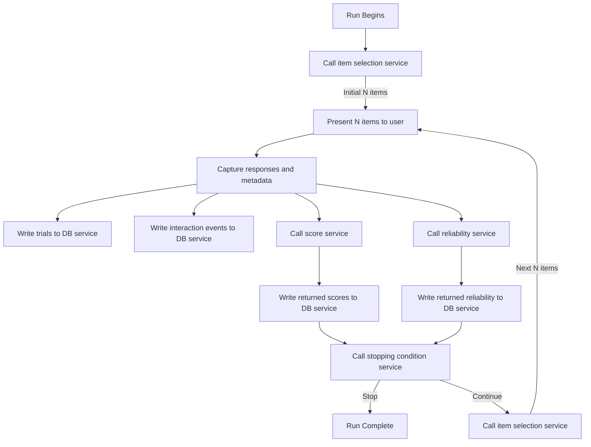

# ROAR Task Integration with Measurement Services: Technical Specification

## Purpose and Scope

This specification defines how the ROAR ecosystem generates, stores, computes, validates, and retrieves scores associated with task runs, and how tasks integrate with psychometric measurement services. It supports:

- Trial-level and run-level score handling
- Final vs. partial score storage
- Reliability tracking
- Browser interaction tracking
- Score update auditing
- Persistent post-run score storage
- On-demand score computation from item responses
- Score validation submitted by external clients
- Integration with stopping condition and item selection services

The API is grouped under the `/api/measurement/` namespace to support extensibility and clear separation from task execution flows.

## System Overview

### Definitions

- **Run**: An attempt by a user to complete a task.

- **Trial**: A single stimulus-response interaction within a task.

- **Run Scores vs. Trial Scores**: in-progress, item-level scoring and run-level (summary) scoring are treated as conceptually and structurally distinct.

  - **Run Scores**, referred to hereafter as simply **scores**, are stored once at the completion of an assessment. They are derived from the full set of a user's item responses.

  - **Trial scores** are real-time estimates and are updated throughout the task after each trial.

  Scores and trial scores are stored in separate database tables.

- **Raw Score**: Direct count/aggregation from item correctness (e.g., total correct, total incorrect, total attempted). Ability estimates from computer adaptive testing are also considered raw scores (e.g., theta estimates and standard errors).

- **Computed Score**: Derived from raw scores via normalization, statistical transformations. This include percentile scores and standard scores.

- **Score Name**: A string representing the name of a particular score (e.g., "percentile," "num_correct", or "ROAR score"). This field can be any arbitrary string.

- **Score Type**: Either "raw" or "computed." See the definitions above.

- **Assessment Phase**: Indicates the testing stage of the assessment run. Acceptable values are:

  - "practice" – Practice or warm-up activity
  - "test" – Core task run used for scoring

  In the design below, we use a string `phase` field to capture this information instead of a boolean `is_practice` field so that we can extend the types of phases in the future (e.g., to add a "review" phase).

- **Assessment Domain**: The skill or subdomain being measured by a particular score within an assessment. A single task may report multiple domains if it includes blocks targeting different subskills (e.g., sound deletion or first-sound matching in a phonological awareness assessment). The `domain` field will default to `"composite"` if not specified, indicating that the score is relevant to the entire assessment.

- **Reliability**: A judgement about whether or not a run results in valid scores. In question form, "would a researcher believe that the scores resulting from this run accurately reflect the user's abilities?" Reliability judgements can evolve over the course of a run or after researcher reviews.

- **Reliability Events**: Events that indicate issues with the validity or trustworthiness of a run. Examples include response times being too fast or patterned guessing. Reliability events are the evidence upon which a final reliability decision is made.

### Component Flow Diagram



## Runtime Behavior

The task runtime operates as a thin orchestrator. It presents items, collects responses and metadata, and invokes services to interpret that data. Services are invoked after each item chunk and may operate in parallel. In practice, the chunk size N is set to one. But tasks are designed to support arbitrary item chunk sizes. For each item chunk (size N):

1. Present Items: The task presents a chunk of N items to the user.
1. Capture Responses and Metadata, including:
   - Trial-level responses
   - Response timestamps
   - Interaction events (e.g., focus/blur, fullscreen)
   - Device-level metadata
   - Eye tracking data
1. Parallel Service Calls:
   - Database Writes:
     - POST /api/scoring/trial-scores (one per trial)
     - POST /api/scoring/browser-interactions (if applicable)
   - Score Computation:
     - Call the score service with trial-level response data
     - Receive a list of raw and computed scores
     - Write scores via POST /api/scoring/scores
   - Reliability Evaluation:
     - Call the reliability service with responses + interactions
     - Receive a judgment and optional list of reliability events
     - Write events via POST /api/scoring/reliability-events
     - Set reliability status via PATCH /api/runs/{run_id}
1. Stopping Condition Evaluation:
   - Call the stopping condition service with trial and run metadata
   - If should_stop = true, finalize the run
   - Otherwise, continue
1. Item Selection:
   - Call the item selection service
   - Present the next chunk of N items

- During each trial, the task computes trials via `POST /api/scoring/compute` and submits trial-level scores via `POST /api/scoring/trial-scores`.
- The task also records browser interactions and submits them via `POST /api/scoring/browser/interactions`.
- The run may be annotated with reliability events via `POST /api/scoring/reliability-events`.
- These reliability events may me marked as resolved if the task determines that they should not invalidate the run.
- After a run completes, final scores are submitted via `POST /api/scoring/scores`.
- If the run is abandoned, a post-processing job may promote trial scores into a partial score record via `POST /api/scoring/scores with status=partial`.
- Scores may be updated later by researchers or staff, with all changes logged.

## Edge Cases and Error Handling

| Scenario                           | Behavior                                                      |
|------------------------------------|---------------------------------------------------------------|
| Run completed normally             | Scores logged with status = 'final'                          |
| Run ended early but is usable      | Trial scores promoted; scores logged with status = 'partial' |
| Run aborted with insufficient data | No scores logged                                              |
| Score service unavailable          | Task retries or defers; run marked incomplete                 |
| Reliability service fails          | Reliability status left undefined or deferred                 |
| Stopping condition service fails   | Default stopping heuristic used (e.g., item count threshold)  |
| No items returned from selector    | Run ends with status = 'complete'                             |
| Reliability issue detected         | Add entry to `reliability_events` and update run metadata     |

## Design Rationale

- Measurement service abstraction separates raw data capture from psychometric logic; supports plugging in different scoring engines, stopping models, or reliability classifiers.
- Chunked item loop: Improves control over runtime memory, UI responsiveness, and async evaluation of trial data.
- Parallel service invocation: Decouples response collection from scoring and reliability computation; enables responsive UIs.
- Separation of scoring from reliability: Allows independent evaluation and debugging of accuracy vs. validity.
- Pluggable, injectable services: Supports experimentation, model versioning, and local vs. cloud-based execution.
- Explicit stopping and item selection logic: Makes adaptive behaviors testable, observable, and replaceable.
- Use of /api/measurement/ namespace: Reflects full scope of evaluation logic, not limited to scoring.
- Separation of trial and final scores: Enables real-time feedback and post-hoc evaluation without cluttering the final scores table.
- Partial scoring: Promotes best-effort summaries when assessments terminate early.
- Domain and phase fields: Allow disaggregated and nuanced reporting across subskills and assessment stages.

## Pluggable Services

::: warning Pluggable Services

These endpoints represent pluggable interfaces. Their implementation may vary by environment (e.g., local module, internal microservice, or remote API).

These services may be exposed publicly or remain internal-only, depending on how the system is deployed. Clients should treat this as a logical service contract rather than a fixed URL.

Do not hardcode assumptions about endpoint location or availability. If you're implementing a client, inject the service endpoint via configuration.
:::

### POST /internal/measurement/compute-scores

Computes scores (raw, computed, IRT) from item responses. This simply returns scores and does not write to the database.

Request:

```json
POST /internal/measurement/compute-scores
{
  "task_slug": "roar-word",
  "responses": [
    { "phase": "test", "domain": "blockA", "a": 1, "b": 0, "c": 0, "d": 1, "correct": true },
    { "phase": "test", "domain": "blockA", "a": 1, "b": 0, "c": 0, "d": 1, "correct": false },
  ],
}
```

Response:

```json
{
  "scores": [
    {
      "name": "total_correct",
      "value": 1,
      "type": "raw",
      "domain": "blockA",
      "phase": "test",
    },
    {
      "name": "total_correct",
      "value": 1,
      "type": "raw",
      "domain": "composite",
      "phase": "test",
    },
    {
      "name": "theta_estimate",
      "value": 0.91,
      "type": "raw",
      "domain": "blockA",
      "phase": "test"
    },
    {
      "name": "theta_se",
      "value": 0.08,
      "type": "raw",
      "domain": "blockA",
      "phase": "test"
    },
    {
      "name": "theta_estimate",
      "value": -0.85,
      "type": "raw",
      "domain": "composite",
      "phase": "test"
    },
    {
      "name": "theta_se",
      "value": 0.1,
      "type": "raw",
      "domain": "composite",
      "phase": "test"
    },
    {
      "name": "percentile",
      "value": 48.2,
      "type": "computed",
      "domain": "composite",
      "phase": "test"
    },
    {
      "name": "standard_score",
      "value": 180,
      "type": "computed",
      "domain": "composite",
      "phase": "test"
    },
  ]
}
```

### POST /internal/measurement/evaluate-reliability

Evaluates reliability of a task run based on response patterns and interaction data.

::: warning TODO
The Request/Response needs refinement.
:::

Request:

```json
POST /internal/measurement/evaluate-reliability
{
  "task_slug": "roar-word",
  "trials": [
    {
      "trial_id": "t1",
      "response_time_ms": 420,
      "correct": true,
      "response_pattern": "ABCD"
    },
    {
      "trial_id": "t2",
      "response_time_ms": 190,
      "correct": false,
      "response_pattern": "DDDD"
    }
  ],
  "interactions": [
    {
      "interaction_type": "fullscreen_exit",
      "timestamp": "2025-07-03T10:00:00Z",
      "trial_id": "t1",
      "metadata": { "window_width": 1024, "window_height": 768 }
    }
  ]
}
```

Response:

```json
{
  "reliable": false,
  "events": [
    {
      "reason": "Mean RT under 200ms for 5+ trials",
      "reason_code": "fast_response"
    },
    {
      "reason": "Fullscreen exited twice",
      "reason_code": "fullscreen_exit"
    }
  ]
}
```

### POST /internal/measurement/evaluate-stopping-condition

Determines whether the task should stop based on accumulated scores, standard error, item count, or elapsed time.

::: warning TODO
The Request/Response needs refinement.
:::

Request:

```json
POST /internal/measurement/evaluate-stopping-condition
{
  "task_slug": "roar-word",
  "elapsed_time_sec": 305,
  "num_items": 32,
  "theta_se": 0.12,
}
```

Response:

```json
{
  "should_stop": true,
  "reason": "Item count threshold reached",
  "reason_code": "item_count"
}
```

### POST /internal/measurement/select-items

Selects the next chunk of items based on current ability estimate and available item pool.

::: warning TODO
The Request/Response needs refinement.
:::

## API Contract

### `POST /api/measurement/validate`

Validates provided scores against computed results

#### `/api/measurement/validate` request

```json
POST /api/measurement/validate
{
  "task_slug": "roar-word",
  "item_responses": [
    { "phase": "test", "a": 1, "b": 0, "c": 0, "d": 1, "correct": true },
    { "phase": "test", "a": 1, "b": 0, "c": 0, "d": 1, "correct": false },
  ],
  "scores": [
    { "name": "total_correct", "value": 1, "type": "raw", "domain": "composite", "phase": "test", },
    { "name": "theta_estimate", "value": -0.85, "type": "raw", "domain": "composite", "phase": "test" },
    { "name": "theta_se", "value": 0.1, "type": "raw", "domain": "composite", "phase": "test" },
    { "name": "percentile", "value": 48.2, "type": "computed", "domain": "composite", "phase": "test" },
    { "name": "standard_score", "value": 180, "type": "computed", "domain": "composite", "phase": "test" },
  ]
}
```

#### `/api/measurement/validate` response

If valid, returns

```json
{ "valid": true }
```

If invalid, returns

```json
{
  "valid": false,
  "discrepancies": [
    {
      "name": "total_correct",
      "phase": "test",
      "domain": "composite",
      "type": "computed",
      "expected": 1,
      "received": 2
    }
  ]
}
```

### `POST /api/measurement/reliability-events`

Records a reliability event for a run.

```json
POST /api/measurement/reliability-events
{
  "run_id": uuid,
  "user_id": uuid,
  "task_id": uuid,
  "variant_id": uuid,
  "assignment_id": uuid,
  "trial_id": uuid,
  "reason": "Mean RT under 200ms for 5+ trials",
  "reason_code": "fast_response"
}
```

### `PATCH /api/measurement/reliability-events/{run_id}`

Marks all reliability events for a run as resolved.

```json
PATCH /api/measurement/reliability-events/{run_id}
{
  "resolution": "Run behavior normalized after block 2",
  "resolution_code": "recovered"
}
```

### `POST /api/measurement/browser-interactions`

Captures a browser interaction during a trial.

```json
POST /api/measurement/browser-interactions
{
  "trial_id": uuid,
  "run_id": uuid,
  "user_id": uuid,
  "task_id": uuid,
  "variant_id": uuid,
  "assignment_id": uuid,
  "interaction_type": "fullscreen_exit",
  "metadata": { "window_width": 1024, "window_height": 768 }
}
```

### `POST /api/measurement/scores`

Creates final or partial scores for a completed or aborted run.

```json
POST /api/measurement/scores
{
  "run_id": uuid,
  "user_id": uuid,
  "task_id": uuid,
  "variant_id": uuid,
  "assignment_id": uuid,
  "scores": [
    {
      "name": "total_correct",
      "value": 1,
      "type": "raw",
      "domain": "composite",
      "phase": "test",
    },
    {
      "name": "theta_estimate",
      "value": -0.85,
      "type": "raw",
      "domain": "composite",
      "phase": "test"
    },
    {
      "name": "theta_se",
      "value": 0.1,
      "type": "raw",
      "domain": "composite",
      "phase": "test"
    },
    {
      "name": "percentile",
      "value": 48.2,
      "type": "computed",
      "domain": "composite",
      "phase": "test"
    },
    {
      "name": "standard_score",
      "value": 180,
      "type": "computed",
      "domain": "composite",
      "phase": "test"
    },
  ]
}
```

### `POST /api/measurement/trial-scores`

Writes a single score from an individual trial (typically in dev or adaptive scenarios).

```json
POST /api/measurement/trial-scores
{
  "trial_id": uuid,
  "run_id": uuid,
  "user_id": uuid,
  "task_id": uuid,
  "variant_id": uuid,
  "assignment_id": uuid,
  "scores": [
    {
      "name": "total_correct",
      "value": 1,
      "type": "raw",
      "domain": "composite",
      "phase": "test",
    },
    {
      "name": "theta_estimate",
      "value": -0.85,
      "type": "raw",
      "domain": "composite",
      "phase": "test"
    },
    {
      "name": "theta_se",
      "value": 0.1,
      "type": "raw",
      "domain": "composite",
      "phase": "test"
    },
    {
      "name": "percentile",
      "value": 48.2,
      "type": "computed",
      "domain": "composite",
      "phase": "test"
    },
    {
      "name": "standard_score",
      "value": 180,
      "type": "computed",
      "domain": "composite",
      "phase": "test"
    },
  ]
}
```

## SQL Schema

### `scores`

```sql
CREATE TABLE scores (
  id UUID PRIMARY KEY DEFAULT gen_random_uuid(),
  run_id UUID REFERENCES runs(id) ON DELETE CASCADE,
  task_id UUID REFERENCES tasks(id),
  variant_id UUID REFERENCES variants(id),
  user_id UUID REFERENCES users(id),
  assignment_id UUID REFERENCES assignments(id),
  value INTEGER NOT NULL,
  name TEXT NOT NULL,
  type TEXT CHECK (type IN ('raw', 'computed')),
  phase TEXT CHECK (phase IN ('practice', 'test')) default 'test',
  domain TEXT DEFAULT 'composite',
  status TEXT CHECK (status in ('final', 'partial', 'invalid')),
  created_at TIMESTAMP DEFAULT now()
  updated_at TIMESTAMP DEFAULT now(),
  deleted_at TIMESTAMP,
);
```

### `trial_scores`

```sql
CREATE TABLE trial_scores (
  id UUID PRIMARY KEY DEFAULT gen_random_uuid(),
  trial_id UUID REFERENCES trials(id) ON DELETE CASCADE,
  run_id UUID REFERENCES runs(id) ON DELETE CASCADE,
  task_id UUID REFERENCES tasks(id),
  variant_id UUID REFERENCES variants(id),
  user_id INTEGER REFERENCES users(id),
  assignment_id INTEGER REFERENCES assignments(id),
  value INTEGER NOT NULL,
  name TEXT NOT NULL,
  type TEXT CHECK (type IN ('raw', 'computed')),
  phase TEXT CHECK (phase IN ('practice', 'test')) default 'test',
  domain TEXT DEFAULT 'composite',
  created_at TIMESTAMP DEFAULT now(),
  updated_at TIMESTAMP DEFAULT now(),
  deleted_at TIMESTAMP,
);
```

### `score_update_log`

```sql
CREATE TABLE score_update_log (
  id UUID PRIMARY KEY DEFAULT gen_random_uuid(),
  score_id UUID REFERENCES scores(id) ON DELETE CASCADE,
  old_domain TEXT NOT NULL,
  old_phase TEXT NOT NULL,
  old_type TEXT NOT NULL,
  old_value INTEGER NOT NULL,
  new_domain TEXT NOT NULL,
  new_phase TEXT NOT NULL,
  new_type TEXT NOT NULL,
  new_value INTEGER NOT NULL,
  updated_by UUID REFERENCES user(id),
  updated_at TIMESTAMP DEFAULT now(),
  reason TEXT
);
```

### `reliability_events`

```sql
CREATE TABLE reliability_events (
  id UUID PRIMARY KEY DEFAULT gen_random_uuid(),
  run_id UUID REFERENCES runs(id) ON DELETE CASCADE,
  user_id UUID REFERENCES users(id),
  task_id UUID REFERENCES tasks(id),
  variant_id UUID REFERENCES variants(id),
  assignment_id UUID REFERENCES assignments(id),
  trial_id UUID REFERENCES trials(id),
  reason TEXT,
  reason_code TEXT CHECK (
    reason_code IN (
      'fast_response',
      'blurred_focus',
      'fullscreen_exit',
      'inconsistent_response',
      'low_accuracy',
      'manual_review'
    )
  ),
  resolution TEXT,
  resolution_code TEXT CHECK (
    resolution_code IN (
      'recovered',
      'invalidated',
      'manual_review'
    )
  ),
  resolved_by UUID REFERENCES users(id),
  created_at TIMESTAMP DEFAULT now(),
  updated_at TIMESTAMP DEFAULT now(),
  deleted_at TIMESTAMP,
);
```

### `browser_interactions`

```sql
CREATE TABLE browser_interactions (
  id UUID PRIMARY KEY DEFAULT gen_random_uuid(),
  trial_id UUID REFERENCES trials(id) ON DELETE CASCADE,
  run_id UUID REFERENCES runs(id) ON DELETE CASCADE,
  user_id UUID REFERENCES users(id) ON DELETE CASCADE,
  interaction_type TEXT CHECK (
    interaction_type IN ('focus', 'blur', 'fullscreen_enter', 'fullscreen_exit')
  ) NOT NULL,
  timestamp TIMESTAMP DEFAULT now(),
  metadata JSONB,
  created_at TIMESTAMP DEFAULT now(),
  updated_at TIMESTAMP DEFAULT now(),
  deleted_at TIMESTAMP,
);
```

### `runs` Table Schema Changes

```sql
-- Add reliability_status with a constraint
ALTER TABLE runs
ADD COLUMN reliability_status TEXT CHECK (
  reliability_status IN ('reliable', 'unreliable', 'questionable')
) DEFAULT 'reliable';

-- Add reliable as a generated column for binary logic
ALTER TABLE runs
ADD COLUMN reliable BOOLEAN GENERATED ALWAYS AS (
  reliability_status = 'reliable'
) STORED;
```

## Migration Plan

- Scores are currently stored in `runs` documents in Firestore but are converted into a separate table using BigQuery. We will use these BigQuery views to populate the new `scores` table in Postgres.
- Derive reliability flags from existing metadata where available and populate `reliability_flags`.
- `trial_scores` will not be backfilled.
- Introduce `score_update_log` forward-looking only — no need to backfill.
- Update all scoring-related API endpoints to align with new schema.
- The `/api/scoring/compute` and `/api/scoring/validate` endpoints (and any services required to support them) will be the last to be implemented. The delivery date for those services and endpoints is after the larger "backend" refactoring of Q3 2025.

## Summary

The ROAR scoring system is built for flexibility, reproducibility, and auditability. By clearly separating trial data, final scores, and reliability annotations, we support both exploratory research and robust production-grade deployment.
