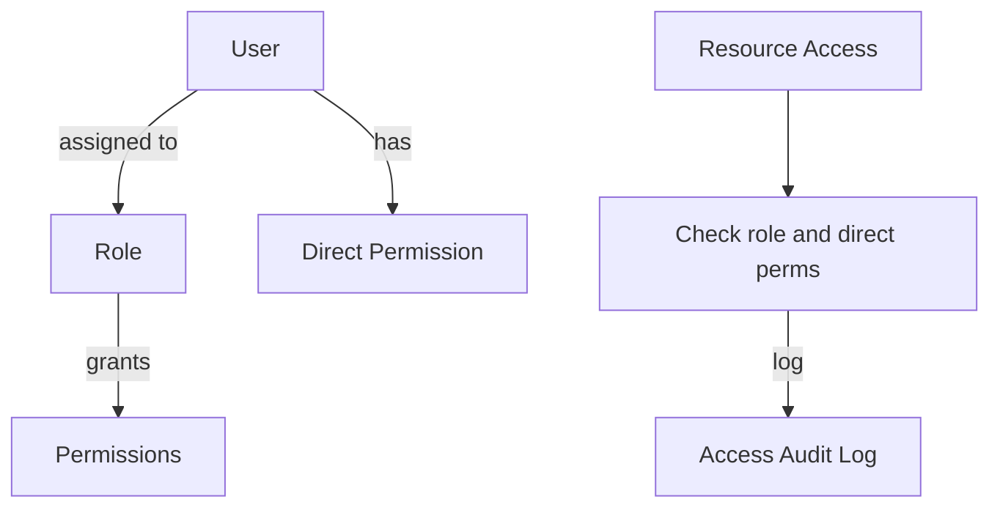

# ROAR Permissions: Technical Specification

ROAR uses a role-based access control (RBAC) system layered on top of org membership and identity resolution.

## Purpose and Scope

This document defines a role-based access control (RBAC) system for the ROAR platform. The system enables fine-grained access control to resources such as users, scores, runs, assignments, and organizations, supporting secure and auditable data access across educational roles (e.g., teachers, admins, researchers).

## System Overview

The system supports both:

* Role-based permissions: Users can be assigned roles scoped to specific entities (e.g., a user is a teacher for a class).

* Direct permissions: Users may also be granted explicit permissions on individual resources (e.g., access to a specific assignment).

Auditability and expiration of permissions are first-class features.

### Definitions

* **Permission**: A grant to perform an action (view, edit, delete, etc.) on a resource.

* **Role**: A named collection of permissions.

* **Entity**: A resource in the system (e.g., org, assignment, user, score, etc.).

* **Entity Type**: The class of object being protected (e.g., score, assignment). This corresponds to a database table.

* **Entity ID**: The unique ID that identifies the entity

* **Access Scope**: Permissions may be scoped to a specific instance of an entity.

* **Audit Logs**: System-generated records of data access or permission changes.

### Component Flow Diagram



## Runtime Behavior

* A user may have one or more roles on different resources (e.g., teacher for one class, observer in another).
* When accessing a resource, both role-based and direct permissions are evaluated.
* Expired permissions are ignored.
* Audit logs are recorded for every data access and permission change.
* A user's access is determined by
  * Their canonical user ID (resolved through `merged_into`, if present)
  * Their roles in specific orgs via `users_orgs`
  * The org type and permissions associated with that role

## Edge Cases and Error Handling

| Scenario                              | Expected Behavior                            |
| ------------------------------------- | -------------------------------------------- |
| Expired permission                    | Deny access                                  |
| Role deleted                          | All associated role\_permissions are revoked |
| User with no matching role/permission | 403 Forbidden                                |
| Invalid entity type in permission     | 400 error with schema validation             |
| Permission escalation attempt         | 403 Forbidden and alert logged               |

## Design Rationale

* RBAC model: Enables clean reuse and standardization of access rules.
* Fine-grained overrides: Enables flexible exceptions beyond roles.
* Expiration: Ensures temporary access (e.g., contract staff) is enforced automatically.
* Audit logs: Provide traceability for security and compliance.
* Future extensibility: New entity types and permission types can be added without schema redesign.
* Separation of Access and Mutation Auditing
  To support clear and auditable access control, we separate audit logs into two categories:

  * `access_audit_logs`: Tracks read and list access to sensitive resources such as scores, users, assignments, and runs. This log ensures visibility into who viewed what data and when, without cluttering the logs with update or creation actions.

  * `*_change_logs`: Tracks create, update, and delete operations on each table independently.

  This design offers the following benefits:

  * Clarity: Distinct logs for read vs. write access make security monitoring and enforcement easier to manage and audit. For example, access_audit_logs can be used for detecting data snooping, while permissions_change_log supports forensic analysis of permission changes.

  * Historical traceability: Change logs provide a structured record of who changed what and when, which supports compliance, rollback, and investigations. Having separate change logs for each table also allows us to enforce that the UUID fields actually reference an existing row in that table.

## SQL Schema

### `roles`

```sql
CREATE TABLE roles (
  id UUID PRIMARY KEY DEFAULT gen_random_uuid(),
  name TEXT NOT NULL UNIQUE,
  description TEXT,
  created_at TIMESTAMP DEFAULT now(),
  updated_at TIMESTAMP DEFAULT now(),
  deleted_at TIMESTAMP,
);
```

Example initial seed values:

```sql
INSERT INTO roles (name, description) VALUES
('admin', 'Admin role'),
('teacher', 'Can assign tasks, view student results, manage assignments within a class'),
('student', 'Can complete tasks assigned via orgs or classes'),
('parent_of_student', "Designed for read-only access to their child's school-assigned tasks and scores")
```

### `role_permissions`

```sql
CREATE TABLE role_permissions (
  id UUID PRIMARY KEY DEFAULT gen_random_uuid(),
  role_id UUID REFERENCES roles(id) ON DELETE CASCADE,
  entity_type TEXT NOT NULL,
  permission_type TEXT NOT NULL,
  UNIQUE(role_id, entity_type, permission_type)
  created_at TIMESTAMP DEFAULT now(),
  updated_at TIMESTAMP DEFAULT now(),
  deleted_at TIMESTAMP,
);
```

### `direct_permissions`

```sql
CREATE TABLE direct_permissions (
  id UUID PRIMARY KEY DEFAULT gen_random_uuid(),
  user_id UUID REFERENCES users(id) ON DELETE CASCADE,
  entity_type TEXT NOT NULL,
  entity_id UUID NOT NULL,
  permission_type TEXT NOT NULL,
  expires_at TIMESTAMP,
  created_at TIMESTAMP DEFAULT now(),
  updated_at TIMESTAMP DEFAULT now(),
  deleted_at TIMESTAMP,
);
```

### `user_roles`

```sql
CREATE TABLE user_roles (
  id UUID PRIMARY KEY DEFAULT gen_random_uuid(),
  user_id UUID REFERENCES users(id) ON DELETE CASCADE,
  role_id UUID REFERENCES roles(id) ON DELETE CASCADE,
  entity_type TEXT NOT NULL,
  entity_id UUID NOT NULL,
  expires_at TIMESTAMP,
  created_at TIMESTAMP DEFAULT now(),
  updated_at TIMESTAMP DEFAULT now(),
  deleted_at TIMESTAMP,
);
```

### `access_audit_logs`

```sql
CREATE TABLE access_audit_logs (
  id UUID PRIMARY KEY,
  user_id UUID REFERENCES users(id),
  entity_type TEXT NOT NULL,
  entity_id UUID NOT NULL,
  access_type TEXT NOT NULL CHECK (access_type IN ('view', 'list')),
  access_time TIMESTAMP DEFAULT now(),
  access_result TEXT NOT NULL CHECK (access_result IN ('allowed', 'denied')),
  source_ip TEXT,
  user_agent TEXT,
);
```

## API Contract

### Assign a role to a user

```http
POST /api/permissions/roles/assign
{
  "user_id": "uuid",
  "role_id": "uuid",
  "entity_type": "org",
  "entity_id": "uuid",
  "expires_at": "2025-12-31T23:59:59Z",
}
```

### Grant a direct permission

```http
POST /api/permissions/grant
{
  "user_id": "uuid",
  "entity_type": "assignment",
  "entity_id": "uuid",
  "permission_type": "view",
  "expires_at": "2025-12-31T23:59:59Z",
}
```

## Migration Plan

* Migrate existing user-level permissions to the new permissions table.
* Migrate existing roles to the new roles table.
* Migrate existing role permissions to the new role_permissions table.
* Backfill granted_by using admin users where known.

## Summary

This spec introduces a flexible and auditable permission system for ROAR. The layered model of roles and direct permissions supports both standard educational hierarchies and research-specific overrides. Auditability and expiration support regulatory compliance and fine-grained trust management.
