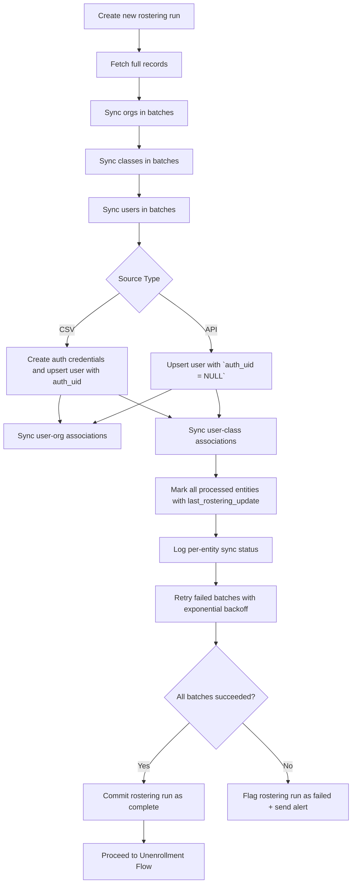
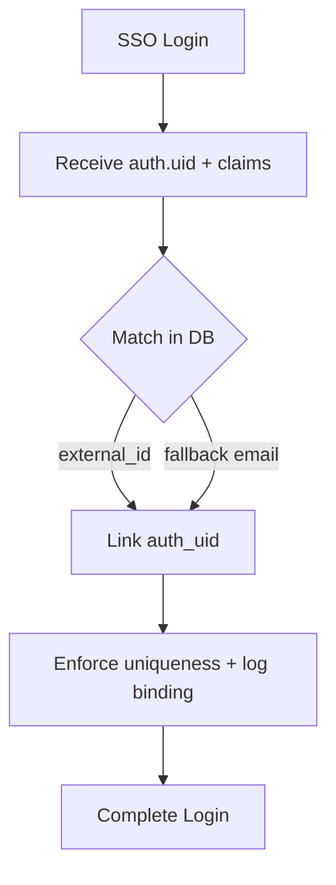
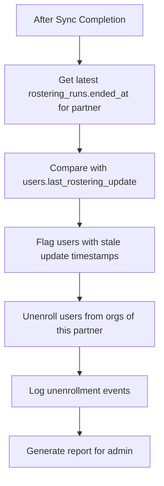

# ROAR Rostering Integration Spec

## Overview

This document defines how ROAR integrates with rostering partners (e.g. school districts) to ingest and synchronize user, organization, course, and enrollment data. It supports both API-based (e.g., OneRoster, Clever) and CSV-based integration.

## Scope

* **In scope:** Weekly ingestion of users, orgs, courses, enrollments; marking un-updated entities; generating unenrollment lists; deferred SSO binding.
* **Out of scope:** Transformation logic between OneRoster/Clever and ROAR models. Transformation logic for CSV upload.

## Actors

* District rostering feed (API or CSV)
* ROAR ingestion service
* ROAR auth service
* Admin dashboard / reviewer

## Data Models

* **External Entities:** user, org, course, class, enrollment
* **Internal Entities:** ROARUser, ROAROrg, ROARCourse, ROAREnrollment
* **Deferred Auth Binding:** If user is ingested via API, `auth_uid` is not assigned until first SSO login

## Workflows

### Full Rostering Ingestion

ROAR currently only supports full rostering ingestion. Future work will support incremental ingestion using "delta" records. This full rostering sync can be run on command or scheduled weekly.



### Deferred Auth UID Binding



### Stale Detection



### Monitoring & Alerts

Rostering events and sync statuses are recorded in the `user_rostering_events` and `rostering_sync_status` tables, respectively. See below for table schemas.

### Post-sync validation

After the unenrollment flow is complete, ROAR runs a validation script that:

* Counts the number of active users, orgs, and classes provided by the rostering partner
* Compares these counts to the number of active users, orgs, and classes in ROAR
* Logs mismatches and raises alerts if discrepancies exceed defined thresholds

## SQL Schema

### `users`

See the [users-orgs](users-orgs.md) spec for the full schema. The `users` table contains a `last_rostering_update` field that tracks the last time a user was ingested via rostering.

### `rostering_partners`

```sql
CREATE TABLE rostering_partners (
  id UUID PRIMARY KEY DEFAULT gen_random_uuid(),
  org_id UUID REFERENCES orgs(id), -- The top level ROAR org that this rostering partner corresponds to
  name TEXT UNIQUE NOT NULL,
  display_name TEXT NOT NULL,
  description TEXT,
  created_at TIMESTAMP DEFAULT now(),
  updated_at TIMESTAMP DEFAULT now(),
  deleted_at TIMESTAMP,
);
```

### `rostering_runs`

```sql
CREATE TABLE rostering_runs (
  id UUID PRIMARY KEY DEFAULT gen_random_uuid(),
  partner_id UUID REFERENCES rostering_partners(id),
  ended_at TIMESTAMP,
  success BOOLEAN DEFAULT false,
  created_at TIMESTAMP DEFAULT now(),
  updated_at TIMESTAMP DEFAULT now(),
  deleted_at TIMESTAMP,
);
```

### `rostering_run_stats`

To fully capture counts for ingested, created, updated, and unenrolled entities per type, we use a normalized schema. This is cleaner and more extensible than expanding the `rostering_runs` table.

```sql
CREATE TABLE rostering_run_stats (
  id UUID PRIMARY KEY DEFAULT gen_random_uuid(),
  run_id UUID REFERENCES rostering_runs(id),
  entity_type TEXT NOT NULL CHECK (entity_type IN ('user', 'org', 'class', 'course', 'enrollment')),
  action TEXT NOT NULL CHECK (action IN ('created', 'updated', 'unenrolled', 'skipped', 'failed')),
  count INTEGER NOT NULL,
  created_at TIMESTAMP DEFAULT now(),
  updated_at TIMESTAMP DEFAULT now(),
  deleted_at TIMESTAMP,
);
```

### `user_rostering_events`

This table captures notable, discrete events during rostering runs, primarily for audit and tracking. Think of it as a log of business-level outcomes like:

* A user being unenrolled
* An auth UID being bound
* A batch being skipped due to validation failure

```sql
CREATE TABLE user_rostering_events (
  id UUID PRIMARY KEY DEFAULT gen_random_uuid(),
  rostering_run_id UUID REFERENCES rostering_runs(id),
  event_type TEXT, -- e.g., 'unenroll', 'auth_bind'
  user_id UUID REFERENCES users(id),
  timestamp TIMESTAMP,
  details JSONB,
  created_at TIMESTAMP DEFAULT now(),
  updated_at TIMESTAMP DEFAULT now(),
  deleted_at TIMESTAMP,
);
```

### `rostering_sync_status`

This table records the result of attempting to sync each entity (user, org, class, etc.) in a given ingestion run. It’s used for:

* Tracking which entities succeeded/failed
* Supporting retries on partial failures
* Diagnosing ingestion problems at the row level

```sql
CREATE TABLE rostering_sync_status (
  id UUID PRIMARY KEY DEFAULT gen_random_uuid(),
  rostering_run_id UUID REFERENCES rostering_runs(id),
  entity_type TEXT, -- e.g., 'user', 'org', 'class'
  entity_id UUID,
  status TEXT, -- 'success', 'failed', 'skipped', etc.
  error_message TEXT,
  processed_at TIMESTAMP DEFAULT now()
);
```
