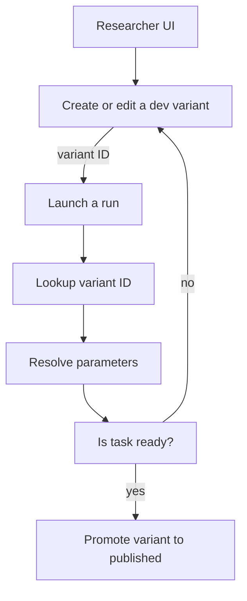
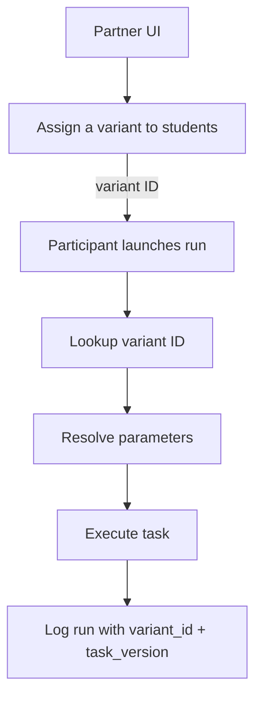

# ROAR Task Configuration and Variant System: Technical Specification

## Purpose and Scope

ROAR supports configurable tasks used in assessments. This document defines the technical specification for how researchers interact with configurable ROAR tasks, including:

* Creating and referencing **variants** (parameter configurations)
* Versioning **tasks**
* Supporting a flexible yet reproducible **dev mode**
* Executing and logging **task runs**

This spec ensures consistency, auditability, and scalability across both development and production contexts.

## System Overview

The ROAR task system consists of the following components:

* **Tasks**: Assessment units with parameterizable behavior

  A task is a unit of assessment content and logic (e.g., "ROAR Word"). Tasks are versioned to allow for backwards-compatible and breaking changes.

* **Task Versions**: Versioned logic and default handling per task

  A specific, versioned implementation of a task (e.g., v1.2.0). Task versions define default parameter values and behavior. Changes to logic, scoring, or parameter handling result in a new task version.

* **Variants**: Immutable parameter sets identified by a stable `variant_id`

  A variant is a unique, immutable configuration of a task's parameters. It is identified by a variant ID, which acts like a DOI. Once created, it will always refer to the same parameter set.

* **Variant Status**: `dev`, `published`, or `deprecated`

  A variant can be in one of three states: `dev`, `published`, or `deprecated`. The `dev` state indicates that the variant is in development and is not yet ready for production use. Dev variants can be edited. Once published, variants are immutable. The `published` state indicates that the variant is ready for production use and is available for use in assessments. The `deprecated` state indicates that the variant is no longer recommended for use in assessments but is preserved for historical reproducibility or auditability.

* **Task Bundles**: A grouping of curated variants under a reusable identifier (e.g., "ROAR Core Four" for batch administration).

* **Task Spec**: `{ variant_id, task_version }` — uniquely defines runtime behavior

  A Task Spec is the pair `{ variant_id, task_version }`. This combination fully determines the behavior of a task run, including default parameters, logic, and scoring. It is important to realize that the variant_id is not tied to any specific task version. The same variant_id may be used with different task versions, and it is the combination of variant_id and task_version — the Task Spec — that determines the full behavior of a task run.

* **Runs**: Executions of a task spec (i.e., a specific `variant_id` and `task_version`)

  A run is a specific instance of a student or researcher interacting with a task. Every run references a variant_id and a task_version_id, allowing the exact task behavior to be reconstructed from the database.

### Component Flow Diagrams

#### Researcher task development



#### Participant task execution



## Runtime Behavior by Mode

### Published Mode

* Partner specifies a known `variant_id`
* System fetches parameter set from `variant_parameters`
* Task version defaults to the version pinned in the ROAR-dashboard dependencies (if task is launched from the dashboard) or the latest stable release (if task is launched as a standalone web application).
* Runtime merges parameters with task version's defaults
* Run is executed and logged with `variant_id`, `task_version_id`

### Dev Mode

* Researcher creates a new variant with `status = "dev"` and provides a custom parameter set
* Variants with `status = "dev"` are not shown in public researcher dashboards or included in standard reporting or analytics views. This ensures that only validated, production-ready variants are visible for data analysis or deployment purposes.
* Researcher develops and tests the task using the dev variant
* Researcher edit the dev variant as needed.
* When it is ready for production, the researcher toggles `status = "published"` and adds a name/description.
* The variant is now available for use in assessments.

## Edge Cases and Error Handling

| Scenario                                             | Expected Behavior                                |
| ---------------------------------------------------- | ------------------------------------------------ |
| Missing `variant_id` in published mode               | 400 error with message "variant\_id is required" |
| Missing parameter value                              | Task resolves using defaults; log warning        |
| Unknown parameter or invalid value in production     | Task throws error and halts execution            |
| Attempt to publish a dev variant with identical parameters to existing published one | Deduplicate by comparing canonical param hash    |
| Attempt to promote already published variant         | No-op; return existing variant info              |
| Running a dev or deprecated variant in production    | Reject request with 400 or 403 error. Dev variants are not permitted in production. |

## Design Rationale

* **Separation of variant and version** allows stable IDs while supporting evolving task logic
* **Variant ID as immutable key** ensures reproducibility and clean version control
* **Dev variants stored as real variants** avoids custom logic for freeform runs, simplifying the schema
* **Task Spec abstraction** clearly captures full execution context for a run
* **Use of a status field** to differentiate between published and dev variants allows for future lifecycle states.

## SQL Schema

### `tasks`

```sql
CREATE TABLE tasks (
  id UUID PRIMARY KEY DEFAULT gen_random_uuid(),
  slug TEXT UNIQUE NOT NULL,
  display_name TEXT NOT NULL,
  description TEXT,
  created_at TIMESTAMP DEFAULT now()
  updated_at TIMESTAMP DEFAULT now(),
  deleted_at TIMESTAMP,
);
```

### `task_versions`

```sql
CREATE TABLE task_versions (
  id UUID PRIMARY KEY DEFAULT gen_random_uuid(),
  task_id UUID REFERENCES tasks(id) ON DELETE CASCADE,
  version TEXT NOT NULL,
  description TEXT,
  created_at TIMESTAMP DEFAULT now(),
  updated_at TIMESTAMP DEFAULT now(),
  deleted_at TIMESTAMP,
  UNIQUE(task_id, version)
);
```

### `variants`

```sql
CREATE TABLE variants (
  id UUID PRIMARY KEY DEFAULT gen_random_uuid(),
  task_id UUID NOT NULL REFERENCES tasks(id) ON DELETE CASCADE,
  task_slug TEXT NOT NULL REFERENCES tasks(slug),
  name TEXT,
  description TEXT,
  status TEXT CHECK (status IN ('dev', 'published', 'deprecated')) NOT NULL DEFAULT 'dev',
  created_at TIMESTAMP DEFAULT now(),
  updated_at TIMESTAMP DEFAULT now(),
  deleted_at TIMESTAMP,
);
```

### `variant_parameters`

```sql
CREATE TABLE variant_parameters (
  id UUID PRIMARY KEY DEFAULT gen_random_uuid(),
  variant_id UUID REFERENCES variants(id) ON DELETE CASCADE,
  name TEXT NOT NULL,
  value JSONB NOT NULL,
  type TEXT,
  UNIQUE(variant_id, name)
  created_at TIMESTAMP DEFAULT now(),
  updated_at TIMESTAMP DEFAULT now(),
  deleted_at TIMESTAMP,
);
```

### `task_bundles`

```sql
CREATE TABLE task_bundles (
  id UUID PRIMARY KEY DEFAULT gen_random_uuid(),
  slug TEXT UNIQUE NOT NULL,
  name TEXT NOT NULL,
  description TEXT,
  created_at TIMESTAMP DEFAULT now(),
  updated_at TIMESTAMP DEFAULT now(),
  deleted_at TIMESTAMP,
);
```

### `task_bundle_variants`

```sql
CREATE TABLE task_bundle_variants (
  id UUID PRIMARY KEY DEFAULT gen_random_uuid(),
  task_bundle_id UUID REFERENCES task_bundles(id) ON DELETE CASCADE,
  variant_id UUID REFERENCES variants(id) ON DELETE CASCADE,
  sort_order INT,
  created_at TIMESTAMP DEFAULT now(),
  updated_at TIMESTAMP DEFAULT now(),
  deleted_at TIMESTAMP,
  UNIQUE(task_bundle_id, variant_id)
);
```

### `runs`

See the [assessment-execution](assessment-execution.md) section for the full schema.

## API Contract

### `GET /api/tasks/`

Returns metadata for all available tasks.

### `GET /api/tasks/{task_slug}`

Returns metadata for a specific task.

### `GET /api/tasks/{task_slug}/versions`

Returns metadata for all available versions of a specific task. Dev variants are excluded by default.

### `POST /api/variants`

Creates a dev variant.

```http
POST /api/variants
{
  "task_slug": "swr",
  "parameters": {
    "num_items": 8,
    "shuffle": true
  }
}
```

### `PATCH /api/variants/{variant_id}`

Edits a dev variant.

```http
PATCH /api/variants/{variant_id}
{
  "parameters": {
    "num_items": 8,
    "shuffle": true
  }
}
```

Allowed only if the variant status is `"dev"`.

### `POST /api/variants/{variant_id}/publish`

Promotes a dev variant to published. Freezes the variant parameters and assigns a name and description.

```http
POST /api/variants/{variant_id}/publish
{
  "name": "My Variant",
  "description": "My Variant Description"
}
```

### `GET /api/task-bundles/{slug}`

Returns metadata and ordered variants for a single task package.

```json
{
  "id": 1,
  "slug": "core-4",
  "name": "Core 4 Literacy Tasks",
  "description": "The ROAR Core 4 literacy tasks",
  "variants": [
    { "variant_id": "uuid-1", "task_slug": "roar-letter", "sort_order": 1 },
    { "variant_id": "uuid-2", "task_slug": "roar-phoneme", "sort_order": 2 },
    { "variant_id": "uuid-3", "task_slug": "roar-word", "sort_order": 3 },
    { "variant_id": "uuid-4", "task_slug": "roar-sentence", "sort_order": 4 },
  ]
}
```

## Migration Plan

* Migrate existing Firestore variants into the `variants` and `variant_parameters` tables
* Migrate the `registered` field to the `status` field.
* Deprecate the `registered` field for tasks. Instead tasks should be considered "published" if they have any published variants.
* Dev-mode Firestore runs can be replayed into SQL by minting variants
* Legacy tasks may require shimming in the API to handle missing variant metadata
* After migration, new runs must go through the SQL-backed system

## Summary

This spec provides a consistent, extensible, and reproducible system for managing task configuration and execution in ROAR. The abstraction of a **Task Spec = { variant ID, task version }** enables clarity for researchers, traceability for engineers, and scalability for the system.
