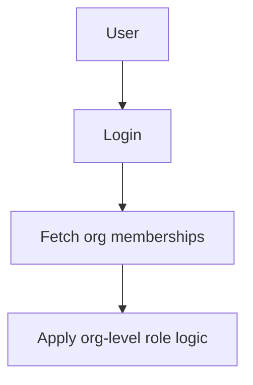

# ROAR Users and Organizations: Technical Specification

## Purpose and Scope

This document defines the data model for users and the organizational hierarchy in ROAR, including support for various org types (e.g., districts, schools, classes, families, groups) and user-org relationships.

## System Overview

ROAR supports hierarchical and non-hierarchical organizations. Users may belong to multiple orgs and may hold different roles depending on their context. This spec focuses on the representation of orgs and memberships only — permissions are handled in a separate spec.

### Definitions

* **User**: A person with a ROAR account (student, teacher, admin, etc.)

* **Organization (Org)**: A logical unit like a school or group

* **Org Type**: A string enum: district, school, family, group

* **Org Hierarchy**: Parent-child relationships among orgs

* **Course**: A curriculum-aligned instructional offering (e.g., "Grade 4 Math") that can be scheduled multiple times across different classes.

* **Class**: A scheduled instance of a course, with associated students, educators, term, and time block metadata. A class may reference a `course_id`.

* **Term**: A period of time during which classes are scheduled. Terms are used to group classes and students together for reporting and analysis.

* **Time Block**: A period of time during which a class is scheduled. Time blocks are used to group classes and students together for reporting and analysis.

* **Role**: A user’s function in an org (e.g., teacher, student, admin)

* **Opt-out status**: Whether a user has opted out of research, either directly (as an individual) or indirectly through association with an organization that has opted out. Opted out users must never be included in research data, but their data is retained in order to fulfill obligations to partners (e.g., score reporting). Once the service obligation to a partner is terminated, opted out users are permanently deleted from the database and all backups.

* **Personally Identifiable Information (PII)**: PII for education records is a FERPA term referring to identifiable information that is maintained in education records and includes direct identifiers, such as a student’s name or identification number, indirect identifiers, such as a student’s date of birth, or other information which can be used to distinguish or trace an individual’s identity either directly or indirectly through linkages with other information. See [Family Educational Rights and Privacy Act Regulations, 34 CFR §99.3](https://studentprivacy.ed.gov/ferpa), for a complete definition of PII specific to education records and for examples of other data elements that are defined to constitute PII.

### Component Flow Diagram



## Runtime Behavior

* A user may belong to multiple orgs at once.
* Roles are stored per org membership. That is, a user may have different roles in different orgs.
* Org hierarchies enable queries like "all students in a district."

### Annual PII scrubbing

To comply with FERPA and data minimization principles, ROAR performs an annual PII scrubbing process to remove personally identifiable information (PII) for users who are no longer affiliated with any active organizations.

A user is eligible for PII scrubbing if:

* The user has no active `user_orgs` records (i.e., all associated `user_orgs.end_date` values are in the past)
* The user has not already been scrubbed (users.pii_scrubbed_at IS NULL)

For each user to be scrubbed, we take the following actions:

* In the `users` table:
  * Nullify:
    * email
    * username
    * name fields
    * date_of_birth
  * Set `pii_scrubbed_at = CURRENT_TIMESTAMP`

* In the `user_external_ids` table:
  * Nullify all identifiers not explicitly retained for reporting. This includes `sis_id`, `state_student_id`, `clever_id`, `classlink_id`
  * `pii_scrubbed_at = CURRENT_TIMESTAMP`

The scrub job is scheduled to run annually (e.g., each July) but it may be invoked manually or run in batches for performance. Here is SQL pseudocode for the annual scrubber:

```sql
-- 1. Identify users who are eligible for scrubbing (not previously scrubbed and no current orgs).
WITH scrub_candidates AS (
  SELECT u.id AS user_id
  FROM users u
  WHERE u.pii_scrubbed_at IS NULL
    AND NOT EXISTS (
      SELECT 1
      FROM user_orgs uo
      WHERE uo.user_id = u.id
        AND (uo.end_date IS NULL OR uo.end_date > CURRENT_DATE)
    )
)

-- 2. Scrub PII fields in the `users` table
UPDATE users
SET
  email = NULL,
  username = NULL,
  dob = NULL,
  name_first = NULL,
  name_last = NULL,
  name_middle = NULL,
  pii_scrubbed_at = CURRENT_TIMESTAMP
WHERE id IN (SELECT user_id FROM scrub_candidates);

-- 3. Scrub external identifiers
UPDATE user_external_ids
SET
  value = NULL,
  scrubbed_at = CURRENT_TIMESTAMP
WHERE user_id IN (SELECT user_id FROM scrub_candidates);
```

## Edge Cases and Error Handling

| Scenario                         | Behavior                       |
| -------------------------------- | ------------------------------ |
| User has no orgs                 | May have limited access only   |
| Org with invalid `parent_org_id` | 400 Bad Request                |
| Circular org hierarchy attempted | 400 Bad Request or block at UI |

## Design Rationale

* A unified orgs table (as opposed to separate tables for districts, schools, etc.) keeps the model simple, flexible, and extensible.
* An enum for org types enables special-case logic (e.g., school vs. family).
* Separating courses and classes from other orgs aligns with both OneRoster and Clever data models (N.B. Clever refers to classes as "sections").
* Separate courses and classes allows course reuse across multiple classes (sections).
* In Clever's data model each course and class are associated with only one grade, term, period, and subject. However, in the OneRoster data model, a course can be associated with multiple grades, terms, periods, and subjects. ROAR conforms to the OneRoster model by adding many-to-many join tables for these relationships. This aligns with OneRoster and is also more expressive (e.g., it supports multi-subject interdisciplinary classes, blended grades, and rolling terms).
* Separate roles per org allows nuanced modeling (e.g., teacher in one, admin in another).

## API Contract

### Create an org

```http
POST /api/orgs
{
  "name": "Lincoln High",
  "org_type": "school",
  "parent_org_id": "uuid-of-district"
}
```

### Update an org

```http
PATCH /api/orgs/:id
{
  "name": "Lincoln High"
}
```

### List orgs

```http
GET /api/orgs
```

### Get an org

```http
GET /api/orgs/:id
```

### Add a user to an org

```http
POST /api/user-orgs
{
  "user_id": "uuid",
  "org_id": "uuid",
  "role": "teacher"
}
```

### Remove a user from an org

```http
DELETE /api/user-orgs/:user_id/:org_id
```

### List user-org memberships

```http
GET /api/users
```

### Get a user

```http
GET /api/users/:id
```

### Create a user

```http
POST /api/users
{
  "name": "John Doe",
  "email": "john.doe@example.com",
  "password": "password"
}
```

### Update a user

```http
PATCH /api/users/:id
{
  "name": "John Doe"
}
```

## SQL Schema

### `frl_status_enum`

```sql
CREATE TYPE frl_status_enum AS ENUM ('free', 'reduced', 'paid', 'unknown');
```

### `grade_levels`

```sql
CREATE TABLE grade_levels (
  name TEXT PRIMARY KEY,         -- The normalized enum value used in ROAR
  display_name TEXT NOT NULL,     -- Human-readable label for UI
  order_index INTEGER NOT NULL,   -- For ordered display
  one_roster_equiv TEXT           -- Closest OneRoster-compatible mapping
  school_level TEXT CHECK (school_level IN ('early', 'elementary', 'middle', 'high', 'postsecondary', 'ungraded', 'other'))
);
```

Here is the entire `grade_levels` table:

| value                    | display\_name             | order\_index | one\_roster\_equiv | school\_level |
| ------------------------ | ------------------------- | ------------ | ------------------ | ------------- |
| InfantToddler            | Infant/Toddler            | 0            | Other              | early       |
| Preschool                | Preschool                 | 1            | Other              | early       |
| PreKindergarten          | Pre-K                     | 2            | PK                 | early       |
| TransitionalKindergarten | Transitional Kindergarten | 3            | Other              | early       |
| Kindergarten             | Kindergarten              | 4            | K                  | elementary  |
| 1                        | 1st Grade                 | 5            | 01                 | elementary  |
| 2                        | 2nd Grade                 | 6            | 02                 | elementary  |
| 3                        | 3rd Grade                 | 7            | 03                 | elementary  |
| 4                        | 4th Grade                 | 8            | 04                 | elementary  |
| 5                        | 5th Grade                 | 9            | 05                 | elementary  |
| 6                        | 6th Grade                 | 10           | 06                 | middle      |
| 7                        | 7th Grade                 | 11           | 07                 | middle      |
| 8                        | 8th Grade                 | 12           | 08                 | middle      |
| 9                        | 9th Grade                 | 13           | 09                 | high        |
| 10                       | 10th Grade                | 14           | 10                 | high        |
| 11                       | 11th Grade                | 15           | 11                 | high        |
| 12                       | 12th Grade                | 16           | 12                 | high        |
| 13                       | Post-secondary            | 17           | 13                 | postsecondary |
| PostGraduate             | Postgraduate              | 18           | Other              | postsecondary |
| Ungraded                 | Ungraded                  | 19           | Ungraded           | ungraded    |
| Other                    | Other                     | 20           | Other              | other       |

### `users`

```sql
CREATE TABLE users (
  id UUID PRIMARY KEY DEFAULT gen_random_uuid(),
  username TEXT UNIQUE NOT NULL,
  email TEXT,

  -- Name Fields
  name_first TEXT,
  name_last TEXT,
  name_middle TEXT,

  -- Demographics
  dob DATE,
  gender TEXT,               -- See enum options below
  grade TEXT REFERENCES grade_levels(name)
  school_level TEXT,         -- Derived (elementary, middle, etc.)
  hispanic_ethnicity BOOLEAN,
  race TEXT[],               -- Multiselect array (e.g., ['White', 'Asian'])
  frl_status frl_status_enum DEFAULT 'unknown',
  iep_status BOOLEAN,
  ell_status BOOLEAN,
  pii_scrubbed_at TIMESTAMP WITH TIME ZONE,

  -- Identifiers
  pid TEXT UNIQUE NOT NULL,  -- Human-readable unique participant ID
  email TEXT UNIQUE,

  -- Metadata
  is_system_user BOOLEAN DEFAULT false,
  created_at TIMESTAMP DEFAULT now(),
  updated_at TIMESTAMP DEFAULT now(),
  deleted_at TIMESTAMP,
);
```

Some tables include fields which track different users who have made changes or authorized certain actions. These could be used for audit logging and provenance tracking. However, it's common to run into cases where no human user directly initiated the action — e.g., a backend job, sync service, or webhook from Clever or another system. In these cases, we use a special "system" user (with `is_system_user` set to `true`) to represent the action. For example:

```sql
INSERT INTO users (id, name_first, name_last, username, email, pid, is_system_user)
VALUES
  ('00000000-0000-0000-0000-000000000001', 'System', 'Automated', 'system', 'system@roar.local', 'system', true),
  ('00000000-0000-0000-0000-000000000002', 'Clever', 'Sync', 'clever-sync', 'clever-sync@roar.local', 'clever-sync', true),
  ('00000000-0000-0000-0000-000000000003', 'OneRoster', 'Import', 'oneroster-import', 'oneroster-import@roar.local', 'oneroster-import', true);
```

### `external_id_types`

```sql
CREATE TABLE external_id_types (
  name TEXT PRIMARY KEY,         -- e.g., 'clever', 'oneroster'
  display_name TEXT NOT NULL,    -- e.g., 'Clever', '1EdTech OneRoster'
  description TEXT,
  created_at TIMESTAMP DEFAULT now(),
  updated_at TIMESTAMP DEFAULT now(),
  deleted_at TIMESTAMP,
);

INSERT INTO external_id_types (name, display_name, description) VALUES
  ('clever', 'Clever', 'External ID provided by the Clever platform'),
  ('oneroster', '1EdTech OneRoster', 'ID aligned with OneRoster spec'),
  ('sis', 'SIS', 'Student Information System ID'),
  ('custom', 'Custom ID', 'Locally defined or imported identifier'),
  ('state_id', 'State ID', 'State-assigned unique student or org identifier'),
  ('local_id', 'Local ID', 'District-assigned ID not tied to a formal rostering system');
  ('nces_id', 'NCES ID', 'NCES-assigned unique identifier');
  ('mdr_number', 'MDR Number', 'MDR-assigned unique identifier')
```

### `user_external_ids`

```sql
CREATE TABLE user_external_ids (
  id UUID PRIMARY KEY DEFAULT gen_random_uuid(),
  user_id UUID REFERENCES users(id),
  external_id TEXT NOT NULL,
  external_id_type TEXT REFERENCES external_id_types(name) NOT NULL,
  pii_scrubbed_at TIMESTAMP WITH TIME ZONE,
  created_at TIMESTAMP DEFAULT now(),
  updated_at TIMESTAMP DEFAULT now(),
  deleted_at TIMESTAMP,
  UNIQUE(user_id, external_id_type),
);
```

### `org_types`

```sql
CREATE TABLE org_types (
  name TEXT PRIMARY KEY,
  one_roster_equiv TEXT CHECK (one_roster_equiv IN ('state', 'region', 'district', 'school', 'local', 'other')),
  created_at TIMESTAMP DEFAULT now(),
  updated_at TIMESTAMP DEFAULT now(),
  deleted_at TIMESTAMP,
);

-- Seed values
INSERT INTO org_types (name, one_roster_equiv) VALUES
  ('district', 'district'),
  ('school', 'school'),
  ('local', 'local'),
  ('state', 'state'),
  ('region', 'region'),
  ('family', 'other'),
  ('group', 'other');
```

### `orgs`

```sql
CREATE TABLE orgs (
  id UUID PRIMARY KEY DEFAULT gen_random_uuid(),
  name TEXT NOT NULL,
  org_type TEXT REFERENCES org_types(name),
  parent_org_id UUID REFERENCES orgs(id) ON DELETE SET NULL,

  -- Location
  location_address_line1 TEXT;
  location_address_line2 TEXT;
  location_city TEXT;
  location_state_province TEXT;
  location_postal_code TEXT;
  location_country CHAR(2) DEFAULT 'US';  -- ISO 3166-1 alpha-2
  location_timezone TEXT;
  location_lat NUMERIC(9,6);
  location_long NUMERIC(9,6);

  -- Metadata
  created_at TIMESTAMP DEFAULT now(),
  updated_at TIMESTAMP DEFAULT now(),
  deleted_at TIMESTAMP,
);
```

### `org_external_ids`

```sql
CREATE TABLE org_external_ids (
  id UUID PRIMARY KEY DEFAULT gen_random_uuid(),
  org_id UUID REFERENCES orgs(id),
  external_id TEXT NOT NULL,
  external_id_type TEXT REFERENCES external_id_types(name) NOT NULL,
  created_at TIMESTAMP DEFAULT now(),
  updated_at TIMESTAMP DEFAULT now(),
  deleted_at TIMESTAMP,
  UNIQUE(org_id, external_id_type),
);
```

### `users_orgs`

```sql
CREATE TABLE users_orgs (
  id UUID PRIMARY KEY DEFAULT gen_random_uuid(),
  user_id UUID REFERENCES users(id),
  org_id UUID REFERENCES orgs(id),
  role TEXT CHECK (role IN ('teacher', 'student', 'admin')),
  start_date DATE DEFAULT CURRENT_DATE,
  end_date DATE, -- NULL means currently active
  created_at TIMESTAMP DEFAULT now(),
  updated_at TIMESTAMP DEFAULT now(),
  deleted_at TIMESTAMP,
  UNIQUE(user_id, org_id),
);
```

### `courses`

```sql
CREATE TABLE courses (
  id UUID PRIMARY KEY DEFAULT gen_random_uuid(),
  org_id UUID REFERENCES orgs(id),
  name TEXT NOT NULL,
  number TEXT,
  created_at TIMESTAMP DEFAULT now(),
  updated_at TIMESTAMP DEFAULT now(),
  deleted_at TIMESTAMP,
  UNIQUE(org_id, name),
);
```

### `course_grades`

```sql
CREATE TABLE course_grades (
  id UUID PRIMARY KEY DEFAULT gen_random_uuid(),
  course_id UUID REFERENCES courses(id),
  grade TEXT REFERENCES grade_levels(name),
  created_at TIMESTAMP DEFAULT now(),
  updated_at TIMESTAMP DEFAULT now(),
  deleted_at TIMESTAMP,
  UNIQUE(course_id, grade),
);
```

### `course_subjects`

```sql
CREATE TABLE course_subjects (
  id UUID PRIMARY KEY DEFAULT gen_random_uuid(),
  course_id UUID REFERENCES courses(id),
  subject TEXT,
  created_at TIMESTAMP DEFAULT now(),
  updated_at TIMESTAMP DEFAULT now(),
  deleted_at TIMESTAMP,
  UNIQUE(course_id, subject),
);
```

### `terms`

```sql
CREATE TABLE terms (
  id UUID PRIMARY KEY DEFAULT gen_random_uuid(),
  org_id UUID REFERENCES orgs(id),
  name TEXT,
  start_date DATE,
  end_date DATE,
  created_at TIMESTAMP DEFAULT now(),
  updated_at TIMESTAMP DEFAULT now(),
  deleted_at TIMESTAMP,
  UNIQUE(org_id, name),
);
```

### `classes`

```sql
CREATE TABLE classes (
  id UUID PRIMARY KEY DEFAULT gen_random_uuid(),
  org_id UUID REFERENCES orgs(id),
  school_id UUID REFERENCES orgs(id),
  district_id UUID REFERENCES orgs(id),
  course_id UUID REFERENCES courses(id),
  class_type TEXT CHECK (class_type IN ('homeroom', 'scheduled', 'other')),
  name TEXT NOT NULL,
  number TEXT,
  term_id UUID REFERENCES terms(id),
  period TEXT,
  created_at TIMESTAMP DEFAULT now(),
  updated_at TIMESTAMP DEFAULT now(),
  deleted_at TIMESTAMP,
);
```

### `class_grades`

```sql
CREATE TABLE class_grades (
  id UUID PRIMARY KEY DEFAULT gen_random_uuid(),
  class_id UUID REFERENCES classes(id),
  grade TEXT REFERENCES grade_levels(name),
  created_at TIMESTAMP DEFAULT now(),
  updated_at TIMESTAMP DEFAULT now(),
  deleted_at TIMESTAMP,
  UNIQUE(class_id, grade),
);
```

### `class_subjects`

```sql
CREATE TABLE class_subjects (
  id UUID PRIMARY KEY DEFAULT gen_random_uuid(),
  class_id UUID REFERENCES classes(id),
  subject TEXT,
  created_at TIMESTAMP DEFAULT now(),
  updated_at TIMESTAMP DEFAULT now(),
  deleted_at TIMESTAMP,
  UNIQUE(class_id, subject),
);
```

### `class_terms`

```sql
CREATE TABLE class_terms (
  id UUID PRIMARY KEY DEFAULT gen_random_uuid(),
  class_id UUID REFERENCES classes(id),
  term_id UUID REFERENCES terms(id),
  created_at TIMESTAMP DEFAULT now(),
  updated_at TIMESTAMP DEFAULT now(),
  deleted_at TIMESTAMP,
  UNIQUE(class_id, term_id),
);
```

### `class_periods`

```sql
CREATE TABLE class_periods (
  id UUID PRIMARY KEY DEFAULT gen_random_uuid(),
  class_id UUID REFERENCES classes(id),
  period TEXT,
  created_at TIMESTAMP DEFAULT now(),
  updated_at TIMESTAMP DEFAULT now(),
  deleted_at TIMESTAMP,
  UNIQUE(class_id, period),
);
```

## Migration Plan

* Migrate current users and roles into the unified membership model
* Assign default roles where missing
* Migrate the Firestore org collections (`districts`, `schools`, `families`, `groups`) into the `orgs` table.
* Migrate the Firestore user-org relationships (currently stored in the `users` collection) into the `users_orgs` table.
* Populate org_type based on known groupings.

## Summary

This spec formalizes a scalable and flexible representation of users and their relationships to hierarchical and non-hierarchical organizations.
