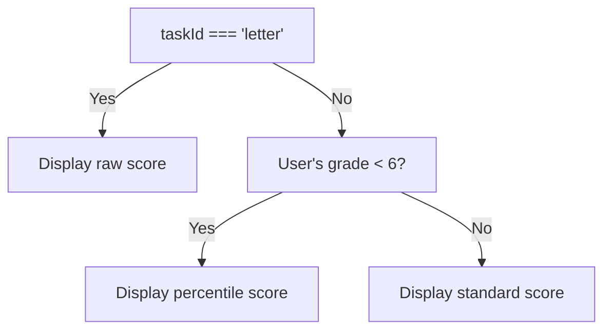

# Individual Score Reports: Technical Specification

## Purpose

This page displays a printable, interactive individual score report for a single student, summarising ROAR task results, context data, and guidance. It is encapsulated in a single file component `src/pages/StudentReport.vue`.

## Entry & Routing

The route path (defined elsewhere in `src/router/index.js`) passes four props:

| Prop Name | Type | Description |
| --- | --- | --- |
| administrationId | string | testing window / group |
| userId | string | student UID |
| orgType | string | 'district', 'school', 'class', etc. |
| orgId | string | organization UID |

The page is rendered only when the authenticated user's `roarfirekit.restConfig()` is ready in the Pinia auth store.

## Data-acquisition layer

All data are fetched through composition-API query hooks that wrap vue-query:

- `useUserDataQuery(userId)`: populates student profile (grade, name, class, etc.)
- `useAdministrationsQuery([administrationId])`: populates administration / assessment metadata.
- `useUserRunPageQuery(userId, administrationId, orgType, orgId)`: populates scored runs per task.
- `useTasksDictionaryQuery()`: populates dictionary of task metadata (public & technical names).

## Reactive state & helpers

| Name | Type | Description |
| --- | --- | --- |
| expanded | boolean | whether accordions are globally opened. |
| exportLoading | boolean | disables PDF button during render. |
| tasks, formattedTasks, studentFirstName/LastName | computed | computed from query results. |
| getGradeWithSuffix | function | grade with suffix. |
| taskDisplayNames, extendedDescriptions, rawOnlyTasks, etc. | computed | come from @/helpers/reports.js. |

## Layout hierarchy

Here we define the layout hierarchy of the page. All content is populated using i18n keys to support internationalization.

### Header (`#individual-report-header`)

- Page title (i18n key `scoreReports.pageTitle`)
- Student name (H2)
- Info block: grade, class, and administration name.

### Action Banner (`.welcome-banner`)

- Greeting text (i18n key `scoreReports.welcome`)
- Expand/Collapse button (toggles expansion state for all accordions)
- Export PDF button (triggers the `exportToPdf` function)

### Empty-state panel (`#individual-report-empty-state`)

This panel is shown when the user has no tasks to display, i.e. when `taskData.length === 0`. It uses the i18n keys `scoreReports.stillWorking` and `scoreReports.needOneComplete` to inform the viewer that the student has not completed enough tasks to populate an individual score report.

### At-a-Glance Banner (`#individual-report-banner`)

This banner is shown when the user has tasks to display. It uses the i18n keys `scoreReports.roarSummery` (sic) and `scoreReports.summery` (sic), as well as the `formattedTasks` computed property to display a high-level summary of the student's performance.

### Task cards wrapper (`#individual-report-cards`)

#### Reportable Tasks

This wrapper contains a single `<individual-score-report-task>` component. This component is defined in the `IndividualScoreReportTask.vue` file and renders a card for each "reportable task". A task is considered reportable if it has a defined `rawScore` in the `getScoreKeys` utility function defined in `src/helpers/reports.js`. Currently, the following tasks are reportable:

- swr, swr-es
- pa, pa-es
- letter, letter-es, letter-en-ca
- sre, sre-es

Other tasks may be added to the individual score report but they must define their own `rawScoreKey` in the `getScoreKeys` utility function defined in `src/helpers/reports.js`.

To onboard a new task to the score report:

1. Implement `getScoreKeys(taskId, grade)` to return these keys:
   - `rawScoreKey` (composite score used as raw value)
   - `percentileScoreKey` (optional)
   - `standardScoreKey` (optional)

1. Ensure the game writes those fields into `scores.composite` in the run payload.

1. Optional: add display metadata in `taskDisplayNames`, `extendedDescriptions`, and if required update helper thresholds.

#### Tags

Each card renders tags indicating whether the task was required or optional and whether the run was reliable or unreliable. If the "unreliable" tag is rendered, a tooltip is added to the tag that explains the reasons for unreliability (i.e., the "engagement flags").

#### Primary Knob

The primary gauge is a [PrimeVue Knob][link_pv_knob] component that displays one of the three scores. The displayed score is chosed according to the following decision tree:

The range color is always gray. The value color reflects the support category of the score. If support categories are not defined, the color is dark gray.

#### Score Description

After the primary knob, each card displays a description of the score. The description template depends on the score type chosen in the above decision tree.

- Raw task description: "{firstName} achieved a composite score of {rawScore} in {taskName}. {taskDescription}",
- Standard task description: "{firstName} scored a standard score of {standardScore}, which indicates they {supportCategory} {taskName}. {taskDescription}",
- Percentile task description: "{firstName} scored in the {percentile}, which indicates they {supportCategory} {taskName}. {taskDescription}",

where

- `firstName` is the student's first name
- `rawScore` is the raw score
- `standardScore` is the standard score
- `percentile` is the percentile score
- `supportCategory` is the support category explanatory text:
  - extra support text: "need extra support in"
  - developing text: "are developing the skill of"
  - achieved text: "have achieved the skill of"
- `taskName` is the task name
- `taskDescription` is the extended task description:
  - swr: 'This test measures your student’s skill in reading single words quickly and correctly.',
  - swr-es: 'This test measures how well a student can identify real words and made-up words. The goal is for students to recognize words quickly and accurately, a skill called decoding. High scores on this assessment indicate a readiness to be a skilled and fluent reader.',
  - pa: 'This test measures how well your student can break down a spoken word into its individual sounds and choose or create a word with the same sounds.',
  - sre: 'This test measures how quickly your student can silently read and understand sentences.',
  - vocab: 'This test measures how well your student knows words by having them match a picture to a spoken word.',
  - multichoice: 'Temporary description for multichoice',
  - morph: 'This test measures how well your student understands how parts of words, including prefixes and suffixes, can change the meaning of a word in a sentence',
  - cva: 'This test measures your students’ knowledge of words that are often used in the books they read at school',
  - letter: 'This test measures how well your student knows the names of letters and which letters are used to spell each sound',
  - letter-en-ca: 'This test measures how well your student knows the names of letters and which letters are used to spell each sound',
  - letter-es: 'This test measures how well your student knows the names of letters and which letters are used to spell each sound',
  - comp: 'Temporary description for comp',
  - phonics: 'This test measures phonics knowledge by testing how well your student can match the sounds of a word to the spelling',
  - syntax: 'This test measures how well students understand sentences that vary from simple to complicated',
  - trog: 'This test measures how well students understand sentences that vary from simple to complicated',
  - fluency: 'Temporary description for fluency',
  - ran: 'Temporary description for ran',
  - crowding: 'Temporary description for crowding',
  - roav-mep: 'Temporary description for mep',
  - roar-readaloud: 'Temporary description for readaloud',

#### Score Breakdown

Each card contains a collapsible accordion that displays a breakdown of the score. This accordion is collapsed by default. The scores are shown in the following order (if defined):

1. **Standard score** (min - max): **${value}**
1. **Raw score** (min - max): **${value}**
1. **Percentile score** (min - max): **${value}**

For the Phoneme task, the following subscores are added:

1. **First Sound Matching (FSM): ${value}**
1. **Last Sound Matching (LSM): ${value}**
1. **Deletion (DEL): ${value}**
1. **Skills to work on: ${either "NONE" or a list containing "LSM", "FSM", or "DEL"}**

For the Letter task, the following subscores are added:

1. **Lower Case**: **${value}**
1. **Upper Case**: **${value}**
1. **Letter Sounds**: **${value}**
1. **Letters to Work On**: **${value}**
1. **Letter Sounds to Work On**: **${value}**

### Support Graphic / Next Steps (#support-graphic)

After the array of assessment score cards, the individual report renders two accordions with a support graphic and definitions and a link to static PDF with next steps.

### Internationalization

- All static copy is driven by i18n keys under the `scoreReports.*` namespace.

### Styling

- Scoped styles in both components, Tailwind utility classes, and PrimeVue theme variables.
- Responsive via flexbox; the `.individual-report-wrapper` class wraps cards on smaller widths.

### PDF Export

- Ensures all accordions are expanded.
- Uses `jsPDF`, `html2canvas`, and helper function `addElementToPdf`
- Renders the DOM sections in order: header, banner, card wrapper, support graphic.
- Saves file IndividualScoreReport_`<First><Last>`.pdf.

### Dependencies

- Vue 3 (script setup)
- Pinia store (auth)
- Vue-Query hooks (custom)
- PrimeVue components: `PvButton`, `PvAccordion`, `PvKnob`, `PvTag`, `PvSpinner`.
- jsPDF 2.x, html2canvas, lodash, @bdelab/roar-utils.

[link_pv_knob]: https://primevue.org/knob/
