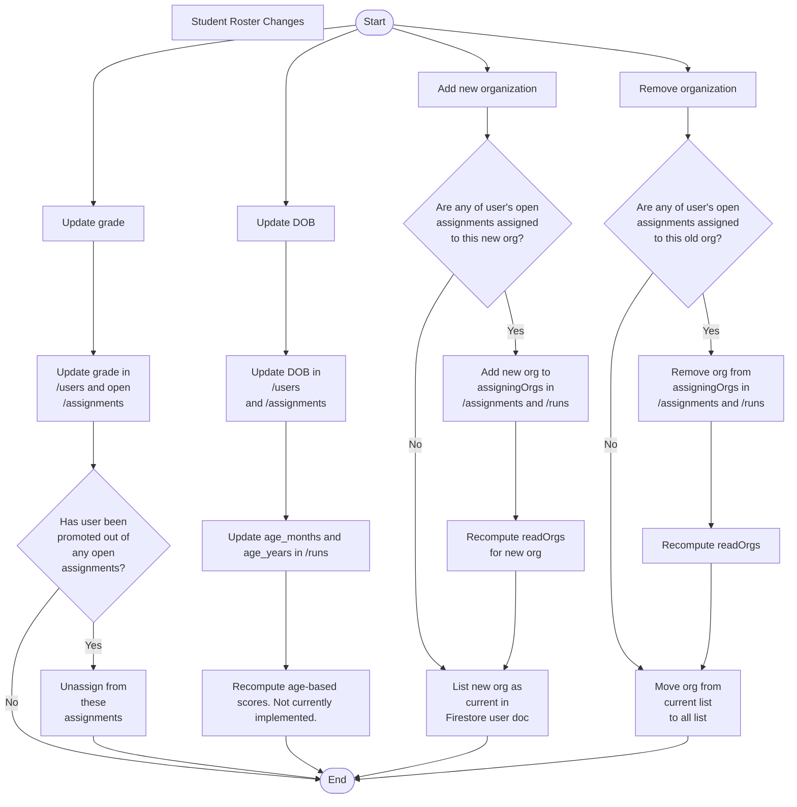

# User Roster Changes

ROAR user data is stored in multiple locations. It is:

- Stored in the Firestore user documents in the `/users` collection,
- Denormalized into Firestore assignment documents in the `/users/{userId}/assignments` collection. This data is meant to capture the user's data at the time that the assignment is closed.
- "Snapshotted" into Firestore run documents in the `/users/{userId}/runs` collection. By "snapshotted", we mean that the user's data is copied into the run documents at the start of each run.

Note that the denormalized data in the `/users/{userId}/assignments` collection will be deprecated when we migrate to a Postgres database.

ROAR users information can be updated in three ways:

- ROAR, via CSV upload by a ROAR administrator,
- Clever, via a cloud function that uses the Clever API to sync organizations and their users, and
- ClassLink, via a similar cloud function that syncs organizations and their users.

When a user's information changes in these service providers, the ROAR platform must update it's own internal information accordingly. Most user information (such as name) can simply be updated in a user's Firestore documents. However, changes to the following fields must be handled differently:

- date of birth (DOB), and therefore age
- grade
- organizational affiliation of any kind (districts, schools, classes, etc.)

Changes to these fields can affect conditional assignment and scoring and must therefore be handled differently.

- We assume that a change to a user's DOB represents a correction to a clerical error and must be updated in all relevant database entities.
- We assume that a change to a user's grade represents matriculation and must be updated only in the user's database entity and any open assignments.
- Lastly, we assume that a change to a user's rostering organizations represents a change in affiliation and must be updated only in the user's database entity and in open assignments.

We follow this rostering change flowchart to determine what to update when these fields change.

