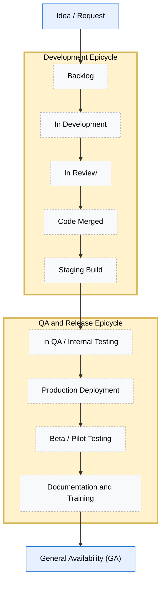

# Product Development Lifecycle & Definitions of Done

## Why we need a shared taxonomy of “done-ness”

As ROAR grows, clear communication between teams becomes essential.  
When developers say something is *done*, they usually mean it’s coded and merged.  
When partnerships or researchers say *done*, they may mean *ready for schools*.  

Without shared language, these differences create misalignment. Schools may be promised features that aren't ready, or the dev team may feel pressured to rush untested releases.  

To stay aligned, we use a **common taxonomy of readiness**. It defines where each feature is in its lifecycle, what kinds of communication are appropriate at each stage, and what "done" really means.

---

## The Product Development Lifecycle

The diagram below illustrates how a feature moves from idea → backlog → development → QA → general availability.  
Each major phase contains its own internal "epicycle," a repeating loop of validation and iteration that helps ensure quality and alignment before advancing.

## 1. Idea / Request

- The feature is conceptual. It may come from research needs, partner feedback, or internal strategy.
- No commitments or dates are made externally.
- External communication: "We're exploring this idea."

## 2. Backlog

- The feature has been prioritized for future work.
- Design, technical approach, and user stories are being defined.
- Appropriate communication: "This is on our roadmap, but not yet scheduled."

## 3. In Development

- Engineers are actively coding the feature.
- Work is happening in a feature branch or draft pull request.
- Code is not yet tested or deployed.
- Appropriate communication: Internal only. Do not announce externally.

## 4. In Review

- Code is complete and under peer or architectural review.
- May involve code review, UX review, or data validation.
- Appropriate communication: Internal progress update only.

## 5. Code Merged

- Code has been merged to the main branch and is ready for staging deployment.

## 6. Staging Build

- Feature is deployed to staging environment for testing.

## 7. In QA / Internal Testing

- Deployed to a staging environment.
- QA tests functionality, performance, and edge cases.
- Partnerships and researchers may do limited testing with internal or pilot data.
- Appropriate communication: "We're testing this internally. We'll let you know when it's live."

## 8. Beta / Pilot Testing

- Feature is being tested with select partners or pilot users.

## 9. Production Deployment

- Feature is live in production but not yet formally announced.
- Team monitors performance and error logs.
- Documentation and support materials may still be in progress.
- Appropriate communication: Internal: Ready for validation. External: Not yet announced.

## 10. Documentation and Training

- User documentation and training materials are being finalized.

## 11. General Availability (GA)

- Stable, documented, and ready for partner use.
- QA complete, monitoring stable, user docs published.
- Appropriate communication: "This feature is now available for all partners."

## Communication Guidelines by Stage and Audience

| Stage                         | Safe to share with partners? | Who can communicate?     | Typical language                           |
| ----------------------------- | ---------------------------- | ------------------------ | ------------------------------------------ |
| Idea / Request                | ❌ No                         | Internal only            | "We're exploring this idea."               |
| Backlog                       | ⚠️ roadmap only              | PM with approval         | "This is on our roadmap, not scheduled."  |
| In Development                | ❌ No                         | Internal only            | "It's under active development."           |
| In Review                     | ❌ No                         | Internal only            | "Code is under review."                    |
| Code Merged                   | ❌ No                         | Internal only            | "Code merged, preparing for testing."      |
| Staging Build                 | ❌ No                         | Internal only            | "Deployed to staging for testing."         |
| In QA / Internal Testing      | ❌ No                         | Internal only            | "We're testing internally."                |
| Production Deployment         | ⚠️ Optional soft-launch      | Coordinated across teams | "It's in production, not yet public."      |
| Beta / Pilot Testing          | ⚠️ Pilot partners only       | With approval from PM    | "We're testing with select partners."      |
| Documentation and Training    | ⚠️ Preparing for launch       | Partnerships team        | "Finalizing docs and training materials."  |
| General Availability (GA)     | ✅ Yes                        | Partnerships, Dev, Comms | "This feature is now available."           |
