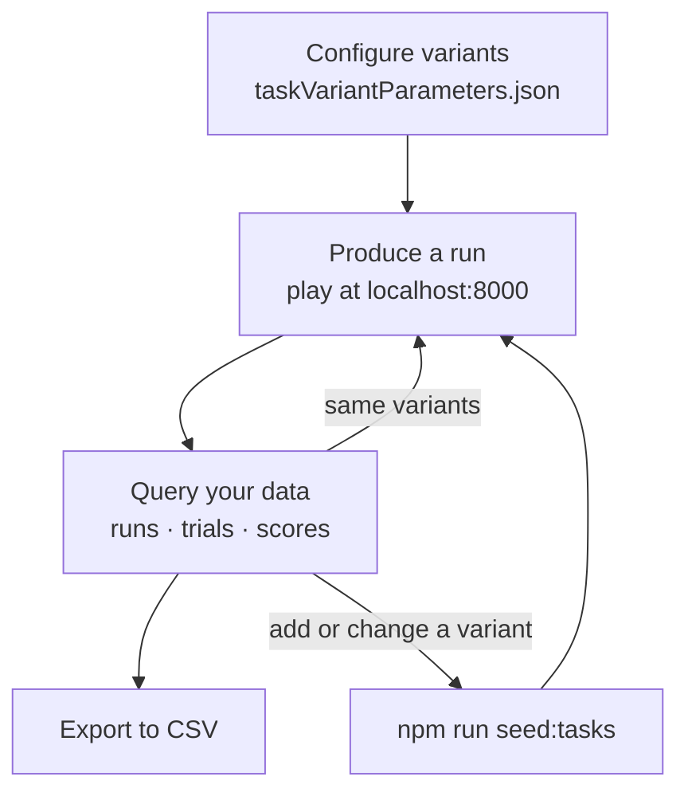
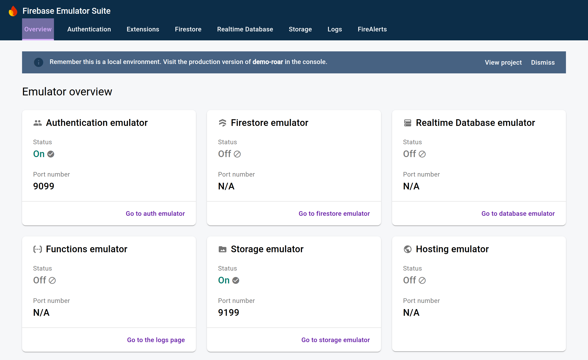
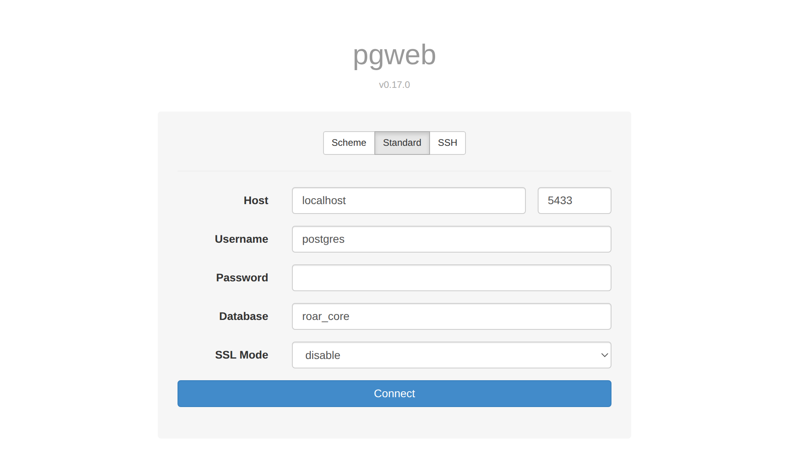
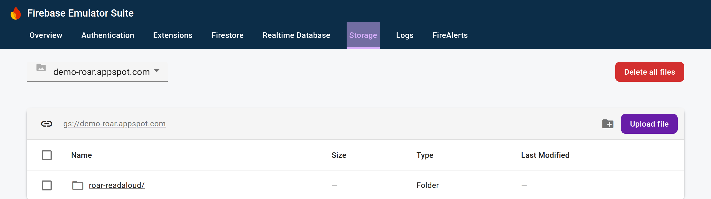
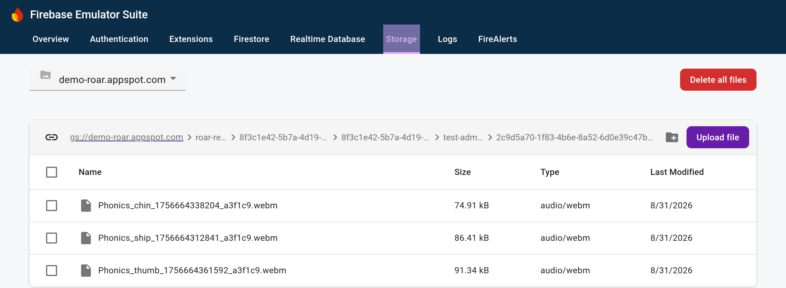

# Assessment Environment

Run any ROAR assessment on your own machine, play through it, and query the data it produces — with a real database, the real backend, and no cloud credentials.

This page is for researchers who want to **produce and inspect assessment data locally**: to try a new task variant, check what a run actually records, or generate test data without touching a shared environment. It is the local counterpart to the cloud data workflow in [Data Tools](https://yeatmanlab.github.io/roar-docs/researcher/data-tools/) — nothing here writes to BigQuery or to any shared bucket.

If you already know your way around and just need the commands, connection details, or a query to paste, go straight to the [Quick Reference](./quick-reference.md).

::: tip Canonical sources
Two documents in the repository are the source of truth and are maintained alongside the code. This page is an orientation guide; where they disagree, the repository wins.

- [Setup &amp; Operations guide](https://github.com/yeatmanlab/roar-dashboard/blob/main/apps/assessments/ASSESSMENT_ENVIRONMENT.md) — installing, starting, seeding, updating, troubleshooting
- [Research guide](https://github.com/yeatmanlab/roar-dashboard/blob/main/apps/assessments/ASSESSMENT_RESEARCH_GUIDE.md) — producing runs, every query, metadata, CSV export, recordings
:::

## What this gives you

- **Every assessment in one place.** Eleven assessments live in the monorepo under `apps/assessments/`, and they all start the same way.
- **Two commands to a running assessment** — `npm run setup` once, then `npm start`.
- **The real backend against a production-shaped schema.** This is not a mock or a simulator, so what you see locally is what the platform records.
- **Your data is yours.** It is local and private, and you query it with ordinary SQL.

## The research loop



Everything below supports that loop.

## Before you start

Clone the monorepo if you have not already:

```bash
git clone https://github.com/yeatmanlab/roar-dashboard.git
cd roar-dashboard
```

You will also need:

- **Node dependencies** — installed from the repository root; `npm run setup` does this for you.
- **Docker** with Compose v2 (`docker compose version` should work).
  - macOS: `brew install --cask docker`, then launch Docker Desktop.
  - Ubuntu/Debian: `curl -fsSL https://get.docker.com | sh`, then `sudo usermod -aG docker $USER` and log out and back in.
- **Port 5433 free** — the local database publishes there by default.

`npm run setup` checks the last two for you and prints fix-it instructions, so you do not have to verify them by hand.

## First-time setup

Run this once, from the directory of the assessment you care about:

```bash
cd apps/assessments/roar-pa
npm run setup
```

It walks through four steps:

1. **Checks Docker** (Compose v2), printing install options if it is missing.
2. **Checks that port 5433 is free** for the local database.
3. **Installs dependencies and builds the platform libraries.** This is the slow step — expect a few minutes.
4. **Creates your `taskVariantParameters.json`** from the committed example. It never overwrites an existing one.

Docker and the port are *checked but not required* to finish, so you can prepare the repository now and sort out Docker later. Any blocker is repeated in a summary at the end.

## Everyday use

```bash
npm start
```

That is all you need from then on. It brings the shared services up if they are not already running, then starts this assessment's dev server. Open **<http://localhost:8000>** to play.

### One shared stack, many assessments

The database, the backend, and the Firebase emulators are **one shared Docker stack** that keeps running in the background. Only the dev server on port 8000 is per-assessment, and only one assessment runs at a time.

Three things follow from that:

1. Switching assessments tears nothing down — only the dev server changes.
2. Runs from several assessments coexist in the same database.
3. Each additional assessment needs its variants seeded once, because automatic seeding only happens for whichever assessment brought the stack up.

### What's running, and where

| Process | URL |
| --- | --- |
| Assessment dev server — *where you play* | <http://localhost:8000> |
| ROAR backend | <http://localhost:4000> |
| PostgreSQL — *where you query* | `localhost:5433` |
| Firebase Auth emulator | <http://localhost:9099> |
| Firebase Storage emulator | <http://localhost:9199> |
| Firebase Emulator UI — *browse recordings* | <http://localhost:9000> |

Only two of these matter day to day: **8000** to play, **5433** to query.

The two Firebase emulators are visible in the Emulator UI at <http://localhost:9000>. Only **Authentication** and **Storage** run in this environment — the other cards showing *Off* is expected, not a sign that something failed:



::: tip Port 5433, not 5432
The local database deliberately avoids the standard PostgreSQL port so it can run alongside a permanent development database on 5432. Every connection string below uses 5433.
:::

## The commands you need

Run all of these from the assessment's directory. The other scripts in `package.json` are for CI and platform developers — ignore them.

| Command | What it does | When to use it | Data |
| --- | --- | --- | --- |
| `npm run setup` | Check prerequisites, install, build libraries, create your config | Once, on a fresh clone | safe |
| `npm start` | Bring the stack up if needed, start this assessment's dev server | Every time you sit down to work | safe |
| `npm run seed:tasks` | Seed newly added variants into the **running** database | After editing your config | safe |
| `npm run update` | Rebuild the platform libraries on your machine | After a pull changes the SDK, schema, or scoring tables | safe |
| `npm run rebuild` | Force a clean rebuild of the Docker images | After a pull changes the backend or migrations | safe |
| `npm stop` | Stop everything **and delete the database** | When you want a completely clean slate | **deletes** |
| `npm restart` | Full teardown **and delete the database**, then start fresh | When the stack is wedged | **deletes** |

## Keeping your data safe

::: danger Read this before you stop anything
`npm stop` and `npm restart` **delete your database** — every run, trial, score, and uploaded recording. They do not mean what "stop" and "restart" usually mean.
:::

| Action | Stops | Your runs, trials, scores | Seeded variants |
| --- | --- | --- | --- |
| **Ctrl+C** | Only the dev server on port 8000 | **kept** — the stack keeps running in the background | kept |
| **`TRUNCATE app.runs CASCADE;`** *(in `roar_assessment`)* | Nothing | **cleared, on purpose** — trials, scores and interactions all cascade | kept, nothing to re-seed |
| **`npm stop`** | Every Docker service | **deleted**, including uploaded recordings | deleted |
| **`npm restart`** | Everything, then starts fresh | **deleted** | deleted, then re-seeded |

Day to day you only need the first: Ctrl+C, walk away, come back, `npm start`. It reattaches to the same database and skips straight to the dev server.

Both destructive commands **prompt for confirmation**, and declining is completely clean — nothing is torn down, nothing starts, and no error is reported. Say no if you are unsure.

## Producing a run

Open <http://localhost:8000>. On load, the page:

1. Signs you in anonymously against the Firebase Auth emulator.
2. Provisions an anonymous ROAR participant.
3. Resolves a task variant.
4. Launches the assessment.

Playing it through writes a run, its trials, and — for scored assessments — its scores. **Play the assessment, and rows appear.** There is nothing to submit or POST by hand.

### Anonymous participants, and what a refresh does

Your anonymous identity is persisted by the browser, so:

- **A page refresh keeps the same participant.** Repeated runs in the same browser accumulate under one identity, which is usually what you want while iterating.
- **A fresh participant** comes from a different browser or profile, an incognito window, cleared site data, or an emulator wipe (`npm restart` or `npm stop` — the Auth emulator is in-memory and reset by both).

Anonymous runs have no participant name, but they do get an `assessment_pid`, which is the identifier worth querying on.

## Choosing what runs: variants

A **task** is the assessment (Phonological Awareness). A **variant** is one configured version of it (English, adaptive, scoring version 5).

### The variant configuration file

Each assessment reads a local `taskVariantParameters.json` to decide which variants to seed. The file is **not committed** — it is yours — and is required before the first start. `npm run setup` creates it from the committed example.

```json
[
  {
    "variantName": "English-Fixed-v3",
    "params": {
      "language": "en",
      "scoringVersion": 3,
      "userMode": "fixed",
      "isAdaptive": false,
      "itemSelect": "fixed",
      "skipInstructions": true
    }
  }
]
```

The committed `taskVariantParameters.example.json` beside it documents **every** parameter with its valid values and sensible defaults. Start there.

Validation happens when the variant is seeded, and a missing file, an unknown parameter key, or an invalid value fails with an error that **names the offending key**. Variants are matched by name, so seeding is idempotent and additive: an existing variant is skipped and a new entry is added alongside it.

::: tip Changing a variant's parameters
Because variants are matched by name, editing the parameters under an existing `variantName` will not update the seeded variant. Give the changed variant a **new name**.
:::

### Seeding a new variant without losing data

::: warning Editing the file does not seed it
The seed runs automatically only **once**, when the stack first comes up. Edit `taskVariantParameters.json` afterwards and run `npm start` again, and nothing happens — the stack is already up, so `npm start` skips straight to the dev server.

`npm restart` does re-seed, but only because it deletes the database first, taking all of your generated data with it.
:::

Use `npm run seed:tasks` instead. It runs the same additive seeder against the live database:

```bash
# 1. Edit taskVariantParameters.json — add a new entry
# 2. Seed it into the running environment (no teardown, no data loss)
npm run seed:tasks
# 3. Reload the assessment, or use the variant picker
```

### The variant picker

In development and staging — never in production — a small **variant picker** appears in the top-right corner of the assessment: a dropdown of the task's published variants. Selecting one reloads the page with that variant, preserving your other URL parameters.

It lists the same variants you seeded, so pair it with `npm run seed:tasks`: add a variant, seed it, reload, and it is in the dropdown. If a variant you expect is missing, it was never seeded.

The picker is scoped to the task(s) this assessment's dev server serves, so even with every assessment seeded into the shared database, one assessment's picker never shows another's variants.

### Which variant runs when you don't name one

With no `variantId` in the URL, the assessment resolves its **declared default variant** — a per-task name in the assessment's `serve/serve.js`:

```javascript
// apps/assessments/roar-pa/serve/serve.js
const DEFAULT_VARIANT_NAMES = {
  [pa.PA_TASK_ID]: "English-Fixed-v3",
};
```

Resolution order is: `variantId` in the URL, then that declared default matched by name, then the oldest published variant if no default is declared.

::: warning A mismatch is quiet
The committed values are placeholders taken from the example config. If you seed variants under names of your own, the declared default stops matching — and locally that is a **console warning**, not an error. You still get a run, just not the one you meant.

The warning lists every published variant name for the task, so **check the browser console** whenever a run does not look like the configuration you expected. To fix it, edit `DEFAULT_VARIANT_NAMES` to match your names.
:::

Keep variant names simple — hyphenated ASCII such as `English-v7` rather than `English (v7)` — because names are matched by name and also passed on the command line.

### URL parameters

Game parameters — adaptivity, item selection, language, scoring version — **always come from the seeded variant**. URL parameters only choose which variant runs and attach participant context.

| Parameter | Purpose |
| --- | --- |
| `variantId` | Run a specific seeded variant |
| `participant` | Participant ID (PID) to associate with the run |
| `grade` | Participant grade |
| `birthyear`, `birthmonth`, `age`, `agemonths` | Participant age or date-of-birth context |
| `labId` | Lab identifier |
| `taskVersion` | Task version string (defaults to `1.0`) |

```
http://localhost:8000/?variantId=<id>&participant=demo-01&grade=3
```

::: tip Demographic parameters are not `run_demographics`
That table is populated from rostering and stays **empty for anonymous local runs**. It also lives in `roar_core`, unlike every other `run_*` table. If an assessment records these values at all, they land in the run's `metadata`.
:::

## Querying your data

### Two databases

Knowing which database holds what is the thing that most often trips people up.

| Data | Database | Tables |
| --- | --- | --- |
| Participants, tasks, variants | `roar_core` | `app.users`, `app.tasks`, `app.task_variants`, `app.task_variant_parameters` |
| Runs, trials, scores, interactions | `roar_assessment` | `app.runs`, `app.run_trials`, `app.run_scores`, `app.run_trial_interactions` |
| Runs and scores, joinable against participants and tasks | `roar_core` | `app_assessment_fdw.runs`, `app_assessment_fdw.run_scores` |

In plain terms: **core is "who and what", assessment is "what happened".**

The third row is what makes cross-database work possible — runs and scores are mirrored into `roar_core`, so a single query can join a score to the participant and task that produced it. **`run_trials` is not mirrored**, so trial-level data is only queryable in `roar_assessment`.

Every table lives in the `app` schema, so prefix every table name with `app.` (or `app_assessment_fdw.` for the two mirrors).

### Connecting with PgWeb

PgWeb is a SQL client that runs in a browser tab — no configuration files, no desktop application to set up.

```bash
# macOS
brew install pgweb
# Linux: download the release binary from https://github.com/sosedoff/pgweb/releases
```

There are two ways to point it at the database. Both end up in the same interface, so use whichever you find easier.

#### Option 1: fill in the connection form

Run `pgweb` with no arguments. It opens <http://localhost:8081> and shows a connection form — choose the **Standard** tab and enter:

| Field | Value |
| --- | --- |
| Host | `localhost` |
| Port | `5433` |
| Username | `postgres` |
| Password | *leave blank* |
| Database | `roar_core` or `roar_assessment` |
| SSL Mode | `disable` |



Then click **Connect**. To work in the other database, change **Database** and reconnect — or start a second PgWeb on another port so you can keep both open at once:

```bash
pgweb --listen 8082
```

#### Option 2: pass the connection string

If you would rather not retype the form, put the details in the command. This also makes it easy to open both databases at once, on two ports:

```bash
pgweb --url "postgres://postgres@localhost:5433/roar_core?sslmode=disable"
# → http://localhost:8081

pgweb --url "postgres://postgres@localhost:5433/roar_assessment?sslmode=disable" --listen 8082
# → http://localhost:8082
```

| Setting | Value |
| --- | --- |
| Host | `localhost` |
| Port | `5433` |
| Username | `postgres` |
| Password | *(none)* |
| SSL mode | `disable` |

The password is blank on purpose: this database is local, disposable, and holds no real participant data. If you prefer other tools, `psql`, `pgcli`, and PgAdmin all connect with the same details.

### The query catalog

| What you want to know | Run it in |
| --- | --- |
| Which variants did I seed, and what are their IDs? | `roar_core` |
| All runs for a task, with the participant | `roar_core` |
| Trial-by-trial detail for one run | `roar_assessment` |
| Scores for completed runs | `roar_assessment` |
| Run summary — trial counts, engagement, reliability | `roar_assessment` |
| Engagement events — focus/blur, fullscreen | `roar_assessment` |
| Scores joined to participant, task, and run metadata | `roar_core` |

All seven are written out ready to paste in the [Quick Reference](./quick-reference.md#queries). The two you will use most are below.

### Which runs exist, and who produced them

Run in `roar_core`:

```sql
SELECT
  r.id,
  u.assessment_pid,
  r.is_anonymous,
  r.completed_at,
  r.reliable_run,
  r.metadata
FROM app_assessment_fdw.runs r
JOIN app.users u ON u.id = r.user_id
JOIN app.task_variants tv ON tv.id = r.task_variant_id
JOIN app.tasks t ON t.id = tv.task_id
WHERE t.slug = 'pa'
  AND r.deleted_at IS NULL
ORDER BY r.created_at DESC;
```

### What happened inside one run

Run in `roar_assessment`, using a `run_id` from the previous query:

```sql
SELECT
  trial_num_total,
  item,
  correct,
  response,
  response_time_ms,
  subtask,
  assessment_stage
FROM app.run_trials
WHERE run_id = '<your-run-id>'
ORDER BY trial_index;
```

::: tip Always filter soft-deleted rows
Records are soft-deleted rather than removed, so include `AND deleted_at IS NULL` or you may pull rows that are meant to be gone.
:::

### Two things that silently mislead

**Task slugs are not always a single value.** Some assessments treat language as a separate task (`swr` and `swr-es`), and multi-task assessments have several slugs. Matching with `=` gives a clean-looking result set that is quietly incomplete:

```sql
WHERE t.slug = 'swr'      -- misses every Spanish run, silently
WHERE t.slug LIKE 'swr%'  -- matches the family
```

**Assessment-specific fields live in `metadata`.** Known trial fields become real columns; everything else a trial emits lands in `run_trials.metadata`. Run-level context lands in `runs.metadata`. `run_scores` has **no** metadata column — join a score to its run and read the run's metadata instead.

Because trial metadata is assessment-specific, discover the keys before extracting them:

```sql
SELECT DISTINCT jsonb_object_keys(metadata) AS metadata_key
FROM app.run_trials
WHERE run_id = '<your-run-id>'
  AND metadata IS NOT NULL;
```

Then pull fields alongside real columns with `metadata ->> 'fieldName'` for text, or `metadata -> 'nested'` to keep JSON. To filter, `->>` compares as text and `@>` does a JSON containment match.

## Exporting to CSV

Any query above can be exported.

- **PgWeb** — run the query, then use the export control on the results toolbar and choose CSV. Best for one-off exports while exploring.
- **`psql \copy`** — scriptable, and it writes to the machine where `psql` runs, so the file lands in your current directory. The whole command must be on one physical line:

  ```sql
  \copy (SELECT trial_num_total, item, correct FROM app.run_trials WHERE run_id = '<your-run-id>' ORDER BY trial_index) TO 'trials.csv' WITH (FORMAT csv, HEADER)
  ```

- **One-liner from the shell** — the same result, handy for repeatable exports:

  ```bash
  psql "postgres://postgres@localhost:5433/roar_assessment?sslmode=disable" --csv \
    -c "SELECT trial_num_total, item, correct FROM app.run_trials WHERE run_id = '<your-run-id>' ORDER BY trial_index" \
    > trials.csv
  ```

Pick the database that matches the query: trial-level exports run against `roar_assessment`, while participant and score joins run against `roar_core`. For a **single CSV combining participants, scores, and run metadata**, export the cross-database join from `roar_core`.

## Resetting your generated data

To clear the runs, trials, scores, and interactions you have generated while **keeping your seeded variants**, truncate the run tables in `roar_assessment`:

```sql
TRUNCATE app.runs CASCADE;
```

Trials, scores, and interactions all cascade from `runs`, so this one statement clears everything you generated. Your tasks and variants in `roar_core` are untouched, so there is nothing to re-seed — far faster than a full teardown.

## Switching between assessments

The stack is shared and persistent, so moving from one assessment to another tears nothing down:

1. **Ctrl+C** — frees port 8000; the stack and your data stay up.
2. **`cd ../roar-swr`** (or whichever assessment you want).
3. **`npm run seed:tasks`** — first visit only. Create its config first if you never have, by copying its example file.
4. **`npm start`** — same stack, same database.

Switching back needs no re-seed. Once an assessment is seeded, returning to it is just Ctrl+C, `cd`, `npm start`. You do not need to run `npm run setup` again — and doing so mid-switch would spuriously report port 5433 as in use, which is only your own running stack.

## Recordings (audio and video assessments)

Assessments that capture audio or video — Read Aloud, for instance — upload through the SDK to the local **Firebase Storage emulator**, so no cloud credentials are needed and no real bucket is touched.

Browse them in the **Emulator UI** at <http://localhost:9000> under the **Storage** tab. The emulated bucket is `demo-roar.appspot.com`, created on the first upload — each assessment that has uploaded anything appears as a top-level folder named after its task.



Recordings are written to a deterministic path:

```
{taskId}/{participantId}/{assessmentPid}/{administrationId}/{runId}/{filename}
```

The third segment falls back to `participantId` when a run has no PID, so for an anonymous local run those two segments often match.

Clicking down through those folders gets you to the recordings themselves. The breadcrumb shows the whole path, and each file carries the size and content type the SDK uploaded it with:



Each recording's `gs://` reference is also written onto its trial. It is not a standard trial column, so it lands in `run_trials.metadata` — for Read Aloud, under the key `uploadUrl`.

::: danger Recordings are held in memory
The Storage emulator has no import or export configured. Recordings survive **Ctrl+C**, which stops only the dev server, but are cleared when the emulator container restarts (`npm restart`) or the environment is torn down (`npm stop`). Download anything you need to keep.
:::

## Keeping current after a pull

| What changed in the pull | Run | Why |
| --- | --- | --- |
| The SDK, assessment schema, or scoring tables | `npm run update` | Your dev server bundles these from your machine — then restart the dev server |
| The backend, migrations, API contract, Dockerfile, or root dependencies | `npm run rebuild` | These live inside the Docker images, and Docker caches aggressively |
| The assessment schema | both | It is used by the dev server *and* the backend |
| You are not sure — it was a big pull | `npm run rebuild`, then `npm run update` | The safe combination |

Neither command deletes anything, and the environment does not need to be stopped first for a rebuild. The symptom that means you need one of these is a change you know landed that is not taking effect.

## Troubleshooting

| Symptom | What it means, and the fix |
| --- | --- |
| **"Port 5433 is already in use"** | Usually a leftover container — `docker ps \| grep 5433`. Stop it, or start with `ASSESSMENT_PG_PORT=<port> npm start`. |
| **"Port 8000 is already in use"** | A previous dev server, possibly for another assessment, is still running. Stop that process. |
| **"taskVariantParameters.json not found"** | The config step was skipped. Run `npm run setup`, or copy the example file yourself. |
| **Migration container failed / "Unknown task"** | The assessment is not registered, or a parameter is invalid. The error names the available tasks and the offending key. Fix it, then `npm run rebuild` and `npm start`. |
| **"My new variant didn't show up"** | Editing the config does not re-seed. Run `npm run seed:tasks` — *not* `npm restart`, which would wipe your data. |
| **The assessment isn't loading the variant I expected** | The declared default probably does not match your variant names. Check the browser console; the warning lists every published variant. |
| **A code change isn't taking effect** | Host library change → `npm run update`. Backend or migration change → `npm run rebuild`. |
| **The Firebase emulator won't start / "failed to bind host port 9000"** | Another Firebase emulator already owns 9000, 9099 or 9199 — most often a persistent platform-dev stack. Stop it, then `npm start`. If the container was created during the failed attempt it can restart without republishing its ports, so recreate it: `docker compose -f docker-compose.assessment.yml up -d --force-recreate firebase-emulator` |
| **Stale containers, name or port conflicts on start** | `npm start` clears known stale containers first. Still wedged? `npm stop` then `npm start` — but that deletes your data. |
| **`docker stop` fails with "permission denied" (Linux)** | `npm stop` falls back to direct process kills and prints the exact `sudo kill` command to run. Run it, then re-run `npm stop`. |

Two messages during seeding look like problems but are not:

- **`Launch sandbox administration not found — skipping assignment`** — four assessments declare a default variant for the dashboard's development sandbox, which is not seeded in this environment. Your variants are still seeded and playable.
- **`Config "…" names defaultVariant "…", which is not in the parameters file`** — you renamed your variants, so only that sandbox assignment was skipped. It does not affect what `localhost:8000` loads.

## Where to go next

- The [Quick Reference](./quick-reference.md), for the commands, connection details, and every query on one page.
- The [Setup &amp; Operations guide](https://github.com/yeatmanlab/roar-dashboard/blob/main/apps/assessments/ASSESSMENT_ENVIRONMENT.md) and [Research guide](https://github.com/yeatmanlab/roar-dashboard/blob/main/apps/assessments/ASSESSMENT_RESEARCH_GUIDE.md) in the repository, for the complete reference.
- [Data Tools](https://yeatmanlab.github.io/roar-docs/researcher/data-tools/) for working with ROAR's cloud data in BigQuery.
- [Data Cleaning](https://yeatmanlab.github.io/roar-docs/researcher/data-cleaning/) for the shared conventions on preparing ROAR data for analysis.

If something on this page was unclear enough that you had to ask someone, that is worth reporting — open a pull request on [roar-docs](https://github.com/yeatmanlab/roar-docs), or raise it with the platform team.
