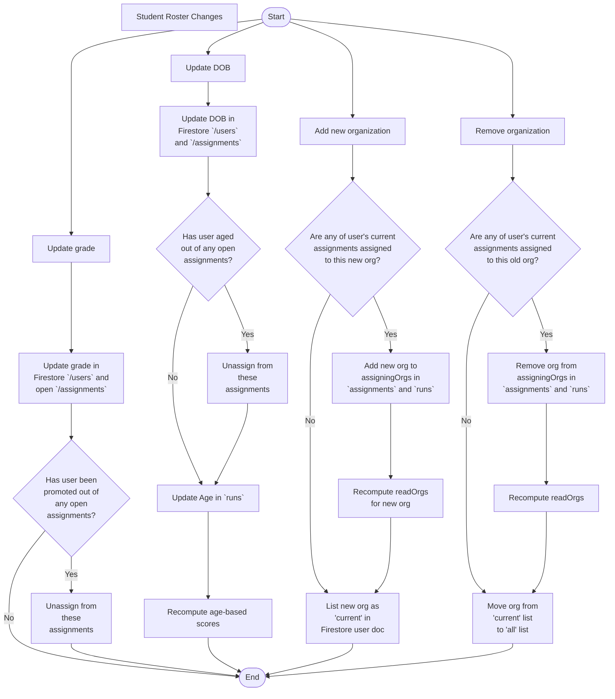

# User Roster Changes

ROAR users are provisioned or imported through three service providers:

- ROAR, via CSV upload by a ROAR administrator,
- Clever, via a cloud function that uses the Clever API to sync organizations and their users, and
- ClassLink, via a similar cloud function that syncs organizations and their users.

When a user's information changes in these service providers, the ROAR platform must update it's own internal information accordingly. Most user information (such as name) can simply be updated in a user's Firestore documents. However, changes to the following fields must be handles differently:

- date of birth (DOB), and therefore age
- grade
- organizational affiliation of any kind (districts, schools, classes, etc.)

Changes to these fields can affect conditional assignment and scoring and must therefore be handled differently. We follow this rostering change flowchart to determine what to update when these fields change.

